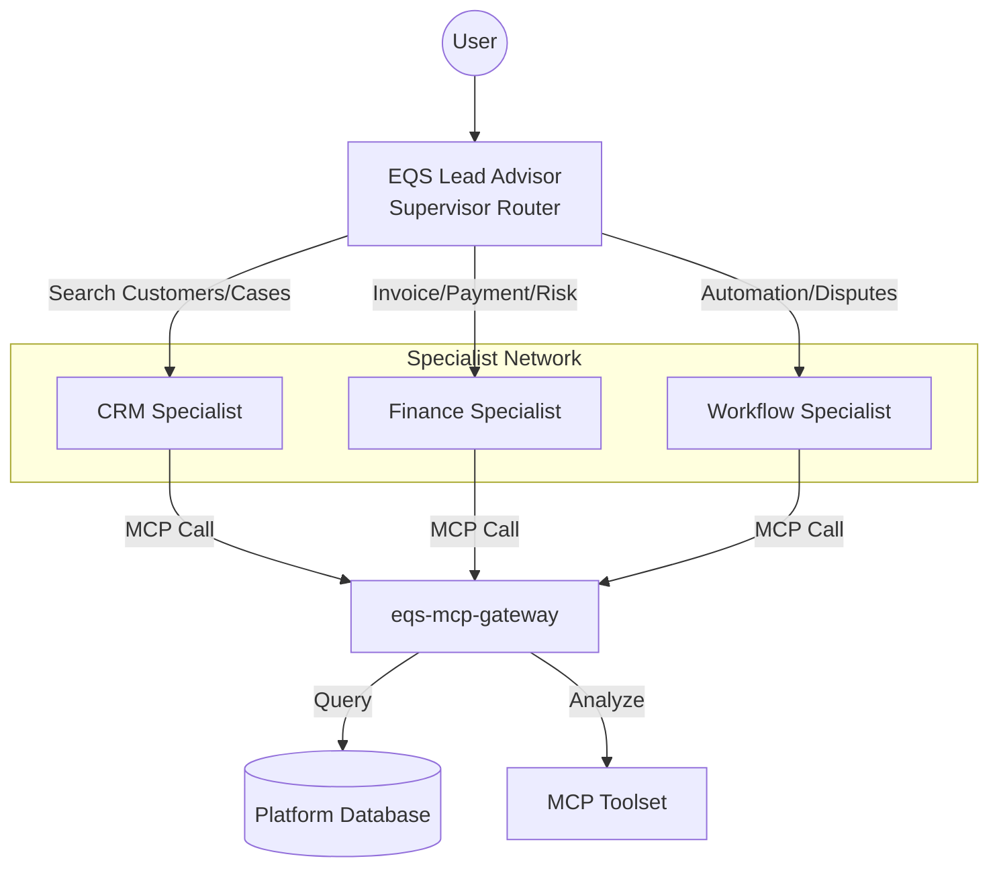

# Bedrock Multi-Agent Orchestration

The EQUIS platform has evolved from a single tool-using bot to a **Truly Agentic Multi-Agent System**. This architecture uses a "Supervisor-Specialist" model to ensure high precision, security, and scalability.

## 🏗️ Architecture

The following diagram illustrates how the Supervisor orchestrates specialized agents to fulfill complex user requests.

## 🧠 The Agent Roles

### 1. EQS Lead Advisor (Supervisor)
*   **Role**: Orchestrator and Router.
*   **Action**: Analyzes the user's intent and decides which specialist(s) to hire.
*   **Architecture**: Configured with `SUPERVISOR_ROUTER` mode.

### 2. CRM Specialist
*   **Instruction**: Specialist in customer relationships, profiles, and case management.
*   **Tools**: Search customers, get case details, customer interaction history.

### 3. Finance Specialist
*   **Instruction**: Specialist in invoices, payments, and financial risk.
*   **Tools**: Invoice status, payment trends, ledger analysis, risk profiling.

### 4. Workflow Specialist
*   **Instruction**: Specialist in process automation, document tracking, and disputes.
*   **Tools**: Workflow stages, document template requests, dispute resolution.

## 🚀 How to Test Orchestration

1.  **Open the Bedrock Console**: Navigate to [Amazon Bedrock > Agents](https://eu-west-2.console.aws.amazon.com/bedrock/home?region=eu-west-2#/agents).
2.  **Select the Supervisor**: `eqs-financial-advisor-staging`.
3.  **Run a Multi-Domain Query**:
    *   *Prompt*: "Summarize CUS-123's risk profile and then tell me if there are any active disputes for their cases."
    *   *Outcome*: The Supervisor will call the **Finance Specialist** for the risk data and the **Workflow Specialist** for the disputes, then synthesize the answer.

## ➕ Creating a New Specialist

To expand the team (e.g., adding a "Compliance Specialist"):

1.  **Define the Specialist in Terraform**:
    Add a new entry to the `sub_agents` local in `modules/bedrock/agent.tf`.
2.  **Generate a Specialized OpenAPI**:
    Update `generate-openapi.ts` to include a new domain and rerun the script.
3.  **Assign Tools**:
    The system will automatically create the action groups and link them to the gateway Lambda.
4.  **Update Supervisor Instructions**:
    The Supervisor will automatically "know" about the new member via its collaborator list.

## 🛡️ Staying Truly Agentic

*   **Bounded Contexts**: Keep specialists small. Don't give the CRM specialist access to payment tools.
*   **Reasoning-First**: Encourage the Supervisor to *plan* before acting in its system prompt.
*   **Verification Cycles**: Add a "Validation Agent" whose only tool is to check drafts against company policy.
