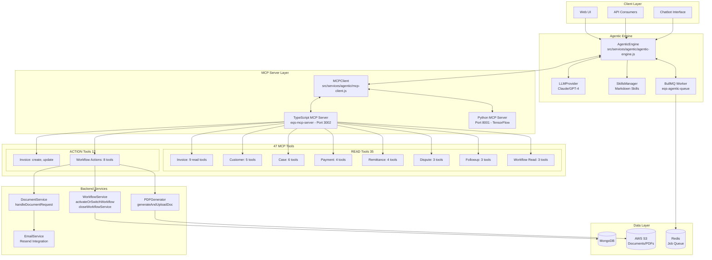
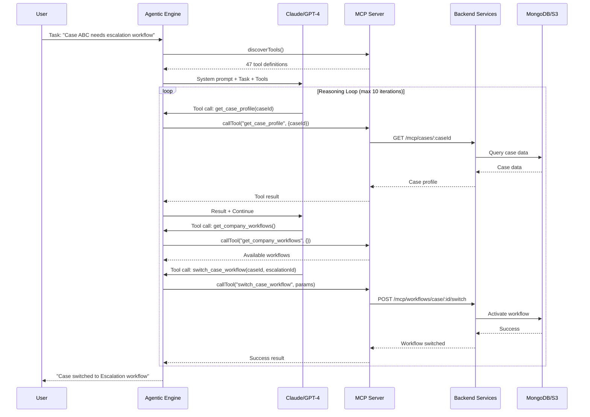
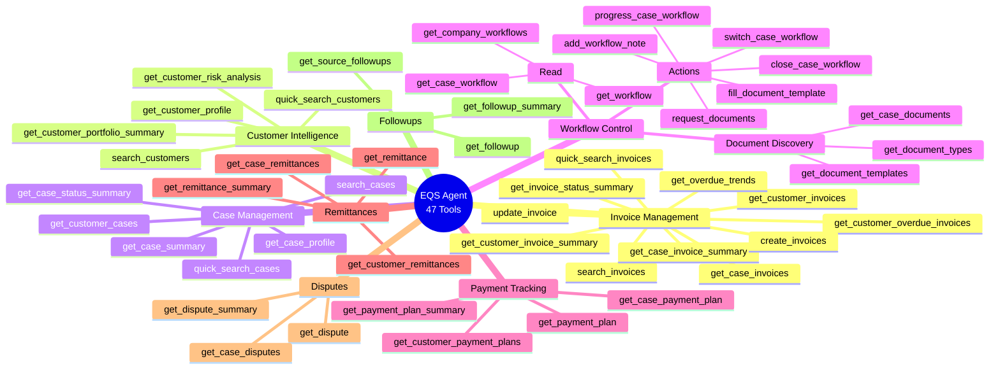
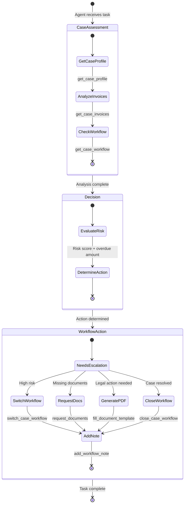
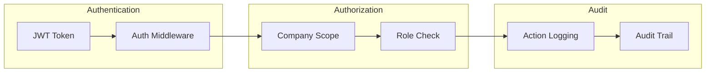
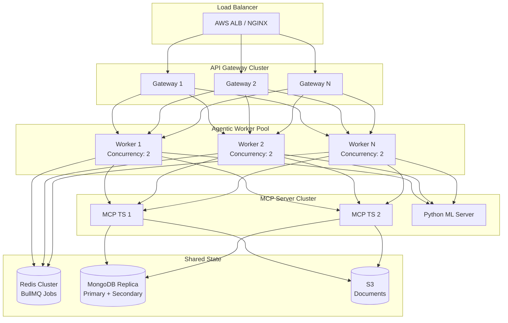
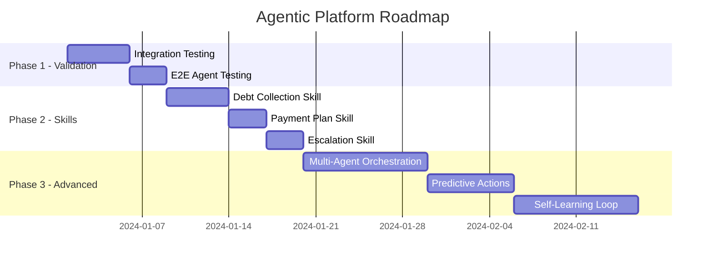

# EQS Agentic Platform - Current State & Strategic Roadmap

## Executive Summary

**Key Finding**: The EQS-115 tools are **already fully implemented**. Your platform has 47 MCP tools including all 6 action-oriented workflow tools. This document provides the current state analysis, architecture diagrams, and a roadmap for next-level agentic capabilities.

---

## 1. Current State Analysis (EQS-114 + EQS-115 Complete)

### Tool Inventory - 47 Total MCP Tools

| Category | Tool Count | Type | Status |
|----------|------------|------|--------|
| Invoice Tools | 11 | READ + WRITE | ✅ Complete |
| Customer Tools | 5 | READ | ✅ Complete |
| Case Tools | 6 | READ | ✅ Complete |
| Payment Arrangement | 4 | READ | ✅ Complete |
| Remittance Tools | 4 | READ | ✅ Complete |
| Workflow Tools | 12 | READ + ACTION | ✅ **Complete (EQS-115)** |
| Dispute Tools | 3 | READ | ✅ Complete |
| Followup Tools | 3 | READ | ✅ Complete |

### EQS-115 Tools - Already Implemented

| Tool | File Location | Status |
|------|---------------|--------|
| `get_document_types` | `eqs-mcp-server/src/tools/workflow-tools.ts:154` | ✅ Implemented |
| `get_document_templates` | `eqs-mcp-server/src/tools/workflow-tools.ts:187` | ✅ Implemented |
| `request_documents` | `eqs-mcp-server/src/tools/workflow-tools.ts:257` | ✅ Implemented |
| `switch_case_workflow` | `eqs-mcp-server/src/tools/workflow-tools.ts:297` | ✅ Implemented |
| `close_case_workflow` | `eqs-mcp-server/src/tools/workflow-tools.ts:335` | ✅ Implemented |
| `fill_document_template` | `eqs-mcp-server/src/tools/workflow-tools.ts:413` | ✅ Implemented |
| `progress_case_workflow` | `eqs-mcp-server/src/tools/workflow-tools.ts:372` | ✅ Bonus tool |
| `add_workflow_note` | `eqs-mcp-server/src/tools/workflow-tools.ts:452` | ✅ Bonus tool |

---

## 2. Architecture Diagrams

### 2.1 Current System Architecture



### 2.2 Agentic Tool Flow



### 2.3 Tool Category Mind Map



### 2.4 Autonomous Workflow Execution



---

## 3. Best Practices & Design Patterns

### 3.1 Tool Design Pattern (Current Implementation)

```
┌─────────────────────────────────────────────────────────────────┐
│ Layer 1: Tool Definition (definitions.ts)                       │
│ - Name, description, inputSchema                                │
│ - Helps LLM understand when/how to use tool                     │
└───────────────────────────┬─────────────────────────────────────┘
                            │
┌───────────────────────────▼─────────────────────────────────────┐
│ Layer 2: Schema Validation (schema.ts)                          │
│ - Zod schemas for type safety                                   │
│ - Runtime validation of parameters                              │
└───────────────────────────┬─────────────────────────────────────┘
                            │
┌───────────────────────────▼─────────────────────────────────────┐
│ Layer 3: Tool Handler (workflow-tools.ts)                       │
│ - Business logic orchestration                                  │
│ - Error handling and response formatting                        │
└───────────────────────────┬─────────────────────────────────────┘
                            │
┌───────────────────────────▼─────────────────────────────────────┐
│ Layer 4: API Client (api/workflows.ts)                          │
│ - HTTP calls to backend                                         │
│ - Token management                                              │
└───────────────────────────┬─────────────────────────────────────┘
                            │
┌───────────────────────────▼─────────────────────────────────────┐
│ Layer 5: REST Routes (workflows.routes.js)                      │
│ - Express endpoints                                             │
│ - Database operations                                           │
└───────────────────────────┬─────────────────────────────────────┘
                            │
┌───────────────────────────▼─────────────────────────────────────┐
│ Layer 6: Service Functions (workflowService.js)                 │
│ - Core business logic                                           │
│ - Transaction management                                        │
└─────────────────────────────────────────────────────────────────┘
```

### 3.2 Key Files Reference

| Purpose | File Path |
|---------|-----------|
| Tool Definitions | `eqs-mcp-server/src/tools/definitions.ts` |
| Zod Schemas | `eqs-mcp-server/src/tools/schema.ts` |
| Workflow Handlers | `eqs-mcp-server/src/tools/workflow-tools.ts` |
| Handler Registry | `eqs-mcp-server/src/tools/index.ts` |
| REST Routes | `eqs-platform-be/src/core-features/mcp/routes/workflows.routes.js` |
| Core Services | `eqs-platform-be/src/core-features/internalManagement/workflows/services/workflowService.js` |
| Agentic Engine | `eqs-platform-be/src/services/agentic/agentic-engine.js` |
| MCP Client | `eqs-platform-be/src/services/agentic/mcp-client.js` |
| LLM Provider | `eqs-platform-be/src/services/agentic/llm-provider.js` |

### 3.3 Security Model (Implemented)



**Current Security Features:**
- JWT-based authentication via `accessToken` in context
- Company-scoped queries (all data filtered by `companyId`)
- User attribution on all write operations
- Audit trail with `performedBy` tracking
- Transaction support for multi-step operations

---

## 4. Scalability Architecture

### 4.1 Horizontal Scaling (Production Ready)



### 4.2 Current Configuration

```javascript
// Environment Variables (from agentic code)
ENABLE_AGENTIC=true
LLM_PROVIDER=anthropic          // or 'openai'
LLM_MODEL=claude-3-5-sonnet     // Model selection
ANTHROPIC_API_KEY=xxx
MCP_TYPESCRIPT_URL=http://localhost:3002
AGENTIC_MAX_ITERATIONS=10       // Reasoning loop limit
AGENTIC_TIMEOUT_MS=30000        // 30s timeout
AGENTIC_STREAMING=true          // Real-time updates
AGENTIC_WORKER_CONCURRENCY=2    // BullMQ workers
```

### 4.3 Rate Limiting Strategy (Recommended)

| Tool Category | Suggested Rate | Rationale |
|---------------|----------------|-----------|
| READ tools | 100/min | High volume, low cost |
| Invoice WRITE | 20/min | Financial impact |
| Workflow Actions | 30/min | State changes |
| Document generation | 10/min | PDF processing cost |
| Email actions | 5/min | External service limits |

---

## 5. Next Steps - Future Roadmap

### 5.1 Immediate Actions (EQS-116)

Since EQS-115 is complete, recommended next steps:

| Priority | Task | Effort |
|----------|------|--------|
| P1 | **Integration Testing**: Test all 8 workflow action tools end-to-end | Medium |
| P1 | **Agent Skill Creation**: Create debt collection skill using new tools | Medium |
| P2 | **Error Handling**: Add retry logic for failed tool calls | Small |
| P2 | **Monitoring**: Add tool usage metrics and success rate tracking | Medium |

### 5.2 Enhanced Agentic Capabilities (EQS-117+)



### 5.3 Potential New Tools (Future)

| Tool | Purpose | Complexity |
|------|---------|------------|
| `create_payment_plan` | Auto-generate payment arrangements | Medium |
| `send_chase_email` | Direct email sending | Small |
| `create_dispute` | Log customer disputes | Medium |
| `schedule_followup` | Create automated follow-ups | Small |
| `calculate_settlement` | Compute settlement offers | Medium |

---

## 6. Verification & Testing Plan

### 6.1 Test the Existing Tools

```bash
# 1. List all available tools via MCP
curl -X POST http://localhost:3002/mcp \
  -H "Content-Type: application/json" \
  -H "Authorization: Bearer YOUR_TOKEN" \
  -d '{"jsonrpc":"2.0","method":"tools/list","id":1}'

# 2. Test get_document_types
curl -X GET http://localhost:3001/api/mcp/documents/types \
  -H "Authorization: Bearer YOUR_TOKEN"

# 3. Test get_company_workflows
curl -X GET http://localhost:3001/api/mcp/workflows \
  -H "Authorization: Bearer YOUR_TOKEN"

# 4. Test switch_case_workflow
curl -X POST http://localhost:3001/api/mcp/workflows/case/CASE_ID/switch \
  -H "Authorization: Bearer YOUR_TOKEN" \
  -H "Content-Type: application/json" \
  -d '{"workflowId":"WORKFLOW_ID","reason":"Agent escalation"}'
```

### 6.2 Agentic E2E Test

```javascript
// Test autonomous workflow management
const result = await agenticEngine.run({
  task: `Case ${caseId} has overdue invoices and is missing proof of income.
         1. Check the case status
         2. Request the missing document
         3. Switch to escalation workflow
         4. Add a note explaining the actions taken`,
  skill: "debt-collection",
  context: { companyId }
});

// Verify agent used the action tools
expect(result.toolsCalled).toContain('get_case_profile');
expect(result.toolsCalled).toContain('request_documents');
expect(result.toolsCalled).toContain('switch_case_workflow');
expect(result.toolsCalled).toContain('add_workflow_note');
```

---

## 7. Summary

### Current State (Achieved)
- **47 MCP tools** fully implemented
- **12 workflow tools** including all EQS-115 action tools
- **Agentic engine** with Claude/GPT-4 support
- **BullMQ** job processing for async tasks
- **Full audit trail** on all write operations

### Architecture Strengths
- Clean separation: Definitions → Schemas → Handlers → Routes → Services
- Type-safe with Zod validation
- Transaction support for data integrity
- Scalable worker pool design

### Recommended Next Steps
1. Validate all workflow action tools with integration tests
2. Create domain-specific skills (debt collection, escalation)
3. Add monitoring/metrics for tool usage
4. Consider multi-agent orchestration for complex cases
