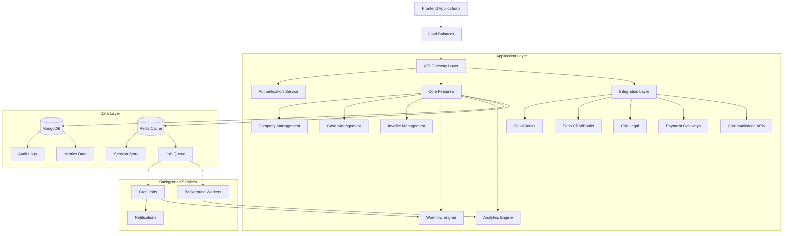
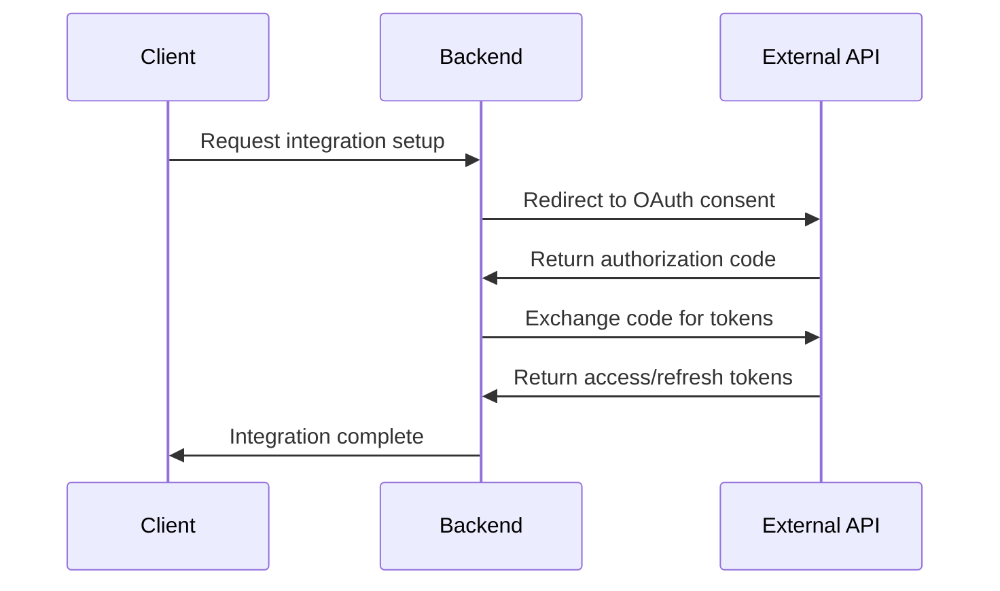

# Architecture Overview

The ÉquiSettle backend platform is built on a sophisticated, multi-layered architecture designed for scalability, maintainability, and enterprise-grade performance. This document provides a comprehensive overview of the system's architectural design and implementation.

## High-Level Architecture



## Architectural Layers

### 1. Presentation Layer

#### API Gateway
- **Express.js Framework**: RESTful API implementation
- **Middleware Chain**: Authentication, validation, error handling
- **Rate Limiting**: Request throttling and abuse prevention
- **CORS Management**: Cross-origin request handling
- **Request/Response Transformation**: Data formatting and validation

#### Authentication & Authorization
- **JWT-Based Authentication**: Stateless token authentication
- **Role-Based Access Control (RBAC)**: Granular permission system
- **Multi-Tenant Security**: Company-based data isolation
- **Session Management**: Redis-backed session storage

### 2. Business Logic Layer

#### Core Features Architecture
```
src/core-features/
├── companies/              # Company management
├── csv-mapping/            # Case management system
├── invoices/               # Invoice processing
├── customerAgreement/      # Customer data management
├── paymentArrangement/     # Payment plan management
├── credit-monitoring/      # Credit assessment
├── portfolios/             # Case organization
├── analytics/              # Business analytics
├── metrics/                # Performance metrics
├── notifications/          # Multi-channel notifications
├── follow-ups/             # Follow-up management
├── disputes/               # Dispute resolution
└── eqs-inventory/          # Inventory management
```

#### Integration Layer Architecture
```
src/integration-layer/
├── quickBooks/             # QuickBooks accounting
├── zoho/                   # Zoho CRM & Books
├── clio/                   # Clio legal practice
├── sage/                   # Sage accounting
├── xero/                   # Xero accounting
├── freeAgent/              # FreeAgent accounting
├── salesforce/             # Salesforce CRM
├── goCardless/             # Direct debit payments
├── chargeBee/              # Subscription billing
├── gmail/                  # Email automation
├── gmail-invoice/          # Invoice email processing
└── chatgpt/                # AI-powered features
```

### 3. Data Access Layer

#### Database Architecture

##### MongoDB Schema Design
```javascript
// Multi-tenant data isolation
{
  companyAccount: ObjectId,  // Tenant identifier in every document
  // ... document data
  createdAt: Date,
  updatedAt: Date
}

// Audit trail pattern
{
  statusHistory: [{
    status: String,
    changedAt: Date,
    changedBy: ObjectId,
    reason: String
  }]
}
```

##### Key Collections
- **Companies**: Tenant configuration and settings
- **CSVMappings**: Core case/debt management
- **Invoices**: Invoice tracking and processing
- **CustomerAgreements**: Customer data and agreements
- **WorkflowStatus**: Automated workflow states
- **PaymentPlanArrangements**: Payment plan management
- **Metrics**: Performance and analytics data

#### Caching Strategy

##### Redis Implementation
```javascript
// Session storage
"sess:{sessionId}": {
  userId: ObjectId,
  companyId: ObjectId,
  permissions: [],
  expiresAt: Date
}

// Job queuing
"queue:csv-processing": [{
  id: String,
  data: Object,
  priority: Number,
  delay: Number
}]

// Temporary data
"temp:{key}": {
  data: Object,
  ttl: Number
}
```

### 4. External Integration Layer

#### Integration Patterns

##### OAuth 2.0 Flow


##### Webhook Processing
```javascript
// Webhook signature verification
const verifyWebhookSignature = (rawBody, signature, secret) => {
  const computedSignature = crypto
    .createHmac('sha256', secret)
    .update(rawBody)
    .digest('hex');

  return crypto.timingSafeEqual(
    Buffer.from(signature, 'hex'),
    Buffer.from(computedSignature, 'hex')
  );
};

// Event-driven processing
const handleWebhookEvent = async (event, data, companyId) => {
  switch(event.type) {
    case 'invoice.created':
      await handleInvoiceCreated(data, companyId);
      break;
    case 'payment.completed':
      await handlePaymentCompleted(data, companyId);
      break;
    // ... additional event handlers
  }
};
```

### 5. Background Processing Layer

#### Cron Job System
```javascript
// Job scheduler initialization
const cronJobs = [
  require("./core-features/csv-mapping/utils/caseOutstanding.cron"),
  require("./integration-layer/zoho/jobs/scheduler"),
  require("./core-features/analytics/jobs/companyAccounts/scheduler"),
  require("./core-features/companies/jobs/scheduler"),
  require("./core-features/metrics/jobs/scheduler"),
  require("./core-features/invoices/cron/reminder"),
  require("./integration-layer/quickBooks/cron/tokenRefreshJob"),
  require("./integration-layer/gmail-invoice/service/gmailService"),
  require("./core-features/csv-mapping/jobs/workflowAutoProgressCron"),
  require("./predictiveAnalytics/jobs/updateAnalyticsJob"),
  require("./integration-layer/sage/jobs/scheduler"),
  require("./core-features/invoices/cron/autoConvert"),
  require("./core-features/internalManagement/workflows/jobs/reminderEmails"),
  require("./integration-layer/clio/jobs/scheduler")
];

// Initialize all cron jobs
cronJobs.forEach(job => job.init());
```

#### Worker Processes
```javascript
// CSV processing worker
const { startCsvWorker } = require("./utils/workers/csvProcessor");

// Demo data generation worker
const { startDemoDataWorker } = require("./utils/workers/demoDataWorker");

// Initialize workers if Redis is available
if (isRedisConnected) {
  startCsvWorker().catch(console.error);
  startDemoDataWorker().catch(console.error);
}
```

## Design Patterns and Principles

### 1. Modular Architecture

#### Feature-Based Organization
```
Each feature module contains:
├── controllers/        # HTTP request handlers
├── models/            # Data models and schemas
├── services/          # Business logic
├── jobs/              # Background tasks
├── utils/             # Utility functions
├── middleware/        # Feature-specific middleware
└── routes/            # API route definitions
```

#### Dependency Injection
```javascript
// Service layer pattern
class CaseManagementService {
  constructor(caseRepository, workflowEngine, notificationService) {
    this.caseRepository = caseRepository;
    this.workflowEngine = workflowEngine;
    this.notificationService = notificationService;
  }

  async createCase(caseData, companyId) {
    // Business logic implementation
    const case = await this.caseRepository.create(caseData, companyId);
    await this.workflowEngine.initiate(case);
    await this.notificationService.notifyCreation(case);
    return case;
  }
}
```

### 2. Event-Driven Architecture

#### Domain Events
```javascript
// Event publishing
class CaseService {
  async updateCaseStatus(caseId, newStatus) {
    const case = await this.updateCase(caseId, { status: newStatus });

    // Publish domain event
    await EventBus.publish('case.status.changed', {
      caseId: case._id,
      oldStatus: case.previousStatus,
      newStatus: case.status,
      timestamp: new Date()
    });

    return case;
  }
}

// Event handling
EventBus.subscribe('case.status.changed', async (event) => {
  // Update analytics
  await AnalyticsService.recordStatusChange(event);

  // Send notifications
  await NotificationService.notifyStatusChange(event);

  // Update workflows
  await WorkflowEngine.handleStatusChange(event);
});
```

### 3. Repository Pattern

#### Data Access Abstraction
```javascript
class CaseRepository {
  constructor(model) {
    this.model = model;
  }

  async findByCompany(companyId, filters = {}, options = {}) {
    const query = { companyAccount: companyId, ...filters };
    return this.model.find(query, null, options);
  }

  async create(caseData, companyId) {
    const case = new this.model({
      ...caseData,
      companyAccount: companyId
    });
    return case.save();
  }

  async updateById(id, updates, companyId) {
    return this.model.findOneAndUpdate(
      { _id: id, companyAccount: companyId },
      updates,
      { new: true }
    );
  }
}
```

### 4. Middleware Pattern

#### Request Processing Chain
```javascript
// Authentication middleware
const verifyJwt = async (req, res, next) => {
  try {
    const token = extractToken(req);
    const decoded = await jwt.verify(token, process.env.JWT_SECRET);
    req.user = decoded;
    next();
  } catch (error) {
    return res.status(403).json({ error: "Authentication failed" });
  }
};

// Authorization middleware
const requireRole = (roles) => (req, res, next) => {
  if (!roles.includes(req.user.role)) {
    return res.status(403).json({ error: "Insufficient permissions" });
  }
  next();
};

// Company access middleware
const requireCompanyAccess = async (req, res, next) => {
  const companyId = req.params.companyId || req.body.companyId;
  if (req.user.companyId !== companyId) {
    return res.status(403).json({ error: "Company access denied" });
  }
  next();
};
```

## Performance Optimization

### 1. Database Optimization

#### Indexing Strategy
```javascript
// Performance-critical indexes
CSVMapping.index({ companyAccount: 1, name: 1 });
CSVMapping.index({ companyAccount: 1, status: 1 });
CSVMapping.index({ companyAccount: 1, "followups.status": 1 });
Invoice.index({ company: 1, status: 1 });
Invoice.index({ company: 1, dueDate: 1 });
CustomerAgreement.index({ email: 1 });
```

#### Query Optimization
```javascript
// Lean queries for performance
const getCasesList = async (companyId, filters) => {
  return CSVMapping.find({ companyAccount: companyId, ...filters })
    .lean()
    .select('name status outstandingBalance createdAt')
    .sort({ createdAt: -1 })
    .limit(100);
};

// Aggregation pipelines for complex queries
const getCaseAnalytics = async (companyId) => {
  return CSVMapping.aggregate([
    { $match: { companyAccount: companyId } },
    { $group: {
        _id: "$status",
        count: { $sum: 1 },
        totalAmount: { $sum: "$outstandingBalance" }
      }
    },
    { $sort: { count: -1 } }
  ]);
};
```

### 2. Caching Strategies

#### Multi-Level Caching
```javascript
// Application-level caching
class CacheService {
  async get(key) {
    // Check memory cache first
    let value = MemoryCache.get(key);
    if (value) return value;

    // Check Redis cache
    value = await RedisCache.get(key);
    if (value) {
      MemoryCache.set(key, value, 300); // 5 min TTL
      return value;
    }

    return null;
  }

  async set(key, value, ttl = 3600) {
    MemoryCache.set(key, value, Math.min(ttl, 300));
    await RedisCache.set(key, value, ttl);
  }
}
```

### 3. Connection Management

#### Database Connection Pooling
```javascript
mongoose.connect(MONGODB_URL, {
  useNewUrlParser: true,
  useUnifiedTopology: true,
  maxPoolSize: 10,          // Maximum number of connections
  serverSelectionTimeoutMS: 5000,
  socketTimeoutMS: 45000,   // Close sockets after 45 seconds
  bufferMaxEntries: 0,      // Disable mongoose buffering
  bufferCommands: false,    // Disable mongoose buffering
});
```

## Security Architecture

### 1. Multi-Tenant Security

#### Data Isolation
```javascript
// Automatic tenant filtering
const addTenantFilter = (req, res, next) => {
  req.tenantFilter = { companyAccount: req.user.companyId };
  next();
};

// Query modification
const findWithTenant = function(filter = {}) {
  return this.find({ ...filter, ...this.tenantFilter });
};
```

### 2. Input Validation and Sanitization

#### Schema Validation
```javascript
const createCaseSchema = {
  name: { type: String, required: true, trim: true, maxlength: 200 },
  amount: { type: Number, required: true, min: 0 },
  email: {
    type: String,
    required: true,
    validate: {
      validator: (email) => /^[^\s@]+@[^\s@]+\.[^\s@]+$/.test(email),
      message: 'Invalid email format'
    }
  }
};
```

### 3. Audit Logging

#### Comprehensive Audit Trail
```javascript
const auditMiddleware = (req, res, next) => {
  const originalSend = res.send;
  res.send = function(data) {
    // Log request/response
    AuditLogger.log({
      userId: req.user?.id,
      action: `${req.method} ${req.path}`,
      requestBody: req.body,
      responseStatus: res.statusCode,
      timestamp: new Date(),
      ipAddress: req.ip,
      userAgent: req.get('User-Agent')
    });

    originalSend.call(this, data);
  };
  next();
};
```

## Scalability Considerations

### 1. Horizontal Scaling Readiness

#### Stateless Design
- JWT-based authentication eliminates server-side session dependency
- All user context stored in tokens or database
- Background jobs use Redis queue for distributed processing

#### Database Scaling
- MongoDB replica sets for read scaling
- Sharding strategy based on company ID
- Connection pooling for efficient resource usage

### 2. Microservice Migration Path

#### Service Boundaries
```javascript
const serviceDefinitions = {
  'auth-service': ['authentication', 'authorization'],
  'company-service': ['company-management', 'user-management'],
  'case-service': ['csv-mapping', 'case-workflows'],
  'invoice-service': ['invoices', 'payments'],
  'integration-service': ['all-external-integrations'],
  'notification-service': ['emails', 'sms', 'push-notifications'],
  'analytics-service': ['metrics', 'reporting', 'analytics']
};
```

## Monitoring and Observability

### 1. Health Checks

#### Service Health Monitoring
```javascript
const healthCheck = async () => {
  const health = {
    status: 'healthy',
    services: {},
    timestamp: new Date().toISOString()
  };

  // Database health
  try {
    await mongoose.connection.db.admin().ping();
    health.services.database = 'healthy';
  } catch (error) {
    health.services.database = 'unhealthy';
    health.status = 'unhealthy';
  }

  // Redis health
  try {
    await redis.ping();
    health.services.redis = 'healthy';
  } catch (error) {
    health.services.redis = 'degraded';
  }

  return health;
};
```

### 2. Performance Metrics

#### Request Monitoring
```javascript
const performanceMiddleware = (req, res, next) => {
  const startTime = Date.now();

  res.on('finish', () => {
    const duration = Date.now() - startTime;

    MetricsCollector.record({
      path: req.path,
      method: req.method,
      statusCode: res.statusCode,
      duration,
      timestamp: new Date()
    });
  });

  next();
};
```

This architecture provides a solid foundation for the ÉquiSettle platform, ensuring scalability, maintainability, and enterprise-grade reliability while supporting complex business workflows and integrations.