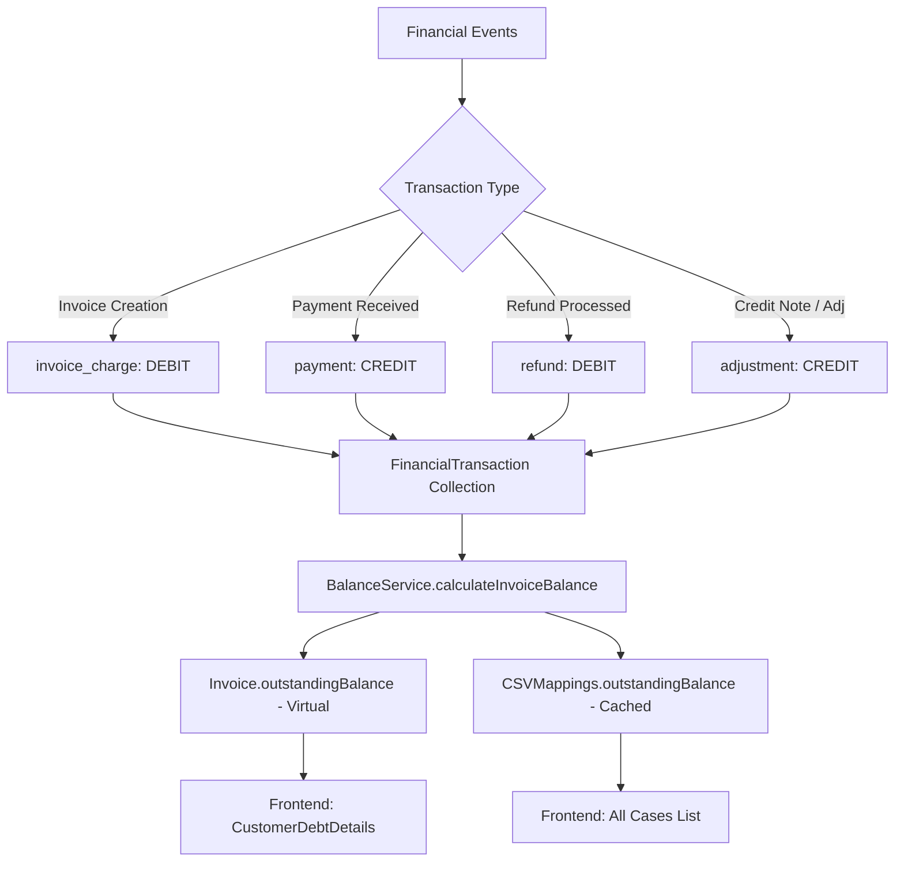

# AR Pure Ledger: Architectural Specification

## Overview
The AR Pure Ledger is a shift from a **Remittance-Based** accounting model (point-in-time calculation) to an **Immutable-Ledger** model (event-based transaction history). This ensures a permanent, verifiable audit trail of all financial movements for every invoice.

## Core Philosophical Shift
- **Remittance-Based (V1/V2)**: Balance = (Total Expected) - (Sum of Remittances). Gaps: Refunds are often miscounted, Voids/Cancellations are hardcoded as £0 instead of being transactionally reversed.
- **Pure Ledger (V3)**: Balance = Sum(All Ledger Entries). Every financial event (Tax Charge, Payment, Refund, Void, Cancellation) creates a `FinancialTransaction` record. The running total of these entries is the *only* source of truth.

## System Architecture

## Critical Audit & Honesty Statement

### 1. What is "Solid Gold" ✅
- **Immutability**: Once written, a `FinancialTransaction` is never updated or soft-deleted. Corrections use new "adjustment" entries.
- **Invoice Balance**: The `invoice.outstandingBalance` field is now a virtual property that never reads from a hardcoded number. It is always fresh from the ledger.
- **Idempotency**: Every transaction uses a deterministic `processorReference`. Retrying a webhook or a failed operation will *never* create duplicate ledger entries due to the unique index.

### 2. The Gaps (Critically Speaking) ⚠️
- **Case-Level Staleness**: While invoices are pure, the `CSVMappings.outstandingBalance` (the one seen on the "All Cases" list) is still **cached**. If a transaction happens and the `calculateCaseBalance` trigger fails, the list view will show a stale debt until manually refreshed.
- **Remittance Mirroring**: Currently, we still create both `Remittance` and `FinancialTransaction`. This is a "double-entry" system that adds complexity. In a perfect world, `Remittance` would be a legacy view derived *from* the ledger.
- **Legacy Backfill**: Historical cases before this refactor don't have a ledger. Their balances are computed via the legacy "Tier 3" logic, which is less precise.

## Duplication Safeguards (EQS-149 Alignment)
To prevent duplication when creating new payment plans or retrying conversions (per EQS-149 requirements), the system employs two layers of protection:

1. **Deterministic Identity**: Every `FinancialTransaction` uses a `processorReference` tied to the source event (e.g., `credit_note_${invoiceId}_${planId}`).
2. **Database Enforcement**: The `FinancialTransaction` collection has a unique index on `processorReference`. Any attempt to record a duplicate event (e.g., hitting the "Convert to Plan" button twice) will be blocked by the database.
3. **Aggregator vs Snapshot**: By removing the cached `outstandingBalance` from the Case model, we eliminate "Snapshot Drift". The balance is always a real-time Sum(Ledger), so it cannot be "incremented" twice by mistake.

## Why this Architecture?

| Factor | Benefit |
|---|-|
| **Audit Compliance** | We can now recreate the balance for any invoice at any historical point by re-running the transaction log. |
| **Atomic Voids** | When an invoice is voided, we don't just "set it to zero". We write a negative adjustment that cancels out the original charge, preserving the original tax record. |
| **Refund Accuracy** | Refunds are debit entries that increase the debtor's balance, preventing the common "phantom zero balance" bug when a payment is returned. |

## The "Pure" Integrity Rule
**"No money moves without a Ledger Entry."**
We have audited every controller path (GC webhooks, Manual Payments, Voids, Supersedes) to ensure this rule is enforced via MongoDB Transactions (Sessions).
