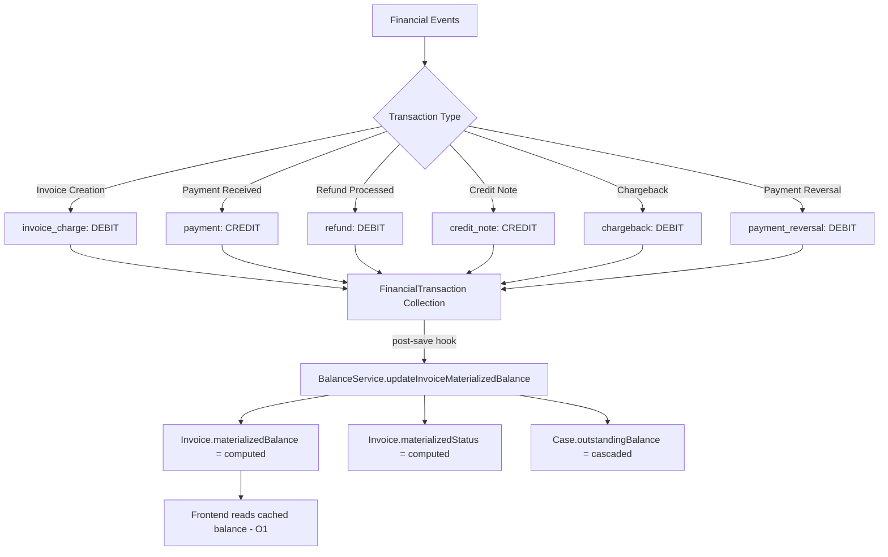
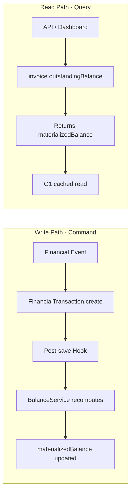
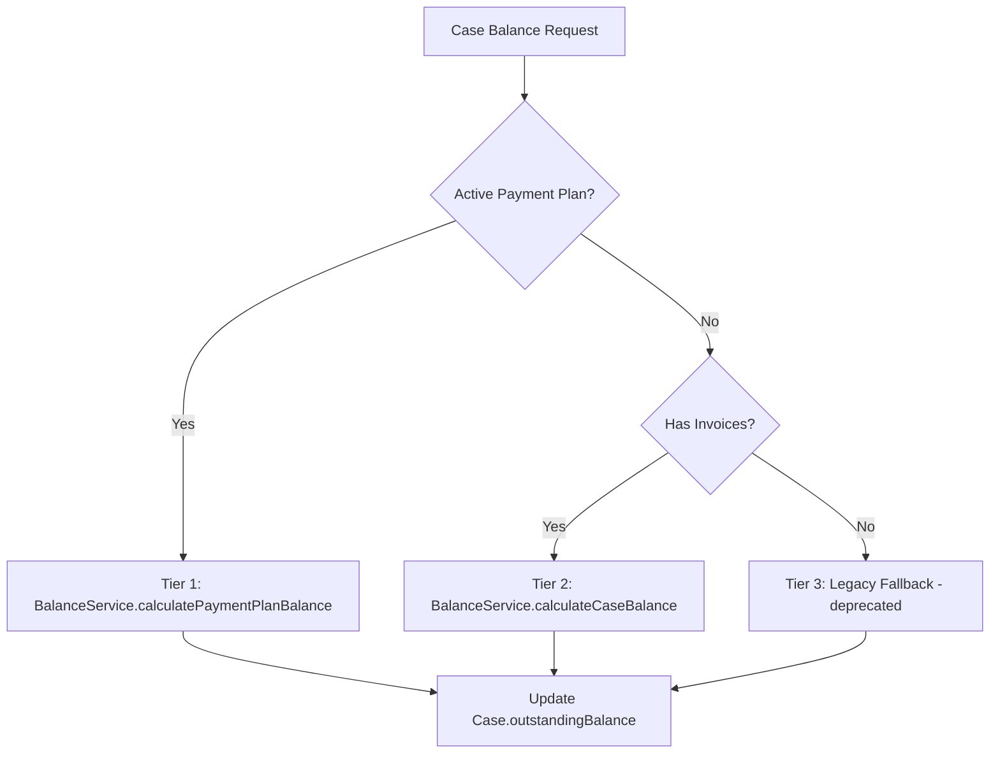

# Hybrid Pure Ledger Architecture

**Last Updated**: 2026-02-21
**Status**: 90% Ledger Compliant (1 gap remaining: Sage payment sync)

## Overview

The EQS Platform implements a **hybrid pure ledger architecture** where:
- **FinancialTransaction** is the immutable, append-only event log (source of truth)
- **materializedBalance** on invoices caches computed balances for performance
- **BalanceService** is the single calculation authority
- **Drift detection** auto-corrects inconsistencies daily

This follows the same patterns used by Stripe, Chargebee, and Brex for event-sourced financial systems.

## Core Design Principles

- **Remittance-Based (V1/V2)**: Balance = (Total Expected) - (Sum of Remittances). Gaps: Refunds miscounted, voids hardcoded as zero.
- **Pure Ledger (V3 - Current)**: Balance = Sum(All Ledger Entries). Every financial event creates an immutable `FinancialTransaction` record. The running total is the *only* source of truth.

## System Architecture



## Write Path vs Read Path (CQRS)



## Payment Path Coverage

| # | Path | FinancialTransaction | materializedBalance | BalanceService | Status |
|---|------|:---:|:---:|:---:|---|
| 1 | Invoice Creation | YES | YES | YES | COMPLIANT |
| 2 | GoCardless Webhooks | YES | YES | YES | COMPLIANT |
| 3 | Bank Reconciliation | YES | YES | YES | COMPLIANT |
| 4 | Manual Payments | YES | YES | YES | COMPLIANT |
| 5 | Payment Plan Payments | YES | YES | YES | COMPLIANT |
| 6 | Credit Notes / Refunds | YES | YES | YES | COMPLIANT |
| 7 | Xero Payment Sync | YES | YES | YES | COMPLIANT |
| 8 | FreeAgent Payment Sync | YES | YES | YES | COMPLIANT |
| 9 | Sage Payment Sync | NO | NO | NO | **GAP** |
| 10 | Case Balance Calc | N/A | YES | YES | COMPLIANT |

## Transaction Types

| Type | Direction | Description |
|------|-----------|-------------|
| `invoice_charge` | Debit (+) | Invoice created, customer owes money |
| `payment` | Credit (-) | Payment received, reduces amount owed |
| `refund` | Debit (+) | Payment reversed, increases amount owed |
| `credit_note` | Credit (-) | Balance reduction / write-off |
| `chargeback` | Debit (+) | Disputed payment, payment taken back |
| `payment_reversal` | Debit (+) | Failed payment reversal |
| `adjustment` | Either | Manual correction (debit or credit) |

## Core Components

### FinancialTransaction Model

**File**: `src/core-features/financials/models/FinancialTransaction.js`

- All key fields are `immutable: true` (transactionId, type, amount, invoice, processorReference)
- Unique constraint on `processorReference` prevents duplicate entries
- Post-save hook automatically triggers balance recomputation
- Append-only: no update or delete operations

### BalanceService

**File**: `src/core-features/financials/services/BalanceService.js`

Single source of truth for all balance calculations:

| Method | Purpose |
|--------|---------|
| `calculateInvoiceBalance(invoiceId)` | Aggregates all transactions for one invoice |
| `calculateCaseBalance(caseId)` | Aggregates across all case invoices |
| `calculatePaymentPlanBalance(planId)` | Aggregates payment plan invoices |
| `batchCalculateInvoiceBalances(ids)` | Optimized batch query |
| `calculateCompanyARMetrics(companyId)` | Company-wide AR with fast-path caching |
| `updateInvoiceMaterializedBalance(id)` | Syncs cache from ledger |

### Materialized Balance Cache

**File**: `src/core-features/invoices/models/invoices.js`

```javascript
// Cache fields (auto-updated by BalanceService via post-save hook)
materializedBalance: Number,    // Cached outstanding balance
materializedStatus: String,     // Cached payment status
lastBalanceUpdate: Date,        // When cache was last refreshed

// Virtual getter (reads cache for O(1) performance)
outstandingBalance → returns materializedBalance ?? amount
```

## Integrity Safeguards

### 1. Immutability
Once written, a `FinancialTransaction` is never updated or deleted. Corrections use new reversal/adjustment entries.

### 2. Idempotency
Every transaction uses a deterministic `processorReference`. Unique index prevents duplicate entries even on retry.

| Source | processorReference Format |
|--------|--------------------------|
| Invoice creation | `invoice_{invoiceId}` |
| GoCardless payment | `gc_{paymentId}` |
| Bank reconciliation | `recon_{paymentId}` or `bank_recon_{matchId}` |
| Manual payment | `manual_{remittanceId}` |
| Credit note | `credit_note_{invoiceId}_{planId}` |
| Xero payment | Via paymentUtils |
| FreeAgent payment | Via paymentUtils |

### 3. Drift Detection
Daily reconciliation job (`balanceDriftDetection.js`) recalculates all balances from ledger and auto-corrects any drift greater than 0.01.

### 4. Transaction Isolation

| Operation | Session Usage | Isolation |
|-----------|--------------|-----------|
| GoCardless webhook | `session.withTransaction()` | SERIALIZABLE |
| Bank reconciliation | MongoDB session | SERIALIZABLE |
| Manual payments | MongoDB session | SERIALIZABLE |
| Credit notes | MongoDB session | SERIALIZABLE |
| Invoice creation | post-save hook | EVENTUAL |
| Xero/FreeAgent sync | No session | EVENTUAL |

## Case Balance Calculation (3-Tier)



## Balance Lifecycle

```
1. CHARGE: Invoice created
   → post-save hook creates invoice_charge FinancialTransaction
   → auto-trigger: materializedBalance = amount

2. PAYMENT: Any payment received
   → handler creates payment FinancialTransaction
   → auto-trigger: materializedBalance = amount - totalPayments

3. QUERY: Dashboard/API reads balance
   → invoice.outstandingBalance returns materializedBalance (O(1))

4. SAFETY: Drift detection (daily)
   → Recalculates all balances from ledger
   → Auto-corrects any drift > 0.01
```

## Known Gaps

### Sage Payment Sync (Priority 1)
**File**: `src/integration-layer/sage/controllers/get.controller.js`

Uses legacy `Payment` model instead of `FinancialTransaction`. Does not update materializedBalance or cascade case balance. Fix: same pattern as Xero/FreeAgent.

### Remittance Mirroring (Acknowledged)
Some paths still create both `Remittance` and `FinancialTransaction`. The Remittance is legacy and should be treated as a read-only audit mirror, not a source of truth.

## Why This Architecture?

| Factor | Benefit |
|--------|---------|
| **Audit Compliance** | Reconstruct balance at any historical point by replaying transaction log |
| **Atomic Voids** | Void creates a negative adjustment, preserving the original charge record |
| **Refund Accuracy** | Refunds are debit entries that correctly increase the debtor's balance |
| **Performance** | materializedBalance cache gives O(1) reads, ledger gives correctness |
| **Idempotency** | processorReference unique index makes all operations safe to retry |
| **Drift Safety** | Daily reconciliation catches and corrects any cache staleness |

## The "Pure" Integrity Rule

**"No money moves without a Ledger Entry."**

All controller paths (GoCardless webhooks, manual payments, bank reconciliation, Xero sync, FreeAgent sync, voids, credit notes, refunds) enforce this rule. The only remaining gap is Sage payment sync.
