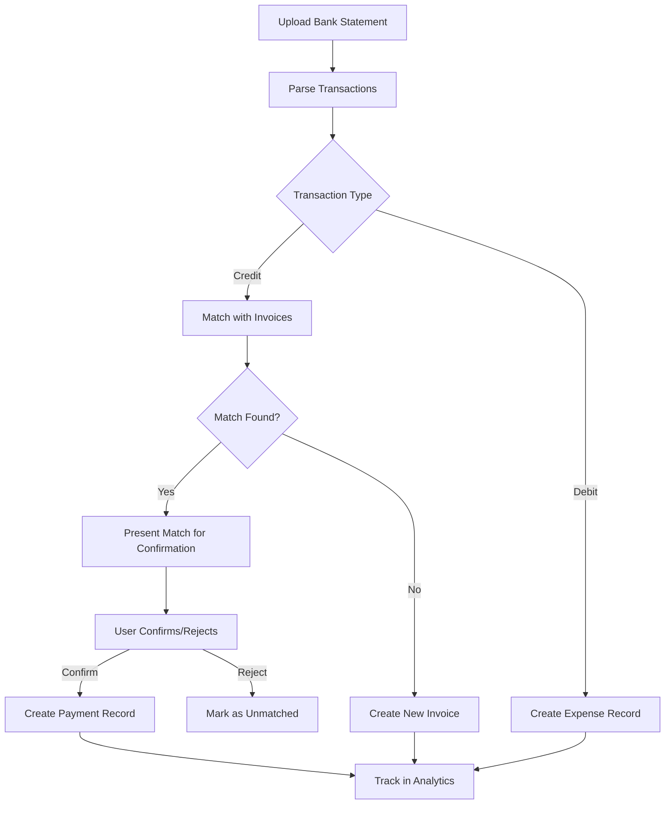

# Bank Reconciliation

## Overview

The Bank Reconciliation feature automatically matches bank transactions with invoices and creates expense records for complete cash flow tracking.

## Key Features

- **Automatic Transaction Matching**: Uses TensorFlow ML model to match bank transactions with invoices
- **Expense Tracking**: Auto-creates expense records for debit transactions (money out)
- **Invoice Creation**: Generates invoices for unmatched credit transactions (money in)
- **A/B Testing**: Compares ML-enhanced vs rule-based matching
- **Performance Metrics**: Tracks operation duration and success rates

## Architecture

### Components

1. **Upload Controller** (`upload.controller.js`)
   - Handles bank statement file uploads
   - Validates files (size, type, malicious content)
   - SHA-256 hashing for duplicate detection
   - Creates notifications on successful upload

2. **Matching Controller** (`matching.controller.js`)
   - Runs matching engine on transactions
   - A/B testing (50/50 ML vs rule-based)
   - Creates Expense records for debit transactions
   - Creates Invoice records for credit transactions
   - Records performance metrics

3. **Matching Engine** (`matchingEngine.service.js`)
   - Exact matching (amount + reference)
   - Fuzzy matching (amount variance, date proximity)
   - Multi-invoice matching
   - ML confidence enhancement via Payment Matching Model (PEM)

4. **Payment Matching Model** (`paymentMatchingModel.js`)
   - TensorFlow neural network (8 features → 24 → 12 → 1)
   - Model persistence with versioning
   - Training data validation
   - Incremental learning from user feedback

## Workflow



## Expense Tracking

### Implementation

When a debit transaction is detected:

```javascript
if (transaction.type === 'debit') {
  const expense = new Expense({
    expenseId: `EXP-BANK-${Date.now()}-${transaction.transactionId.slice(-6)}`,
    title: transaction.payeeName || transaction.description || 'Bank Payment',
    amount: Math.abs(transaction.amount),
    dueDate: transaction.date,
    paidDate: transaction.date,
    status: 'Paid',
    description: `Auto-created from bank reconciliation. Reference: ${transaction.reference}`,
    company: companyId
  });

  await expense.save();
}
```

### Data Flow

1. **Bank Statement Upload** → Parse CSV/Excel
2. **Transaction Classification** → Identify debit vs credit
3. **Debit Transactions** → Create Expense records
4. **Credit Transactions** → Match with invoices or create new
5. **Analytics Update** → Both income and expenses tracked

## A/B Testing

### Purpose
Measure effectiveness of ML-enhanced matching vs rule-based matching

### Implementation

```javascript
// Randomly assign 50/50
const ablTestGroup = Math.random() < 0.5 ? 'ml_enhanced' : 'rule_based';

const matchResult = await matchingEngine.matchTransaction(
  transaction,
  companyId,
  {
    forceRuleBased: ablTestGroup === 'rule_based'
  }
);

// Record metric
await PerformanceMetric.record({
  company: companyId,
  operation: 'match_transaction',
  ablTestGroup: ablTestGroup,
  confidence: matchResult.confidence,
  mlEnhanced: matchResult.mlEnhanced || false
});
```

### Metrics Tracked

- **Acceptance Rate**: % of matches accepted by users
- **Average Confidence**: Mean confidence score
- **Processing Time**: Duration per transaction
- **Success Rate**: Matches confirmed vs rejected

### Viewing Results

```bash
GET /api/v1/reconciliation/metrics/ab-test?companyId={id}&startDate={date}&endDate={date}
```

Response:
```json
{
  "ml_enhanced": {
    "totalMatches": 1250,
    "acceptedMatches": 1150,
    "acceptanceRate": 92,
    "avgConfidence": 0.87
  },
  "rule_based": {
    "totalMatches": 1230,
    "acceptedMatches": 1050,
    "acceptanceRate": 85.4,
    "avgConfidence": 0.72
  }
}
```

## Model Persistence

### Saving Models

```javascript
await paymentMatchingModel.saveModel(companyId);
```

Saves to: `/models/pem/{companyId}-v{version}/`

### Loading Models

```javascript
await paymentMatchingModel.loadModel(companyId);
```

Automatically loads latest version for the company.

### Versioning

- Format: `{companyId}-v{version}`
- Example: `6507f1a2b3c4d5e6f7a8b9c0-v3`
- Metadata stored: version, accuracy, timestamp, training samples

## File Validation

### Security Checks

1. **Filename Sanitization**: Removes path traversal attempts
2. **File Size**: 10 bytes - 20MB
3. **MIME Type Validation**: Matches extension
4. **Malicious Content Scan**: Detects scripts, eval(), etc.
5. **Duplicate Detection**: SHA-256 hash comparison

### Implementation

```javascript
const validation = await fileValidation.validateFile(file, companyId, BankStatement);

if (!validation.valid) {
  return res.status(400).json({ errors: validation.errors });
}
```

## Rate Limiting

Prevents API abuse:

- **File Uploads**: 20 per 15 minutes
- **Bulk Operations**: 10 per 15 minutes
- **ML Retraining**: 5 per hour

## API Endpoints

### Upload Statement
```
POST /api/v1/reconciliation/statements/upload
Content-Type: multipart/form-data

Body:
- statement: File (CSV, Excel)
- companyId: String
```

### Run Matching
```
POST /api/v1/reconciliation/matching/run/:sessionId
```

### Confirm Match
```
POST /api/v1/reconciliation/confirm/:matchId
```

### Confirm Bulk
```
POST /api/v1/reconciliation/confirm/bulk
Body: { matchIds: [String], companyId: String }
```

### Get Session
```
GET /api/v1/reconciliation/sessions/:sessionId
```

### Get Matches
```
GET /api/v1/reconciliation/matches/:sessionId
```

### Get Performance Metrics
```
GET /api/v1/reconciliation/metrics/performance?companyId={id}
```

### Retrain PEM Model
```
POST /api/v1/reconciliation/pem/retrain/:companyId
```

## Analytics Integration

### What's Tracked

✅ **Income (Credit Transactions)**
- Matched invoices → Mark as paid
- Unmatched credits → Create new invoices
- Payment records created

✅ **Expenses (Debit Transactions)**
- Auto-created Expense records
- Linked to company
- Marked as 'Paid'

### Viewing in Analytics

All reconciliation data flows into:
- Overall Analytics Dashboard
- Cash Flow Reports
- Income vs Expense Charts
- AR Aging Buckets

## Testing

### Upload Test Statement

1. Create CSV file:
```csv
Date,Description,Amount,Type,Reference,PayeeName
2025-01-10,Invoice Payment,1500.00,credit,REF001,Client A
2025-01-11,Office Rent,-800.00,debit,REF002,Landlord
2025-01-12,Supplier Payment,-350.50,debit,REF003,Office Supplies Ltd
```

2. Upload via UI or API
3. Check notification for summary
4. Verify in database:

```javascript
// Check expenses created
db.expenses.find({ expenseId: /^EXP-BANK-/ })

// Check performance metrics
db.performancemetrics.find({ operation: 'match_transaction' })
```

## Troubleshooting

### Issue: Expenses Not Created

**Check:**
1. Transaction type is 'debit'
2. Amount is positive
3. Company ID is valid
4. Check backend logs: `[Reconciliation] Created expense:`

### Issue: Model Not Saving

**Check:**
1. `/models/pem/` directory exists and is writable
2. Sufficient disk space
3. Check logs for TensorFlow errors

### Issue: Matches Not Appearing

**Check:**
1. Session ID is correct
2. Matching completed successfully
3. Check `reconciliationMatches` collection
4. Verify unpaid invoices exist for matching

## Performance Considerations

- **ML Model**: ~50-100ms per transaction
- **File Upload**: Async processing for large files
- **Bulk Confirmation**: Batched database operations
- **Metrics Recording**: Non-blocking (setImmediate)

## Future Enhancements

- [ ] Multi-currency support
- [ ] Recurring expense detection
- [ ] Supplier categorization
- [ ] Budget vs actual tracking
- [ ] Cash flow forecasting
- [ ] Bank API integration (Open Banking)

## Related Documentation

- [Expense Management](./expense-management.md)
- [Invoice Management](./invoice-management.md)
- [Payment Matching Model](../ml/payment-matching-model.md)
- [Analytics Integration](./analytics.md)
