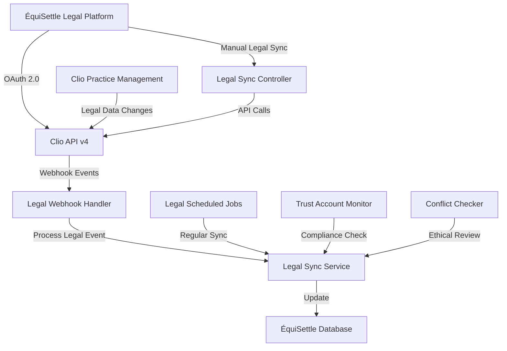
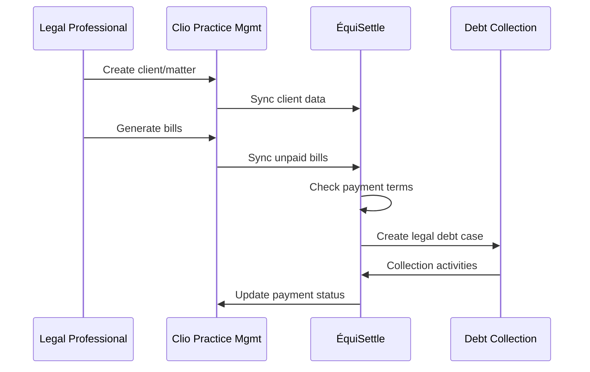

# Clio Integration

The ÉquiSettle Clio integration provides specialized connectivity with Clio legal practice management software, enabling automated client billing, matter management, and legal-specific debt collection workflows.

## DiagramEmbed Component Support

```jsx
import DiagramEmbed from '@/components/DiagramEmbed';

// Display Clio legal workflow diagram
<DiagramEmbed
  diagramUrl="YOUR_DRAW_IO_URL"
  sheetName="Clio Legal Workflow"
  title="Clio Integration for Legal Practices"
  height="700px"
/>
```

## Overview

Clio is the world's leading cloud-based legal practice management software, serving over 150,000 legal professionals. Our integration enables:

- **Legal-Specific Workflows**: Specialized debt collection for legal practices
- **Client-Matter Management**: Complete client and matter synchronization
- **Bill Processing**: Automated legal billing and collection
- **Trust Account Integration**: IOLTA/trust account compliance

## Features

### Core Legal Capabilities

| Feature | Description | Sync Direction |
|---------|-------------|----------------|
| **Client Management** | Client contacts, addresses, billing preferences | Bidirectional |
| **Matter Tracking** | Case/matter information, status, billing | From Clio |
| **Bill Processing** | Legal bills, time entries, expenses | Bidirectional |
| **Payment Tracking** | Client payments, trust disbursements | From Clio |
| **Document Management** | Case documents, client communications | From Clio |
| **Time Tracking** | Billable time, task tracking | From Clio |

### Legal-Specific Features

- **Ethical Compliance**: ABA Model Rules compliance
- **Trust Account Management**: IOLTA regulations adherence
- **Conflict Checking**: Client conflict detection
- **Legal Billing Standards**: ABA billing guidelines
- **Professional Responsibility**: Legal ethics integration

## Architecture

### Legal Practice Integration Flow



### Legal Workflow Process



## Implementation

### Legal Service Layer

```javascript
// src/integration-layer/clio/services/ClioLegalService.js
class ClioLegalService {
  constructor() {
    this.client = new ClioApiClient();
    this.tokenManager = new TokenManager();
    this.complianceChecker = new LegalComplianceChecker();
  }

  async initializeConnection(companyId, authCode) {
    try {
      const tokens = await this.exchangeAuthCode(authCode);
      await this.tokenManager.storeTokens(companyId, 'clio', tokens);

      // Get firm information and verify legal compliance
      const firmInfo = await this.getFirmInfo(tokens.accessToken);
      await this.complianceChecker.verifyFirmCompliance(firmInfo);

      return {
        success: true,
        firmId: firmInfo.id,
        firmName: firmInfo.name,
        jurisdiction: firmInfo.jurisdiction,
        compliance: {
          trustAccountEnabled: firmInfo.trust_account_enabled,
          ethicsCompliant: true
        }
      };
    } catch (error) {
      throw new ClioIntegrationError('Failed to initialize legal connection', error);
    }
  }

  async syncClients(companyId, options = {}) {
    const token = await this.tokenManager.getValidToken(companyId, 'clio');

    try {
      const clients = await this.client.contacts.getAll(token, {
        type: 'Person',
        is_client: true,
        updated_at: options.lastSync ? { gte: options.lastSync } : undefined
      });

      const syncResults = [];

      for (const client of clients) {
        // Check for conflicts before syncing
        const conflictCheck = await this.complianceChecker.checkClientConflict(companyId, client);
        if (conflictCheck.hasConflict) {
          console.warn(`Conflict detected for client ${client.id}: ${conflictCheck.reason}`);
          continue;
        }

        const result = await this.processLegalClient(companyId, client);
        syncResults.push(result);
      }

      return {
        success: true,
        processed: syncResults.length,
        results: syncResults
      };
    } catch (error) {
      throw new ClioSyncError('Legal client sync failed', error);
    }
  }

  async syncMatters(companyId, options = {}) {
    const token = await this.tokenManager.getValidToken(companyId, 'clio');

    try {
      const matters = await this.client.matters.getAll(token, {
        status: 'open',
        updated_at: options.lastSync ? { gte: options.lastSync } : undefined
      });

      const syncResults = [];

      for (const matter of matters) {
        const result = await this.processLegalMatter(companyId, matter);
        syncResults.push(result);
      }

      return {
        success: true,
        processed: syncResults.length,
        results: syncResults
      };
    } catch (error) {
      throw new ClioSyncError('Legal matter sync failed', error);
    }
  }

  async syncBills(companyId, options = {}) {
    const token = await this.tokenManager.getValidToken(companyId, 'clio');

    try {
      const bills = await this.client.bills.getAll(token, {
        status: ['sent', 'overdue'],
        updated_at: options.lastSync ? { gte: options.lastSync } : undefined
      });

      const syncResults = [];

      for (const bill of bills) {
        const result = await this.processLegalBill(companyId, bill);
        syncResults.push(result);

        // Check if bill is overdue and needs legal debt collection
        if (this.isLegalBillOverdue(bill)) {
          await this.createLegalDebtCase(companyId, bill);
        }
      }

      return {
        success: true,
        processed: syncResults.length,
        results: syncResults
      };
    } catch (error) {
      throw new ClioSyncError('Legal bill sync failed', error);
    }
  }

  async createLegalDebtCase(companyId, bill) {
    try {
      // Get matter and client information
      const matter = await this.getMatterDetails(bill.matter.id);
      const client = await this.getClientDetails(matter.client.id);

      // Check legal compliance before creating debt case
      const complianceCheck = await this.complianceChecker.checkDebtCollectionCompliance({
        client,
        matter,
        bill,
        jurisdiction: matter.jurisdiction
      });

      if (!complianceCheck.isCompliant) {
        throw new LegalComplianceError(`Cannot create debt case: ${complianceCheck.reason}`);
      }

      const debtCase = {
        type: 'legal_debt',
        clientId: client.id,
        matterId: matter.id,
        billId: bill.id,
        amount: bill.total,
        amountDue: bill.amount_due,
        dueDate: bill.due_date,
        description: `Legal services - ${matter.display_number}: ${matter.description}`,
        practiceArea: matter.practice_area,
        billingContact: bill.billing_contact,
        complianceNotes: complianceCheck.notes,
        ethicalConsiderations: complianceCheck.ethicalConsiderations
      };

      return await this.createDebtCase(companyId, debtCase);
    } catch (error) {
      throw new LegalDebtCaseError('Failed to create legal debt case', error);
    }
  }

  isLegalBillOverdue(bill) {
    if (!bill.due_date || bill.status !== 'sent') {
      return false;
    }

    const dueDate = new Date(bill.due_date);
    const today = new Date();
    const daysOverdue = Math.floor((today - dueDate) / (1000 * 60 * 60 * 24));

    // Legal bills typically have different grace periods
    const gracePeriod = bill.matter?.practice_area === 'Personal Injury' ? 45 : 30;

    return daysOverdue > gracePeriod && bill.amount_due > 0;
  }
}
```

### Legal Compliance Checker

```javascript
// src/integration-layer/clio/services/LegalComplianceChecker.js
class LegalComplianceChecker {
  async checkClientConflict(companyId, client) {
    try {
      // Check against existing clients and matters
      const existingClients = await this.getExistingClients(companyId);

      for (const existingClient of existingClients) {
        if (this.hasConflictIndicators(client, existingClient)) {
          return {
            hasConflict: true,
            reason: 'Potential client conflict detected',
            conflictingClient: existingClient.id
          };
        }
      }

      return { hasConflict: false };
    } catch (error) {
      console.error('Conflict checking failed:', error);
      return { hasConflict: false, error: error.message };
    }
  }

  async checkDebtCollectionCompliance(data) {
    const { client, matter, bill, jurisdiction } = data;

    // Check ABA Model Rules compliance
    const abaCompliance = this.checkABACompliance(matter);
    if (!abaCompliance.isCompliant) {
      return abaCompliance;
    }

    // Check jurisdiction-specific rules
    const jurisdictionCompliance = this.checkJurisdictionRules(jurisdiction, matter);
    if (!jurisdictionCompliance.isCompliant) {
      return jurisdictionCompliance;
    }

    // Check trust account implications
    const trustCompliance = this.checkTrustAccountRules(bill);
    if (!trustCompliance.isCompliant) {
      return trustCompliance;
    }

    return {
      isCompliant: true,
      notes: 'All legal compliance checks passed',
      ethicalConsiderations: this.getEthicalConsiderations(matter)
    };
  }

  checkABACompliance(matter) {
    // ABA Model Rule 1.16 - Declining or Terminating Representation
    if (matter.status === 'terminated' && matter.termination_reason === 'non_payment') {
      return {
        isCompliant: false,
        reason: 'Cannot collect from terminated client due to non-payment under ABA Rule 1.16'
      };
    }

    // ABA Model Rule 1.5 - Fees
    if (matter.fee_arrangement === 'contingency') {
      return {
        isCompliant: false,
        reason: 'Contingency fee matters require special handling under ABA Rule 1.5'
      };
    }

    // ABA Model Rule 1.15 - Safekeeping Property
    if (matter.has_trust_balance) {
      return {
        isCompliant: true,
        notes: 'Trust account balance exists - ensure compliance with ABA Rule 1.15',
        requiresTrustReview: true
      };
    }

    return { isCompliant: true };
  }

  checkJurisdictionRules(jurisdiction, matter) {
    // State-specific rules
    const stateRules = {
      'California': {
        maxInterestRate: 10,
        requiresClientNotice: true,
        gracePeriod: 60
      },
      'New York': {
        maxInterestRate: 9,
        requiresClientNotice: true,
        gracePeriod: 45
      },
      'Texas': {
        maxInterestRate: 18,
        requiresClientNotice: false,
        gracePeriod: 30
      }
    };

    const rules = stateRules[jurisdiction] || stateRules['Texas']; // Default

    return {
      isCompliant: true,
      jurisdictionRules: rules,
      notes: `Following ${jurisdiction} legal collection rules`
    };
  }

  checkTrustAccountRules(bill) {
    // IOLTA compliance checks
    if (bill.trust_disbursements && bill.trust_disbursements.length > 0) {
      return {
        isCompliant: true,
        notes: 'Trust disbursements detected - ensure IOLTA compliance',
        requiresTrustAudit: true
      };
    }

    return { isCompliant: true };
  }

  getEthicalConsiderations(matter) {
    const considerations = [];

    if (matter.practice_area === 'Family Law') {
      considerations.push('Family law matters require sensitive collection approach');
    }

    if (matter.practice_area === 'Criminal Defense') {
      considerations.push('Criminal defense matters may have indigent client considerations');
    }

    if (matter.practice_area === 'Personal Injury') {
      considerations.push('Personal injury matters may be contingency-based');
    }

    return considerations;
  }
}
```

### Legal Webhook Handler

```javascript
// src/integration-layer/clio/webhooks/clioLegalWebhookHandler.js
class ClioLegalWebhookHandler {
  async handleWebhook(req, res) {
    try {
      // Verify Clio webhook signature
      const signature = req.headers['x-clio-signature'];
      if (!this.verifyClioSignature(req.body, signature)) {
        return res.status(401).json({ error: 'Invalid signature' });
      }

      const event = req.body;
      await this.processLegalEvent(event);

      res.status(200).json({ status: 'success' });
    } catch (error) {
      console.error('Clio legal webhook error:', error);
      res.status(500).json({ error: 'Legal webhook processing failed' });
    }
  }

  async processLegalEvent(event) {
    const { model, id, action, firm_id } = event;

    const companyId = await this.getCompanyByFirmId(firm_id);
    if (!companyId) {
      console.warn(`No company found for Clio firm: ${firm_id}`);
      return;
    }

    switch (model) {
      case 'Contact':
        await this.handleClientEvent(companyId, action, id);
        break;

      case 'Matter':
        await this.handleMatterEvent(companyId, action, id);
        break;

      case 'Bill':
        await this.handleBillEvent(companyId, action, id);
        break;

      case 'Payment':
        await this.handlePaymentEvent(companyId, action, id);
        break;

      case 'TimeEntry':
        await this.handleTimeEntryEvent(companyId, action, id);
        break;

      default:
        console.log(`Unhandled Clio model: ${model}`);
    }
  }

  async handleBillEvent(companyId, action, billId) {
    try {
      const token = await tokenManager.getValidToken(companyId, 'clio');

      switch (action) {
        case 'created':
        case 'updated':
          const bill = await clioApi.bills.getById(token, billId);
          await this.syncBillToLocal(companyId, bill);

          // Check if bill became overdue
          if (clioLegalService.isLegalBillOverdue(bill)) {
            await clioLegalService.createLegalDebtCase(companyId, bill);
          }
          break;

        case 'deleted':
          await this.handleBillDelete(companyId, billId);
          break;

        case 'sent':
          await this.handleBillSent(companyId, billId);
          break;

        case 'paid':
          await this.handleBillPaid(companyId, billId);
          break;
      }
    } catch (error) {
      console.error(`Failed to handle Clio bill event ${action}:`, error);
    }
  }

  async handleMatterEvent(companyId, action, matterId) {
    try {
      const token = await tokenManager.getValidToken(companyId, 'clio');

      switch (action) {
        case 'created':
        case 'updated':
          const matter = await clioApi.matters.getById(token, matterId);
          await this.syncMatterToLocal(companyId, matter);
          break;

        case 'closed':
          await this.handleMatterClosed(companyId, matterId);
          break;

        case 'archived':
          await this.handleMatterArchived(companyId, matterId);
          break;
      }
    } catch (error) {
      console.error(`Failed to handle Clio matter event ${action}:`, error);
    }
  }
}
```

## Data Mapping

### Legal Client Mapping

```javascript
const legalClientMapping = {
  fromClio: (clioClient) => ({
    externalId: clioClient.id,
    type: 'legal_client',
    name: `${clioClient.first_name} ${clioClient.last_name}`.trim(),
    firstName: clioClient.first_name,
    lastName: clioClient.last_name,
    email: clioClient.primary_email_address,
    phone: clioClient.primary_phone_number,
    address: {
      street: clioClient.addresses?.[0]?.street,
      city: clioClient.addresses?.[0]?.city,
      state: clioClient.addresses?.[0]?.province,
      postalCode: clioClient.addresses?.[0]?.postal_code,
      country: clioClient.addresses?.[0]?.country
    },
    clientSince: clioClient.created_at,
    isActive: !clioClient.archived,
    legalInfo: {
      clientType: clioClient.type, // Person, Company, etc.
      preferredLanguage: clioClient.preferred_language,
      clientNumber: clioClient.number,
      referralSource: clioClient.referral_source,
      conflictChecked: clioClient.conflict_checked,
      ethicalScreening: clioClient.ethical_screening_complete
    },
    billingInfo: {
      billingContact: clioClient.billing_contact,
      paymentTerms: clioClient.payment_terms || 30,
      billingMethod: clioClient.preferred_billing_method,
      autoPayEnabled: clioClient.auto_pay_enabled
    },
    metadata: {
      clioClientId: clioClient.id,
      clioFirmId: clioClient.firm?.id,
      lastUpdated: clioClient.updated_at
    }
  }),

  toClio: (localClient) => ({
    first_name: localClient.firstName,
    last_name: localClient.lastName,
    primary_email_address: localClient.email,
    primary_phone_number: localClient.phone,
    addresses: localClient.address ? [{
      name: 'Primary',
      street: localClient.address.street,
      city: localClient.address.city,
      province: localClient.address.state,
      postal_code: localClient.address.postalCode,
      country: localClient.address.country
    }] : [],
    type: localClient.legalInfo?.clientType || 'Person',
    preferred_language: localClient.legalInfo?.preferredLanguage || 'en',
    referral_source: localClient.legalInfo?.referralSource,
    payment_terms: localClient.billingInfo?.paymentTerms || 30,
    preferred_billing_method: localClient.billingInfo?.billingMethod
  })
};
```

### Legal Matter Mapping

```javascript
const legalMatterMapping = {
  fromClio: (clioMatter) => ({
    externalId: clioMatter.id,
    matterNumber: clioMatter.display_number,
    description: clioMatter.description,
    clientId: clioMatter.client?.id,
    status: clioMatter.status, // open, closed, pending
    practiceArea: clioMatter.practice_area?.name,
    jurisdiction: clioMatter.jurisdiction,
    openDate: clioMatter.open_date,
    closeDate: clioMatter.close_date,
    billingMethod: clioMatter.billing_method, // hourly, flat_fee, contingency
    hourlyRate: clioMatter.rate,
    flatFee: clioMatter.flat_fee,
    contingencyRate: clioMatter.contingency_rate,
    responsibleAttorney: {
      id: clioMatter.responsible_attorney?.id,
      name: clioMatter.responsible_attorney?.name
    },
    legalDetails: {
      courtCase: clioMatter.court_case_number,
      opposingParty: clioMatter.opposing_party,
      opposingCounsel: clioMatter.opposing_counsel,
      statute: clioMatter.statute_of_limitations,
      priority: clioMatter.priority
    },
    compliance: {
      conflictChecked: clioMatter.conflict_checked,
      retainerSigned: clioMatter.retainer_signed,
      engagementLetterSent: clioMatter.engagement_letter_sent
    },
    financials: {
      totalBilled: clioMatter.total_billed,
      totalPaid: clioMatter.total_paid,
      outstandingBalance: clioMatter.outstanding_balance,
      trustBalance: clioMatter.trust_balance
    }
  })
};
```

### Legal Bill Mapping

```javascript
const legalBillMapping = {
  fromClio: (clioBill) => ({
    externalId: clioBill.id,
    billNumber: clioBill.number,
    matterId: clioBill.matter?.id,
    clientId: clioBill.matter?.client?.id,
    issueDate: clioBill.issued_at,
    dueDate: clioBill.due_date,
    total: clioBill.total,
    amountDue: clioBill.amount_due,
    amountPaid: clioBill.amount_paid,
    status: clioBill.state, // draft, sent, overdue, paid
    currency: clioBill.currency,
    billingContact: clioBill.billing_contact,
    legalBillDetails: {
      timeEntries: clioBill.time_entries?.map(entry => ({
        id: entry.id,
        description: entry.description,
        hours: entry.quantity,
        rate: entry.rate,
        amount: entry.total,
        date: entry.date,
        attorney: entry.user?.name
      })),
      expenses: clioBill.expenses?.map(expense => ({
        id: expense.id,
        description: expense.description,
        amount: expense.total,
        date: expense.date,
        category: expense.expense_category?.name
      })),
      trustDisbursements: clioBill.trust_request_disbursements?.map(disbursement => ({
        id: disbursement.id,
        amount: disbursement.amount,
        description: disbursement.description,
        date: disbursement.date
      }))
    },
    paymentTerms: clioBill.payment_terms,
    notes: clioBill.notes,
    metadata: {
      clioBillId: clioBill.id,
      clioMatterId: clioBill.matter?.id,
      lastUpdated: clioBill.updated_at
    }
  })
};
```

## Legal Workflow Integration

### Practice Area Specific Workflows

```javascript
// src/integration-layer/clio/workflows/legalWorkflows.js
class LegalWorkflows {
  async createPracticeAreaWorkflow(practiceArea, debtCase) {
    switch (practiceArea) {
      case 'Personal Injury':
        return await this.createPersonalInjuryWorkflow(debtCase);

      case 'Family Law':
        return await this.createFamilyLawWorkflow(debtCase);

      case 'Corporate Law':
        return await this.createCorporateLawWorkflow(debtCase);

      case 'Criminal Defense':
        return await this.createCriminalDefenseWorkflow(debtCase);

      default:
        return await this.createGeneralLegalWorkflow(debtCase);
    }
  }

  async createPersonalInjuryWorkflow(debtCase) {
    return {
      name: 'Personal Injury Debt Collection',
      stages: [
        {
          name: 'Initial Review',
          duration: 7,
          actions: [
            'Review case settlement status',
            'Verify contingency fee arrangement',
            'Check for outstanding liens'
          ]
        },
        {
          name: 'Client Contact',
          duration: 14,
          actions: [
            'Send settlement status inquiry',
            'Request payment arrangement',
            'Document client communication'
          ]
        },
        {
          name: 'Legal Collection',
          duration: 30,
          actions: [
            'Attorney review required',
            'Consider lien enforcement',
            'Evaluate collection alternatives'
          ]
        }
      ],
      compliance: {
        ethicalRules: ['ABA Rule 1.5 - Contingency Fees'],
        stateRules: ['Personal Injury Protection statutes'],
        specialConsiderations: ['Medical lien priority', 'Insurance settlements']
      }
    };
  }

  async createFamilyLawWorkflow(debtCase) {
    return {
      name: 'Family Law Debt Collection',
      stages: [
        {
          name: 'Sensitive Review',
          duration: 5,
          actions: [
            'Review family court orders',
            'Check for domestic relations implications',
            'Verify billing authorization'
          ]
        },
        {
          name: 'Respectful Outreach',
          duration: 21,
          actions: [
            'Send sensitive collection notice',
            'Offer payment plan options',
            'Consider family circumstances'
          ]
        },
        {
          name: 'Careful Escalation',
          duration: 45,
          actions: [
            'Attorney consultation required',
            'Review court order compliance',
            'Consider collection moratorium'
          ]
        }
      ],
      compliance: {
        ethicalRules: ['ABA Rule 1.14 - Clients with Diminished Capacity'],
        specialConsiderations: ['Domestic violence history', 'Child support obligations']
      }
    };
  }
}
```

## Configuration

### Environment Variables

```bash
# Clio OAuth Configuration
CLIO_CLIENT_ID=your_client_id
CLIO_CLIENT_SECRET=your_client_secret
CLIO_REDIRECT_URI=https://your-domain.com/api/v1/integrations/clio/callback

# Clio API Configuration
CLIO_API_BASE_URL=https://app.clio.com/api/v4
CLIO_ENVIRONMENT=production  # or sandbox

# Legal Compliance Configuration
LEGAL_COMPLIANCE_ENABLED=true
ABA_RULES_COMPLIANCE=true
STATE_RULES_JURISDICTION=California

# Webhook Configuration
CLIO_WEBHOOK_SECRET=your_webhook_signing_key
CLIO_WEBHOOK_ENDPOINT=/api/v1/webhooks/clio

# Trust Account Configuration
TRUST_ACCOUNT_MONITORING=true
IOLTA_COMPLIANCE=true
```

## Testing

### Legal Integration Tests

```javascript
// tests/integration/clioLegal.test.js
describe('Clio Legal Integration', () => {
  describe('Legal Compliance', () => {
    test('should check client conflicts before syncing', async () => {
      const client = { name: 'John Doe', email: 'john@example.com' };
      const conflictCheck = await complianceChecker.checkClientConflict(testCompanyId, client);

      expect(conflictCheck.hasConflict).toBeDefined();
    });

    test('should validate ABA rule compliance for debt collection', async () => {
      const matter = { practice_area: 'Personal Injury', fee_arrangement: 'contingency' };
      const compliance = await complianceChecker.checkABACompliance(matter);

      expect(compliance.isCompliant).toBe(false);
      expect(compliance.reason).toContain('contingency fee');
    });

    test('should handle trust account compliance', async () => {
      const bill = { trust_disbursements: [{ amount: 1000 }] };
      const trustCompliance = await complianceChecker.checkTrustAccountRules(bill);

      expect(trustCompliance.requiresTrustAudit).toBe(true);
    });
  });

  describe('Legal Workflows', () => {
    test('should create practice area specific workflows', async () => {
      const workflow = await legalWorkflows.createPracticeAreaWorkflow('Family Law', {});

      expect(workflow.name).toBe('Family Law Debt Collection');
      expect(workflow.stages).toHaveLength(3);
      expect(workflow.compliance.specialConsiderations).toContain('Domestic violence history');
    });
  });

  describe('Legal Data Sync', () => {
    test('should sync legal clients with proper validation', async () => {
      const result = await clioLegalService.syncClients(testCompanyId);

      expect(result.success).toBe(true);
      expect(result.processed).toBeGreaterThan(0);
    });

    test('should create legal debt cases with compliance checks', async () => {
      const bill = {
        id: 'bill-123',
        total: 5000,
        amount_due: 5000,
        due_date: '2023-01-01',
        matter: { id: 'matter-123', practice_area: 'Corporate Law' }
      };

      const debtCase = await clioLegalService.createLegalDebtCase(testCompanyId, bill);

      expect(debtCase.type).toBe('legal_debt');
      expect(debtCase.complianceNotes).toBeDefined();
    });
  });
});
```

## Best Practices

### Legal Ethics Compliance

1. **ABA Model Rules**: Ensure compliance with professional responsibility rules
2. **Client Confidentiality**: Protect attorney-client privilege in collection activities
3. **Conflict Checking**: Regular conflict checking for all collection activities
4. **Trust Account Separation**: Maintain strict separation of trust and operating funds

### Legal Collection Guidelines

1. **Professional Tone**: Maintain professional correspondence appropriate for legal practice
2. **Court Order Compliance**: Respect existing court orders and judgments
3. **Practice Area Sensitivity**: Tailor collection approach to practice area specifics
4. **Documentation**: Maintain detailed records for potential malpractice protection

## Troubleshooting

### Common Legal Integration Issues

| Issue | Cause | Solution |
|-------|-------|----------|
| Conflict Check Failed | Missing client data | Update client information in Clio |
| Trust Account Error | IOLTA rules violation | Review trust account transactions |
| Compliance Violation | Ethics rule breach | Consult with legal compliance officer |
| Bill Sync Failed | Missing matter information | Verify matter setup in Clio |

### Legal Debugging

```bash
# Test Clio API connectivity
curl -X GET "https://app.clio.com/api/v4/contacts" \
  -H "Authorization: Bearer $ACCESS_TOKEN"

# Check firm compliance
curl -X GET "https://app.clio.com/api/v4/users/who_am_i" \
  -H "Authorization: Bearer $ACCESS_TOKEN"

# Verify webhook endpoint
curl -X POST "https://your-domain.com/api/v1/webhooks/clio" \
  -H "Content-Type: application/json" \
  -d '{"model": "Bill", "action": "created", "id": "test"}'
```

## Support

For Clio legal integration support:

1. **Clio API Documentation**: [app.clio.com/api/v4/documentation](https://app.clio.com/api/v4/documentation)
2. **Clio Developer Portal**: [developers.clio.com](https://developers.clio.com)
3. **Legal Ethics Resources**: [americanbar.org](https://americanbar.org)
4. **ÉquiSettle Legal Support**: [legal-support@equisettle.com](mailto:legal-support@equisettle.com)

The Clio integration provides specialized legal practice management capabilities, ensuring ethical compliance while enabling effective debt collection for legal professionals.