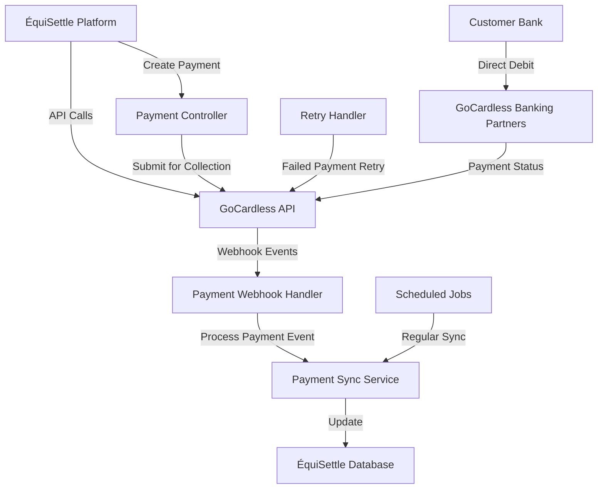
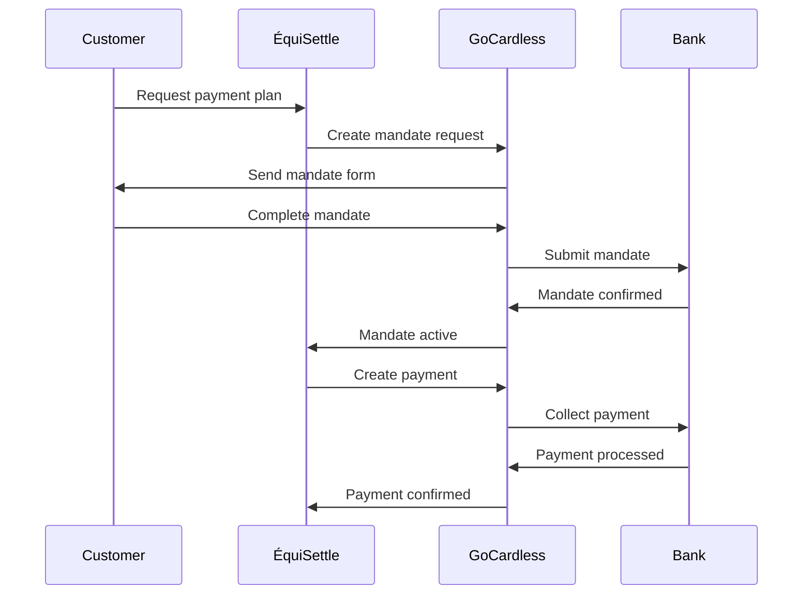

# GoCardless Integration

The ÉquiSettle GoCardless integration provides comprehensive direct debit payment processing, enabling automated recurring payments, mandate management, and bank-to-bank collections across multiple countries.

## DiagramEmbed Component Support

```jsx
import DiagramEmbed from '@/components/DiagramEmbed';

// Display GoCardless payment flow diagram
<DiagramEmbed
  diagramUrl="YOUR_DRAW_IO_URL"
  sheetName="GoCardless Payment Flow"
  title="GoCardless Direct Debit Integration"
  height="600px"
/>
```

## Overview

GoCardless is a leading direct debit payment processor, serving over 75,000 businesses worldwide. Our integration enables:

- **Multi-Country Support**: SEPA, Bacs, ACH, and other direct debit schemes
- **Automated Payments**: Recurring payment collection
- **Mandate Management**: Customer authorization handling
- **Real-time Webhooks**: Instant payment status updates

## Features

### Payment Capabilities

| Feature | Description | Supported Schemes |
|---------|-------------|-------------------|
| **One-off Payments** | Single direct debit collection | All schemes |
| **Recurring Payments** | Automated recurring collections | All schemes |
| **Variable Payments** | Different amounts per collection | All schemes |
| **Payment Retries** | Automatic retry on failures | All schemes |
| **Refunds** | Full and partial refund processing | All schemes |

### Supported Payment Schemes

| Scheme | Countries | Processing Time | Retry Options |
|--------|-----------|-----------------|---------------|
| **Bacs** | UK | 3 business days | 3 retries |
| **SEPA Core** | Eurozone | 1 business day | 2 retries |
| **ACH** | US | 1-2 business days | 2 retries |
| **Autogiro** | Sweden | 1-2 business days | 1 retry |
| **Betalingsservice** | Denmark | 1-2 business days | 1 retry |

## Architecture

### Payment Processing Flow



### Mandate Lifecycle



## Implementation

### Payment Service Layer

```javascript
// src/integration-layer/gocardless/services/GoCardlessService.js
class GoCardlessService {
  constructor() {
    this.client = new GoCardlessClient({
      accessToken: process.env.GOCARDLESS_ACCESS_TOKEN,
      environment: process.env.GOCARDLESS_ENVIRONMENT // sandbox or live
    });
    this.webhookSecret = process.env.GOCARDLESS_WEBHOOK_SECRET;
  }

  async createCustomer(customerData) {
    try {
      const customer = await this.client.customers.create({
        email: customerData.email,
        given_name: customerData.firstName,
        family_name: customerData.lastName,
        address_line1: customerData.address.street,
        city: customerData.address.city,
        region: customerData.address.state,
        postal_code: customerData.address.postalCode,
        country_code: customerData.address.country || 'GB',
        language: customerData.language || 'en',
        phone_number: customerData.phone,
        metadata: {
          equisettle_customer_id: customerData.id,
          company_id: customerData.companyId
        }
      });

      return {
        success: true,
        customerId: customer.id,
        data: customer
      };
    } catch (error) {
      throw new GoCardlessError('Failed to create customer', error);
    }
  }

  async createMandateRequest(customerId, options = {}) {
    try {
      const mandateRequest = await this.client.redirect_flows.create({
        description: options.description || 'ÉquiSettle Direct Debit Authorization',
        session_token: this.generateSessionToken(),
        success_redirect_url: options.successUrl || `${process.env.FRONTEND_URL}/payment/success`,
        prefilled_customer: {
          email: options.customerEmail,
          given_name: options.customerFirstName,
          family_name: options.customerLastName,
          address_line1: options.customerAddress?.street,
          city: options.customerAddress?.city,
          postal_code: options.customerAddress?.postalCode,
          country_code: options.customerAddress?.country || 'GB'
        },
        scheme: this.determinePaymentScheme(options.customerAddress?.country),
        metadata: {
          equisettle_customer_id: customerId,
          debt_case_id: options.debtCaseId
        }
      });

      return {
        success: true,
        redirectUrl: mandateRequest.redirect_url,
        mandateRequestId: mandateRequest.id
      };
    } catch (error) {
      throw new GoCardlessError('Failed to create mandate request', error);
    }
  }

  async completeMandateRequest(mandateRequestId, sessionToken) {
    try {
      const completedFlow = await this.client.redirect_flows.complete(mandateRequestId, {
        session_token: sessionToken
      });

      const mandate = completedFlow.links.mandate;
      const customer = completedFlow.links.customer;

      // Store mandate information
      await this.storeMandateInfo(mandate, customer, completedFlow.metadata);

      return {
        success: true,
        mandateId: mandate,
        customerId: customer,
        status: 'active'
      };
    } catch (error) {
      throw new GoCardlessError('Failed to complete mandate request', error);
    }
  }

  async createPayment(paymentData) {
    try {
      const payment = await this.client.payments.create({
        amount: Math.round(paymentData.amount * 100), // Convert to pence/cents
        currency: paymentData.currency || 'GBP',
        description: paymentData.description || `Payment for debt case ${paymentData.debtCaseId}`,
        charge_date: paymentData.chargeDate || this.getNextWorkingDay(),
        reference: this.generatePaymentReference(paymentData.debtCaseId),
        metadata: {
          equisettle_debt_case_id: paymentData.debtCaseId,
          equisettle_payment_id: paymentData.id,
          company_id: paymentData.companyId
        },
        links: {
          mandate: paymentData.mandateId
        }
      });

      // Update local payment record
      await this.updateLocalPayment(paymentData.id, {
        gocardlessPaymentId: payment.id,
        status: payment.status,
        chargeDate: payment.charge_date,
        lastUpdated: new Date()
      });

      return {
        success: true,
        paymentId: payment.id,
        status: payment.status,
        chargeDate: payment.charge_date
      };
    } catch (error) {
      throw new GoCardlessError('Failed to create payment', error);
    }
  }

  async createRecurringPayments(recurringData) {
    try {
      const subscription = await this.client.subscriptions.create({
        amount: Math.round(recurringData.amount * 100),
        currency: recurringData.currency || 'GBP',
        name: recurringData.name || `Payment plan for debt case ${recurringData.debtCaseId}`,
        interval_unit: recurringData.intervalUnit || 'monthly', // weekly, monthly, yearly
        interval: recurringData.interval || 1,
        start_date: recurringData.startDate || this.getNextWorkingDay(),
        end_date: recurringData.endDate,
        metadata: {
          equisettle_debt_case_id: recurringData.debtCaseId,
          equisettle_payment_plan_id: recurringData.paymentPlanId,
          company_id: recurringData.companyId
        },
        links: {
          mandate: recurringData.mandateId
        }
      });

      return {
        success: true,
        subscriptionId: subscription.id,
        status: subscription.status,
        nextPaymentDate: subscription.upcoming_payments[0]?.charge_date
      };
    } catch (error) {
      throw new GoCardlessError('Failed to create recurring payments', error);
    }
  }

  async cancelPayment(paymentId, reason = 'requested_by_customer') {
    try {
      const cancelledPayment = await this.client.payments.cancel(paymentId, {
        metadata: {
          cancellation_reason: reason,
          cancelled_at: new Date().toISOString()
        }
      });

      // Update local payment record
      await this.updateLocalPayment(paymentId, {
        status: 'cancelled',
        cancellationReason: reason,
        lastUpdated: new Date()
      });

      return {
        success: true,
        status: 'cancelled',
        paymentId
      };
    } catch (error) {
      throw new GoCardlessError('Failed to cancel payment', error);
    }
  }

  async createRefund(paymentId, refundData) {
    try {
      const refund = await this.client.refunds.create({
        amount: Math.round(refundData.amount * 100),
        total_amount_confirmation: Math.round(refundData.totalAmount * 100),
        reference: this.generateRefundReference(paymentId),
        metadata: {
          equisettle_refund_reason: refundData.reason,
          equisettle_debt_case_id: refundData.debtCaseId,
          refund_requested_by: refundData.requestedBy
        },
        links: {
          payment: paymentId
        }
      });

      return {
        success: true,
        refundId: refund.id,
        status: refund.status,
        amount: refund.amount / 100
      };
    } catch (error) {
      throw new GoCardlessError('Failed to create refund', error);
    }
  }

  async retryFailedPayment(paymentId, options = {}) {
    try {
      // Get original payment details
      const originalPayment = await this.client.payments.get(paymentId);

      if (originalPayment.status !== 'failed') {
        throw new Error('Payment is not in failed status');
      }

      // Create new payment with same details
      const retryPayment = await this.client.payments.create({
        amount: originalPayment.amount,
        currency: originalPayment.currency,
        description: `Retry: ${originalPayment.description}`,
        charge_date: options.chargeDate || this.getNextWorkingDay(),
        reference: this.generateRetryReference(originalPayment.reference),
        metadata: {
          ...originalPayment.metadata,
          retry_of_payment: paymentId,
          retry_attempt: options.retryAttempt || 1
        },
        links: {
          mandate: originalPayment.links.mandate
        }
      });

      return {
        success: true,
        retryPaymentId: retryPayment.id,
        originalPaymentId: paymentId,
        retryAttempt: options.retryAttempt || 1
      };
    } catch (error) {
      throw new GoCardlessError('Failed to retry payment', error);
    }
  }

  determinePaymentScheme(countryCode) {
    const schemeMap = {
      'GB': 'bacs',
      'FR': 'sepa_core',
      'DE': 'sepa_core',
      'ES': 'sepa_core',
      'IT': 'sepa_core',
      'NL': 'sepa_core',
      'US': 'ach',
      'SE': 'autogiro',
      'DK': 'betalingsservice'
    };

    return schemeMap[countryCode] || 'bacs';
  }

  getNextWorkingDay(daysFromNow = 3) {
    const date = new Date();
    date.setDate(date.getDate() + daysFromNow);

    // Skip weekends
    while (date.getDay() === 0 || date.getDay() === 6) {
      date.setDate(date.getDate() + 1);
    }

    return date.toISOString().split('T')[0]; // Return YYYY-MM-DD format
  }

  generateSessionToken() {
    return require('crypto').randomBytes(32).toString('hex');
  }

  generatePaymentReference(debtCaseId) {
    return `EQS-${debtCaseId}-${Date.now()}`;
  }

  generateRefundReference(paymentId) {
    return `REF-${paymentId}-${Date.now()}`;
  }

  generateRetryReference(originalReference) {
    return `RETRY-${originalReference}`;
  }
}
```

### Payment Controller

```javascript
// src/integration-layer/gocardless/controllers/gocardlessController.js
class GoCardlessController {
  async createPaymentPlan(req, res) {
    try {
      const { debtCaseId, customerData, paymentPlan } = req.body;
      const { companyId } = req.user;

      // Create customer in GoCardless
      const customerResult = await gocardlessService.createCustomer({
        ...customerData,
        companyId
      });

      if (!customerResult.success) {
        return res.status(400).json({
          success: false,
          error: 'Failed to create customer'
        });
      }

      // Create mandate request
      const mandateResult = await gocardlessService.createMandateRequest(
        customerResult.customerId,
        {
          description: `Payment plan for debt case ${debtCaseId}`,
          debtCaseId,
          customerEmail: customerData.email,
          customerFirstName: customerData.firstName,
          customerLastName: customerData.lastName,
          customerAddress: customerData.address,
          successUrl: `${process.env.FRONTEND_URL}/payment-plans/${debtCaseId}/success`
        }
      );

      // Store payment plan locally
      const paymentPlanRecord = await this.createLocalPaymentPlan({
        debtCaseId,
        companyId,
        gocardlessCustomerId: customerResult.customerId,
        mandateRequestId: mandateResult.mandateRequestId,
        amount: paymentPlan.amount,
        frequency: paymentPlan.frequency,
        startDate: paymentPlan.startDate,
        endDate: paymentPlan.endDate,
        status: 'pending_mandate'
      });

      res.json({
        success: true,
        data: {
          paymentPlanId: paymentPlanRecord.id,
          redirectUrl: mandateResult.redirectUrl,
          customerId: customerResult.customerId
        }
      });
    } catch (error) {
      res.status(500).json({
        success: false,
        error: error.message
      });
    }
  }

  async completeMandateSetup(req, res) {
    try {
      const { mandateRequestId, sessionToken } = req.body;

      const result = await gocardlessService.completeMandateRequest(
        mandateRequestId,
        sessionToken
      );

      if (result.success) {
        // Update local payment plan with mandate information
        await this.updatePaymentPlanWithMandate(mandateRequestId, {
          mandateId: result.mandateId,
          gocardlessCustomerId: result.customerId,
          status: 'active'
        });

        // Schedule first payment
        await this.scheduleFirstPayment(mandateRequestId);
      }

      res.json({
        success: result.success,
        data: result
      });
    } catch (error) {
      res.status(500).json({
        success: false,
        error: error.message
      });
    }
  }

  async createOneOffPayment(req, res) {
    try {
      const { debtCaseId, mandateId, amount, description, chargeDate } = req.body;
      const { companyId } = req.user;

      const result = await gocardlessService.createPayment({
        debtCaseId,
        mandateId,
        amount,
        description,
        chargeDate,
        companyId
      });

      res.json({
        success: result.success,
        data: result
      });
    } catch (error) {
      res.status(500).json({
        success: false,
        error: error.message
      });
    }
  }

  async retryFailedPayment(req, res) {
    try {
      const { paymentId } = req.params;
      const { chargeDate, retryAttempt } = req.body;

      const result = await gocardlessService.retryFailedPayment(paymentId, {
        chargeDate,
        retryAttempt
      });

      res.json({
        success: result.success,
        data: result
      });
    } catch (error) {
      res.status(500).json({
        success: false,
        error: error.message
      });
    }
  }

  async createRefund(req, res) {
    try {
      const { paymentId } = req.params;
      const { amount, totalAmount, reason, requestedBy } = req.body;

      const result = await gocardlessService.createRefund(paymentId, {
        amount,
        totalAmount,
        reason,
        requestedBy
      });

      res.json({
        success: result.success,
        data: result
      });
    } catch (error) {
      res.status(500).json({
        success: false,
        error: error.message
      });
    }
  }
}
```

### Webhook Handler

```javascript
// src/integration-layer/gocardless/webhooks/gocardlessWebhookHandler.js
class GoCardlessWebhookHandler {
  async handleWebhook(req, res) {
    try {
      // Verify webhook signature
      const signature = req.headers['webhook-signature'];
      if (!this.verifyWebhookSignature(req.body, signature)) {
        return res.status(401).json({ error: 'Invalid webhook signature' });
      }

      const { events } = req.body;

      for (const event of events) {
        await this.processEvent(event);
      }

      res.status(200).json({ message: 'Webhook processed successfully' });
    } catch (error) {
      console.error('GoCardless webhook error:', error);
      res.status(500).json({ error: 'Webhook processing failed' });
    }
  }

  async processEvent(event) {
    const { resource_type, action, links } = event;

    switch (resource_type) {
      case 'payments':
        await this.handlePaymentEvent(action, links.payment, event.details);
        break;

      case 'mandates':
        await this.handleMandateEvent(action, links.mandate, event.details);
        break;

      case 'subscriptions':
        await this.handleSubscriptionEvent(action, links.subscription, event.details);
        break;

      case 'refunds':
        await this.handleRefundEvent(action, links.refund, event.details);
        break;

      default:
        console.log(`Unhandled GoCardless event: ${resource_type}`);
    }
  }

  async handlePaymentEvent(action, paymentId, details) {
    try {
      switch (action) {
        case 'created':
          await this.handlePaymentCreated(paymentId);
          break;

        case 'submitted':
          await this.handlePaymentSubmitted(paymentId);
          break;

        case 'confirmed':
          await this.handlePaymentConfirmed(paymentId);
          break;

        case 'paid_out':
          await this.handlePaymentPaidOut(paymentId);
          break;

        case 'failed':
          await this.handlePaymentFailed(paymentId, details);
          break;

        case 'cancelled':
          await this.handlePaymentCancelled(paymentId, details);
          break;

        case 'customer_approval_denied':
          await this.handlePaymentDenied(paymentId, details);
          break;

        case 'charged_back':
          await this.handlePaymentChargedBack(paymentId, details);
          break;
      }
    } catch (error) {
      console.error(`Failed to handle payment event ${action}:`, error);
    }
  }

  async handlePaymentConfirmed(paymentId) {
    // Get payment details from GoCardless
    const payment = await gocardlessService.client.payments.get(paymentId);

    // Update local payment record
    await this.updateLocalPayment(paymentId, {
      status: 'confirmed',
      confirmedAt: new Date(),
      amount: payment.amount / 100,
      currency: payment.currency
    });

    // Update debt case status
    const debtCaseId = payment.metadata?.equisettle_debt_case_id;
    if (debtCaseId) {
      await this.updateDebtCasePaymentStatus(debtCaseId, {
        paymentReceived: payment.amount / 100,
        paymentDate: payment.charge_date,
        paymentMethod: 'direct_debit',
        paymentReference: payment.reference
      });
    }

    // Send confirmation notification
    await this.sendPaymentConfirmationNotification(payment);
  }

  async handlePaymentFailed(paymentId, details) {
    const payment = await gocardlessService.client.payments.get(paymentId);

    // Update local payment record
    await this.updateLocalPayment(paymentId, {
      status: 'failed',
      failureReason: details.reason_code,
      failureDescription: details.description,
      failedAt: new Date()
    });

    // Determine if retry is appropriate
    const retryInfo = await this.determineRetryStrategy(paymentId, details);

    if (retryInfo.shouldRetry) {
      // Schedule automatic retry
      await this.schedulePaymentRetry(paymentId, retryInfo);
    } else {
      // Notify of permanent failure
      await this.handlePermanentPaymentFailure(paymentId, details);
    }
  }

  async handleMandateEvent(action, mandateId, details) {
    switch (action) {
      case 'created':
        await this.handleMandateCreated(mandateId);
        break;

      case 'active':
        await this.handleMandateActivated(mandateId);
        break;

      case 'cancelled':
      case 'failed':
      case 'expired':
        await this.handleMandateInactivated(mandateId, action, details);
        break;

      case 'replaced':
        await this.handleMandateReplaced(mandateId, details);
        break;
    }
  }

  async determineRetryStrategy(paymentId, failureDetails) {
    const retryableReasons = [
      'insufficient_funds',
      'account_closed',
      'invalid_account_details'
    ];

    const nonRetryableReasons = [
      'mandate_cancelled',
      'refer_to_payer',
      'disputed'
    ];

    if (nonRetryableReasons.includes(failureDetails.reason_code)) {
      return { shouldRetry: false, reason: 'Non-retryable failure' };
    }

    if (retryableReasons.includes(failureDetails.reason_code)) {
      const retryCount = await this.getPaymentRetryCount(paymentId);
      const maxRetries = this.getMaxRetries(failureDetails.reason_code);

      if (retryCount < maxRetries) {
        return {
          shouldRetry: true,
          retryAttempt: retryCount + 1,
          retryDate: this.calculateRetryDate(failureDetails.reason_code, retryCount)
        };
      }
    }

    return { shouldRetry: false, reason: 'Max retries exceeded' };
  }

  getMaxRetries(reasonCode) {
    const retryLimits = {
      'insufficient_funds': 3,
      'account_closed': 1,
      'invalid_account_details': 2
    };

    return retryLimits[reasonCode] || 1;
  }

  calculateRetryDate(reasonCode, retryCount) {
    const retryDelays = {
      'insufficient_funds': [7, 14, 21], // Days after failure
      'account_closed': [30],
      'invalid_account_details': [7, 14]
    };

    const delays = retryDelays[reasonCode] || [7];
    const delay = delays[retryCount] || delays[delays.length - 1];

    const retryDate = new Date();
    retryDate.setDate(retryDate.getDate() + delay);

    return gocardlessService.getNextWorkingDay(delay);
  }

  verifyWebhookSignature(payload, signature) {
    const crypto = require('crypto');
    const expectedSignature = crypto
      .createHmac('sha256', process.env.GOCARDLESS_WEBHOOK_SECRET)
      .update(JSON.stringify(payload))
      .digest('hex');

    return signature === expectedSignature;
  }
}
```

## Scheduled Jobs

### Payment Synchronization

```javascript
// src/integration-layer/gocardless/jobs/gocardlessJobs.js
class GoCardlessJobs {
  async syncPaymentStatuses() {
    try {
      const pendingPayments = await this.getPendingPayments();

      for (const payment of pendingPayments) {
        try {
          const gocardlessPayment = await gocardlessService.client.payments.get(
            payment.gocardlessPaymentId
          );

          if (gocardlessPayment.status !== payment.status) {
            await this.updateLocalPayment(payment.id, {
              status: gocardlessPayment.status,
              lastSyncAt: new Date()
            });

            // Process status change
            await this.processPaymentStatusChange(payment, gocardlessPayment);
          }
        } catch (error) {
          console.error(`Failed to sync payment ${payment.id}:`, error);
        }
      }
    } catch (error) {
      console.error('Payment status sync failed:', error);
    }
  }

  async processRecurringPayments() {
    try {
      const dueRecurringPayments = await this.getDueRecurringPayments();

      for (const recurringPayment of dueRecurringPayments) {
        try {
          await gocardlessService.createPayment({
            debtCaseId: recurringPayment.debtCaseId,
            mandateId: recurringPayment.mandateId,
            amount: recurringPayment.amount,
            description: `Recurring payment - ${recurringPayment.description}`,
            chargeDate: recurringPayment.nextChargeDate
          });

          // Update next charge date
          await this.updateRecurringPaymentNextDate(recurringPayment.id);
        } catch (error) {
          console.error(`Failed to process recurring payment ${recurringPayment.id}:`, error);
        }
      }
    } catch (error) {
      console.error('Recurring payment processing failed:', error);
    }
  }

  async handleFailedPaymentRetries() {
    try {
      const scheduledRetries = await this.getScheduledPaymentRetries();

      for (const retry of scheduledRetries) {
        try {
          await gocardlessService.retryFailedPayment(retry.originalPaymentId, {
            chargeDate: retry.retryDate,
            retryAttempt: retry.retryAttempt
          });

          await this.markRetryProcessed(retry.id);
        } catch (error) {
          console.error(`Failed to process payment retry ${retry.id}:`, error);
        }
      }
    } catch (error) {
      console.error('Payment retry processing failed:', error);
    }
  }
}
```

## Configuration

### Environment Variables

```bash
# GoCardless API Configuration
GOCARDLESS_ACCESS_TOKEN=your_access_token
GOCARDLESS_ENVIRONMENT=sandbox  # or live
GOCARDLESS_WEBHOOK_SECRET=your_webhook_secret

# Webhook Configuration
GOCARDLESS_WEBHOOK_ENDPOINT=/api/v1/webhooks/gocardless

# Payment Configuration
GOCARDLESS_DEFAULT_CURRENCY=GBP
GOCARDLESS_DEFAULT_SCHEME=bacs
GOCARDLESS_MAX_RETRIES=3

# Frontend URLs
FRONTEND_URL=https://your-domain.com
PAYMENT_SUCCESS_URL=https://your-domain.com/payment/success
PAYMENT_FAILURE_URL=https://your-domain.com/payment/failure
```

## Testing

### Integration Tests

```javascript
// tests/integration/gocardless.test.js
describe('GoCardless Integration', () => {
  describe('Payment Processing', () => {
    test('should create customer and mandate request', async () => {
      const customerData = {
        email: 'test@example.com',
        firstName: 'John',
        lastName: 'Doe',
        address: {
          street: '123 Test St',
          city: 'London',
          postalCode: 'SW1A 1AA',
          country: 'GB'
        }
      };

      const customerResult = await gocardlessService.createCustomer(customerData);
      expect(customerResult.success).toBe(true);

      const mandateResult = await gocardlessService.createMandateRequest(
        customerResult.customerId,
        { customerEmail: customerData.email }
      );
      expect(mandateResult.success).toBe(true);
      expect(mandateResult.redirectUrl).toContain('gocardless.com');
    });

    test('should create and process payment', async () => {
      const paymentData = {
        amount: 100.00,
        currency: 'GBP',
        mandateId: 'test-mandate-id',
        debtCaseId: 'test-debt-case',
        description: 'Test payment'
      };

      const result = await gocardlessService.createPayment(paymentData);

      expect(result.success).toBe(true);
      expect(result.paymentId).toBeDefined();
      expect(result.status).toBe('pending_submission');
    });

    test('should handle payment failure and retry', async () => {
      const failedPaymentId = 'test-failed-payment';
      const failureDetails = {
        reason_code: 'insufficient_funds',
        description: 'Insufficient funds in account'
      };

      const retryStrategy = await webhookHandler.determineRetryStrategy(
        failedPaymentId,
        failureDetails
      );

      expect(retryStrategy.shouldRetry).toBe(true);
      expect(retryStrategy.retryAttempt).toBe(1);
    });
  });

  describe('Webhook Processing', () => {
    test('should process payment confirmed webhook', async () => {
      const webhookPayload = {
        events: [{
          resource_type: 'payments',
          action: 'confirmed',
          links: {
            payment: 'test-payment-id'
          }
        }]
      };

      const result = await webhookHandler.handleWebhook({
        body: webhookPayload,
        headers: { 'webhook-signature': 'valid-signature' }
      });

      expect(result.status).toBe(200);
    });
  });
});
```

## Best Practices

### Payment Security

1. **Webhook Verification**: Always verify webhook signatures
2. **Token Security**: Protect GoCardless access tokens
3. **PCI Compliance**: Follow PCI DSS guidelines for payment data
4. **Fraud Prevention**: Implement fraud detection patterns

### Customer Experience

1. **Clear Communication**: Explain direct debit process clearly
2. **Advance Notice**: Provide advance notice of payment collection
3. **Flexible Retry Logic**: Implement customer-friendly retry strategies
4. **Support Options**: Provide easy payment plan modification

## Troubleshooting

### Common Issues

| Issue | Cause | Solution |
|-------|-------|----------|
| Mandate Creation Failed | Invalid customer data | Validate all required fields |
| Payment Failed | Insufficient funds | Implement retry strategy |
| Webhook Not Received | Network issues | Check webhook endpoint accessibility |
| Signature Verification Failed | Wrong webhook secret | Verify webhook secret configuration |

### GoCardless Status Codes

| Status | Description | Action Required |
|--------|-------------|-----------------|
| `pending_submission` | Payment created, awaiting submission | None - automatic |
| `submitted` | Payment submitted to bank | None - await confirmation |
| `confirmed` | Payment confirmed by bank | Update debt case |
| `paid_out` | Funds transferred to merchant | Complete payment process |
| `failed` | Payment failed | Implement retry logic |
| `cancelled` | Payment cancelled | Handle cancellation |

### Debugging

```bash
# Test GoCardless API connectivity
curl -X GET "https://api.gocardless.com/customers" \
  -H "Authorization: Bearer $GOCARDLESS_ACCESS_TOKEN" \
  -H "GoCardless-Version: 2015-07-06"

# Check webhook endpoint
curl -X POST "https://your-domain.com/api/v1/webhooks/gocardless" \
  -H "Content-Type: application/json" \
  -H "Webhook-Signature: test-signature" \
  -d '{"events": [{"resource_type": "payments", "action": "confirmed"}]}'
```

## Support

For GoCardless integration support:

1. **GoCardless API Documentation**: [developer.gocardless.com](https://developer.gocardless.com)
2. **GoCardless Support**: [gocardless.com/support](https://gocardless.com/support)
3. **Developer Forums**: [developer.gocardless.com/forums](https://developer.gocardless.com/forums)
4. **ÉquiSettle Support**: [support@equisettle.com](mailto:support@equisettle.com)

The GoCardless integration provides robust, automated payment collection capabilities, enabling businesses to efficiently manage recurring payments and reduce payment failures through intelligent retry logic and comprehensive webhook handling.