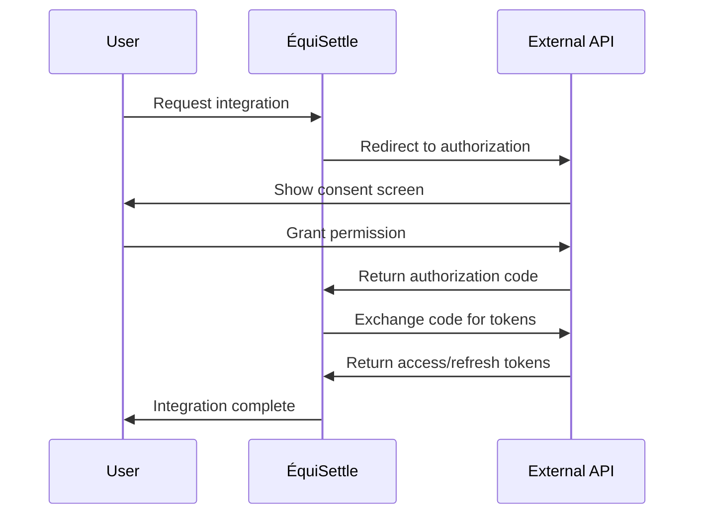
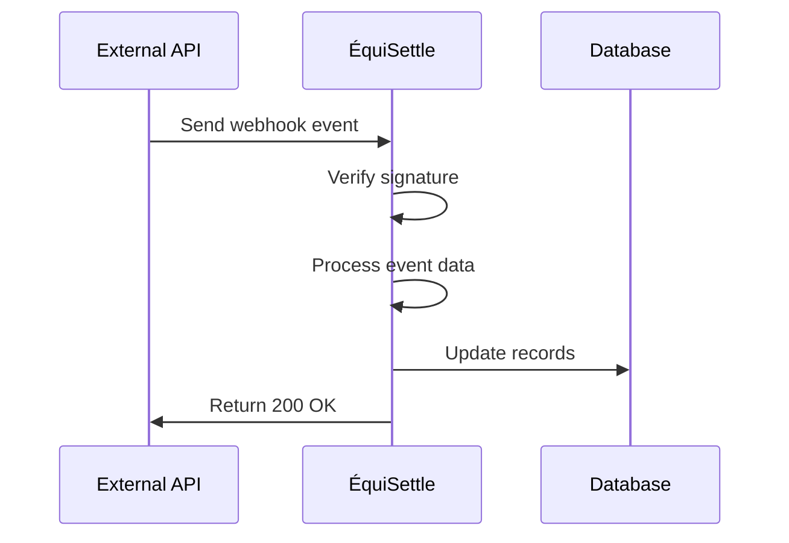

# Integrations Overview

The ÉquiSettle platform features 12+ comprehensive integrations with leading business software platforms, enabling seamless data synchronization and automated workflows across the entire debt collection ecosystem.

## Integration Architecture

### Integration Design Principles

1. **OAuth 2.0 First**: Secure authentication using industry standards
2. **Bidirectional Sync**: Two-way data flow where applicable
3. **Real-time Updates**: Webhook-based event processing
4. **Error Resilience**: Comprehensive error handling and retry logic
5. **Rate Limiting**: Respectful API usage with built-in throttling
6. **Data Integrity**: Validation and conflict resolution

### Common Integration Patterns

#### OAuth 2.0 Flow


#### Webhook Processing


## Integration Categories

### 🏢 Accounting Systems

Comprehensive integrations with major accounting platforms for invoice and customer data synchronization.

| Integration | Features | Sync Type | Webhooks |
|-------------|----------|-----------|----------|
| **[QuickBooks](./quickbooks)** | Invoices, Customers, Payments | Bidirectional | ✅ |
| **[Sage](./sage)** | Invoices, Contacts, Transactions | Bidirectional | ✅ |
| **[Xero](./xero)** | Invoices, Contacts, Payments | Bidirectional | ✅ |
| **[FreeAgent](./freeagent)** | Invoices, Contacts, Expenses | Bidirectional | ✅ |

#### Key Capabilities
- **Invoice Synchronization**: Automatic invoice creation and status updates
- **Customer Data Sync**: Bidirectional customer information management
- **Payment Tracking**: Real-time payment status updates
- **Debt Case Creation**: Automatic debt case generation from overdue invoices

### ⚖️ Legal Practice Management

Specialized integrations for legal firms and practice management systems.

| Integration | Features | Sync Type | Webhooks |
|-------------|----------|-----------|----------|
| **[Clio](./clio)** | Clients, Bills, Activities, Time Entries | Bidirectional | ✅ |

#### Key Capabilities
- **Client Management**: Complete client data synchronization
- **Bill Processing**: Automated billing and payment tracking
- **Activity Logging**: Comprehensive activity and time tracking
- **Legal Workflow Integration**: Specialized debt collection workflows for legal firms

### 🎯 CRM Systems

Customer relationship management platform integrations for enhanced client data management.

| Integration | Features | Sync Type | Webhooks |
|-------------|----------|-----------|----------|
| **[Salesforce](./salesforce)** | Accounts, Contacts, Opportunities | Bidirectional | ✅ |
| **[Zoho CRM](./zoho)** | Contacts, Deals, Activities | Bidirectional | ✅ |

#### Key Capabilities
- **Contact Management**: Unified customer data across platforms
- **Sales Pipeline Integration**: Debt collection impact on sales opportunities
- **Activity Tracking**: Comprehensive customer interaction history
- **Lead Management**: Converting prospects to collection cases

### 💳 Payment Processing

Multiple payment gateway integrations for flexible payment collection options.

| Integration | Features | Sync Type | Webhooks |
|-------------|----------|-----------|----------|
| **[GoCardless](./gocardless)** | Direct Debits, Mandates, Refunds | Real-time | ✅ |
| **[Stripe](./stripe)** | Card Payments, Subscriptions | Real-time | ✅ |
| **[ChargeBee](./chargebee)** | Subscription Billing, Dunning | Real-time | ✅ |

#### Key Capabilities
- **Payment Collection**: Multiple payment method support
- **Automated Retries**: Smart payment retry logic
- **Mandate Management**: Direct debit authorization handling
- **Subscription Management**: Recurring payment processing

### 📧 Communication Platforms

Multi-channel communication integrations for customer engagement.

| Integration | Features | Sync Type | Webhooks |
|-------------|----------|-----------|----------|
| **[Gmail](./gmail)** | Email Automation, Templates | Real-time | ✅ |
| **[SMS Providers](./sms)** | Text Messaging, Reminders | Real-time | ✅ |
| **[WhatsApp Business](./whatsapp)** | Rich Messaging, Templates | Real-time | ✅ |

#### Key Capabilities
- **Automated Communications**: Template-based messaging
- **Multi-channel Delivery**: Email, SMS, and WhatsApp support
- **Delivery Tracking**: Read receipts and engagement metrics
- **Personalization**: Dynamic content based on case data

### 🤖 AI & Analytics

Artificial intelligence and analytics platform integrations for enhanced capabilities.

| Integration | Features | Sync Type | Webhooks |
|-------------|----------|-----------|----------|
| **[ChatGPT](./chatgpt)** | Content Generation, Analysis | Real-time | ❌ |
| **[Predictive Analytics](./predictive-analytics)** | Risk Assessment, Forecasting | Batch | ❌ |

#### Key Capabilities
- **Content Generation**: AI-powered communication templates
- **Sentiment Analysis**: Customer communication analysis
- **Risk Scoring**: Predictive debt collection success rates
- **Behavioral Analysis**: Customer payment pattern analysis

## Integration Management

### Configuration Management

Each integration follows a consistent configuration pattern:

```javascript
// Integration configuration structure
const integrationConfig = {
  // OAuth credentials
  clientId: process.env.INTEGRATION_CLIENT_ID,
  clientSecret: process.env.INTEGRATION_CLIENT_SECRET,
  redirectUri: process.env.INTEGRATION_REDIRECT_URI,

  // API configuration
  apiBaseUrl: process.env.INTEGRATION_API_URL,
  apiVersion: process.env.INTEGRATION_API_VERSION,
  environment: process.env.INTEGRATION_ENVIRONMENT, // sandbox | production

  // Webhook configuration
  webhookSecret: process.env.INTEGRATION_WEBHOOK_SECRET,
  webhookEndpoint: '/api/v1/webhooks/integration-name',

  // Rate limiting
  rateLimitRequests: 100,
  rateLimitWindow: 60000, // 1 minute

  // Retry configuration
  maxRetries: 3,
  retryDelay: 1000,
  backoffMultiplier: 2
};
```

### Token Management

Centralized token management system for OAuth integrations:

```javascript
class TokenManager {
  async getValidToken(companyId, integration) {
    const tokenData = await this.getStoredToken(companyId, integration);

    // Check if token needs refresh
    if (this.isTokenExpired(tokenData)) {
      return await this.refreshToken(companyId, integration, tokenData);
    }

    return tokenData.accessToken;
  }

  async refreshToken(companyId, integration, tokenData) {
    try {
      const response = await this.callRefreshEndpoint(integration, tokenData.refreshToken);
      await this.storeToken(companyId, integration, response);
      return response.accessToken;
    } catch (error) {
      await this.handleTokenRefreshError(companyId, integration, error);
      throw new Error('Token refresh failed');
    }
  }
}
```

### Error Handling

Standardized error handling across all integrations:

```javascript
class IntegrationErrorHandler {
  handleApiError(error, integration, operation) {
    const errorInfo = {
      integration,
      operation,
      timestamp: new Date(),
      error: this.sanitizeError(error)
    };

    switch (error.status) {
      case 401:
        return this.handleUnauthorized(errorInfo);
      case 403:
        return this.handleForbidden(errorInfo);
      case 429:
        return this.handleRateLimited(errorInfo);
      case 500:
        return this.handleServerError(errorInfo);
      default:
        return this.handleGenericError(errorInfo);
    }
  }

  async handleRateLimited(errorInfo) {
    const retryAfter = this.getRetryDelay(errorInfo);
    await this.scheduleRetry(errorInfo, retryAfter);
    throw new RateLimitError(`Rate limited for ${errorInfo.integration}`);
  }
}
```

## Data Synchronization

### Sync Strategies

#### Real-time Synchronization
- **Webhook Events**: Immediate processing of external changes
- **API Polling**: Regular checks for updates (fallback)
- **Event-driven Updates**: Internal changes trigger external updates

#### Batch Synchronization
- **Scheduled Jobs**: Regular bulk data synchronization
- **Delta Sync**: Only sync changes since last update
- **Full Refresh**: Complete data resynchronization (periodic)

### Conflict Resolution

```javascript
class ConflictResolver {
  async resolveConflict(localData, externalData, conflictType) {
    switch (conflictType) {
      case 'TIMESTAMP_CONFLICT':
        return this.resolveByTimestamp(localData, externalData);

      case 'AMOUNT_CONFLICT':
        return this.resolveByAmountValidation(localData, externalData);

      case 'STATUS_CONFLICT':
        return this.resolveByBusinessRules(localData, externalData);

      default:
        return this.resolveByPriority(localData, externalData);
    }
  }

  resolveByTimestamp(localData, externalData) {
    return localData.updatedAt > externalData.updatedAt ? localData : externalData;
  }
}
```

## Integration Security

### Authentication Security

#### OAuth 2.0 Best Practices
- **PKCE Support**: Proof Key for Code Exchange when available
- **State Parameter**: CSRF protection for OAuth flows
- **Secure Storage**: Encrypted token storage in database
- **Token Rotation**: Regular refresh token rotation

#### API Security
- **Request Signing**: HMAC signature validation for webhooks
- **IP Allowlisting**: Restrict webhook sources where possible
- **Rate Limiting**: Prevent abuse and respect API limits
- **SSL/TLS**: All communications over HTTPS

### Data Protection

#### Sensitive Data Handling
```javascript
class DataProtection {
  encryptSensitiveData(data) {
    const sensitiveFields = ['bankDetails', 'cardNumber', 'socialSecurityNumber'];

    return Object.keys(data).reduce((encrypted, key) => {
      if (sensitiveFields.includes(key)) {
        encrypted[key] = this.encrypt(data[key]);
      } else {
        encrypted[key] = data[key];
      }
      return encrypted;
    }, {});
  }

  sanitizeLoggingData(data) {
    const sensitivePatterns = [
      /\b\d{4}[-\s]?\d{4}[-\s]?\d{4}[-\s]?\d{4}\b/, // Credit card numbers
      /\b[A-Za-z0-9._%+-]+@[A-Za-z0-9.-]+\.[A-Z|a-z]{2,}\b/, // Email addresses
      /\b\d{3}-\d{2}-\d{4}\b/ // SSN patterns
    ];

    let sanitized = JSON.stringify(data);
    sensitivePatterns.forEach(pattern => {
      sanitized = sanitized.replace(pattern, '[REDACTED]');
    });

    return JSON.parse(sanitized);
  }
}
```

## Monitoring and Analytics

### Integration Health Monitoring

```javascript
class IntegrationMonitor {
  async checkIntegrationHealth(integration) {
    const health = {
      integration,
      status: 'healthy',
      lastSync: null,
      errorRate: 0,
      avgResponseTime: 0,
      issues: []
    };

    try {
      // Test API connectivity
      const response = await this.testApiConnection(integration);
      health.avgResponseTime = response.duration;

      // Check sync status
      health.lastSync = await this.getLastSyncTime(integration);

      // Calculate error rate
      health.errorRate = await this.calculateErrorRate(integration);

      // Identify issues
      health.issues = await this.identifyIssues(integration);

      if (health.errorRate > 0.1 || health.issues.length > 0) {
        health.status = 'degraded';
      }

    } catch (error) {
      health.status = 'unhealthy';
      health.issues.push(`Connection failed: ${error.message}`);
    }

    return health;
  }
}
```

### Usage Analytics

```javascript
class IntegrationAnalytics {
  async getIntegrationMetrics(companyId, timeRange) {
    return {
      apiCallVolume: await this.getApiCallVolume(companyId, timeRange),
      syncSuccessRate: await this.getSyncSuccessRate(companyId, timeRange),
      dataVolume: await this.getDataVolume(companyId, timeRange),
      popularEndpoints: await this.getPopularEndpoints(companyId, timeRange),
      errorBreakdown: await this.getErrorBreakdown(companyId, timeRange)
    };
  }
}
```

## Getting Started with Integrations

### Setup Checklist

1. **Environment Variables**: Configure integration credentials
2. **OAuth Setup**: Register application with external service
3. **Webhook Configuration**: Set up webhook endpoints
4. **Test Connection**: Verify authentication and basic functionality
5. **Data Mapping**: Configure field mappings between systems
6. **Sync Schedule**: Set up automated synchronization jobs

### Integration Testing

```bash
# Test integration connectivity
curl -X GET http://localhost:8000/api/v1/integrations/quickbooks/test \
  -H "Authorization: Bearer $JWT_TOKEN"

# Trigger manual sync
curl -X POST http://localhost:8000/api/v1/integrations/quickbooks/sync \
  -H "Authorization: Bearer $JWT_TOKEN" \
  -H "Content-Type: application/json" \
  -d '{"syncType": "incremental"}'

# Check integration status
curl -X GET http://localhost:8000/api/v1/integrations/status \
  -H "Authorization: Bearer $JWT_TOKEN"
```

## Next Steps

### Individual Integration Guides
- **[QuickBooks Integration](./quickbooks)** - Complete QuickBooks setup and usage
- **[Zoho Integration](./zoho)** - Zoho CRM and Books configuration
- **[Clio Integration](./clio)** - Legal practice management setup
- **[Payment Gateways](./gocardless)** - Payment processing configuration

### Advanced Topics
- **[Custom Integrations](../development/patterns#custom-integrations)** - Building new integrations
- **[Webhook Security](../development/security#webhook-security)** - Securing webhook endpoints
- **[Rate Limiting](../development/patterns#rate-limiting)** - Managing API limits
- **[Error Handling](../troubleshooting/integrations)** - Troubleshooting integration issues

The ÉquiSettle platform's comprehensive integration ecosystem provides seamless connectivity with your existing business tools, enabling automated workflows and centralized debt collection management across all your systems.