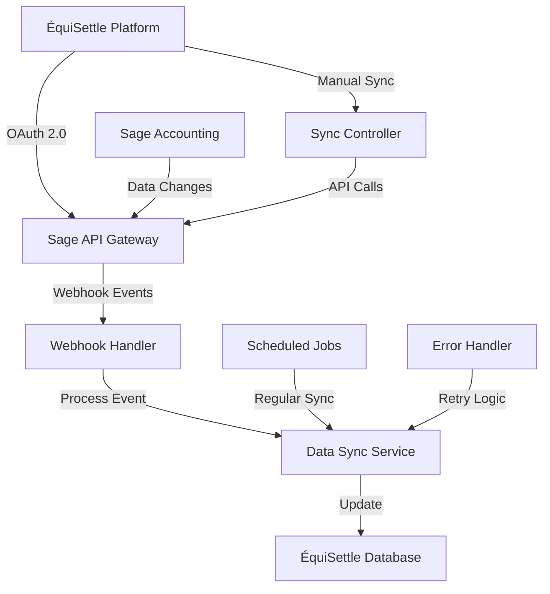
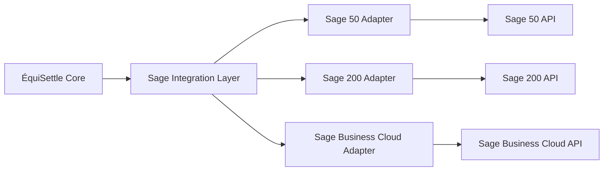

# Sage Integration

The ÉquiSettle Sage integration provides comprehensive connectivity with Sage accounting platforms (Sage 50, Sage 200, Sage Business Cloud), enabling automated invoice synchronization, customer management, and financial data flow.

## DiagramEmbed Component Support

```jsx
import DiagramEmbed from '@/components/DiagramEmbed';

// Display Sage architecture diagram
<DiagramEmbed
  diagramUrl="YOUR_DRAW_IO_URL"
  sheetName="Sage Integration Flow"
  title="Sage Integration Architecture"
  height="600px"
/>
```

## Overview

Sage is a leading provider of business management software, serving over 6 million customers worldwide. Our integration supports:

- **Multi-Product Support**: Sage 50, Sage 200, Sage Business Cloud
- **Real-time Synchronization**: Webhook and API-based data flow
- **Comprehensive Data Sync**: Customers, invoices, payments, and transactions
- **Automated Workflows**: Debt case creation from overdue invoices

## Features

### Supported Sage Products

| Product | API Version | Sync Capabilities | Real-time Events |
|---------|-------------|-------------------|------------------|
| **Sage 50** | REST API v3 | Customers, Invoices, Payments | Limited |
| **Sage 200** | REST API v1 | Full ERP Integration | ✅ |
| **Sage Business Cloud** | REST API v3.1 | Complete Cloud Integration | ✅ |

### Core Capabilities

| Feature | Description | Sync Direction |
|---------|-------------|----------------|
| **Customer Management** | Contact sync, credit limits, payment terms | Bidirectional |
| **Invoice Processing** | Sales invoices, credit notes, status updates | Bidirectional |
| **Payment Tracking** | Payment allocations, receipts, refunds | From Sage |
| **Product Sync** | Items, services, price lists | From Sage |
| **Financial Reporting** | Aged debtors, trial balance data | From Sage |

## Architecture

### Integration Flow



### Multi-Product Architecture



## Implementation

### Service Layer

```javascript
// src/integration-layer/sage/services/SageService.js
class SageService {
  constructor() {
    this.adapters = {
      'sage50': new Sage50Adapter(),
      'sage200': new Sage200Adapter(),
      'sage_business_cloud': new SageBusinessCloudAdapter()
    };
    this.tokenManager = new TokenManager();
  }

  async initializeConnection(companyId, sageProduct, authData) {
    try {
      const adapter = this.getAdapter(sageProduct);
      const connection = await adapter.initialize(authData);

      await this.storeConnectionInfo(companyId, sageProduct, connection);

      return {
        success: true,
        productType: sageProduct,
        companyInfo: connection.companyInfo
      };
    } catch (error) {
      throw new SageIntegrationError('Failed to initialize Sage connection', error);
    }
  }

  async syncCustomers(companyId, options = {}) {
    const connectionInfo = await this.getConnectionInfo(companyId);
    const adapter = this.getAdapter(connectionInfo.productType);

    try {
      const customers = await adapter.getCustomers({
        modifiedSince: options.lastSync,
        includeInactive: false
      });

      const syncResults = [];

      for (const customer of customers) {
        const result = await this.processCustomer(companyId, customer);
        syncResults.push(result);
      }

      return {
        success: true,
        processed: syncResults.length,
        results: syncResults
      };
    } catch (error) {
      throw new SageSyncError('Customer sync failed', error);
    }
  }

  async syncInvoices(companyId, options = {}) {
    const connectionInfo = await this.getConnectionInfo(companyId);
    const adapter = this.getAdapter(connectionInfo.productType);

    try {
      const invoices = await adapter.getInvoices({
        modifiedSince: options.lastSync,
        includeVoided: false
      });

      const syncResults = [];

      for (const invoice of invoices) {
        const result = await this.processInvoice(companyId, invoice);
        syncResults.push(result);

        // Check for overdue invoices
        if (this.isOverdue(invoice)) {
          await this.createDebtCase(companyId, invoice);
        }
      }

      return {
        success: true,
        processed: syncResults.length,
        results: syncResults
      };
    } catch (error) {
      throw new SageSyncError('Invoice sync failed', error);
    }
  }

  getAdapter(productType) {
    const adapter = this.adapters[productType];
    if (!adapter) {
      throw new Error(`Unsupported Sage product: ${productType}`);
    }
    return adapter;
  }
}
```

### Sage Business Cloud Adapter

```javascript
// src/integration-layer/sage/adapters/SageBusinessCloudAdapter.js
class SageBusinessCloudAdapter {
  constructor() {
    this.baseUrl = 'https://api.columbus.sage.com/uk/sbc/accounts/v3.1';
    this.clientId = process.env.SAGE_BC_CLIENT_ID;
    this.clientSecret = process.env.SAGE_BC_CLIENT_SECRET;
  }

  async initialize(authData) {
    try {
      const tokens = await this.exchangeAuthCode(authData.code);
      const companyInfo = await this.getCompanyInfo(tokens.accessToken);

      return {
        tokens,
        companyInfo,
        productType: 'sage_business_cloud'
      };
    } catch (error) {
      throw new SageAuthError('Failed to initialize Sage Business Cloud', error);
    }
  }

  async getCustomers(options = {}) {
    const token = await this.getValidToken();

    const params = new URLSearchParams({
      $filter: this.buildCustomerFilter(options),
      $select: 'id,name,email,telephone,address,creditLimit,paymentTerms,isActive',
      $orderby: 'updatedAt desc'
    });

    try {
      const response = await this.makeRequest(
        `${this.baseUrl}/contacts?${params}`,
        { headers: { Authorization: `Bearer ${token}` } }
      );

      return response.data.items.map(this.mapCustomer);
    } catch (error) {
      throw new SageApiError('Failed to fetch customers', error);
    }
  }

  async getInvoices(options = {}) {
    const token = await this.getValidToken();

    const params = new URLSearchParams({
      $filter: this.buildInvoiceFilter(options),
      $select: 'id,invoiceNumber,contact,date,dueDate,totalAmount,outstandingAmount,status',
      $orderby: 'updatedAt desc'
    });

    try {
      const response = await this.makeRequest(
        `${this.baseUrl}/sales_invoices?${params}`,
        { headers: { Authorization: `Bearer ${token}` } }
      );

      return response.data.items.map(this.mapInvoice);
    } catch (error) {
      throw new SageApiError('Failed to fetch invoices', error);
    }
  }

  buildCustomerFilter(options) {
    const filters = [];

    if (options.modifiedSince) {
      filters.push(`updatedAt gt ${options.modifiedSince.toISOString()}`);
    }

    if (!options.includeInactive) {
      filters.push('isActive eq true');
    }

    return filters.join(' and ');
  }

  buildInvoiceFilter(options) {
    const filters = ['invoice_type eq "SALES_INVOICE"'];

    if (options.modifiedSince) {
      filters.push(`updatedAt gt ${options.modifiedSince.toISOString()}`);
    }

    if (!options.includeVoided) {
      filters.push('status ne "VOID"');
    }

    return filters.join(' and ');
  }

  mapCustomer(sageCustomer) {
    return {
      externalId: sageCustomer.id,
      name: sageCustomer.name,
      email: sageCustomer.email,
      phone: sageCustomer.telephone,
      address: this.mapAddress(sageCustomer.address),
      creditLimit: sageCustomer.creditLimit,
      paymentTerms: sageCustomer.paymentTerms?.daysFromInvoice || 30,
      isActive: sageCustomer.isActive,
      source: 'sage_business_cloud'
    };
  }

  mapInvoice(sageInvoice) {
    return {
      externalId: sageInvoice.id,
      invoiceNumber: sageInvoice.invoiceNumber,
      customerId: sageInvoice.contact?.id,
      issueDate: new Date(sageInvoice.date),
      dueDate: new Date(sageInvoice.dueDate),
      totalAmount: sageInvoice.totalAmount,
      outstandingAmount: sageInvoice.outstandingAmount,
      status: this.mapInvoiceStatus(sageInvoice.status),
      source: 'sage_business_cloud'
    };
  }

  mapInvoiceStatus(sageStatus) {
    const statusMap = {
      'DRAFT': 'draft',
      'SENT': 'sent',
      'PAID': 'paid',
      'PARTIALLY_PAID': 'partial',
      'OVERDUE': 'overdue',
      'VOID': 'cancelled'
    };
    return statusMap[sageStatus] || 'unknown';
  }
}
```

### Sage 50 Adapter

```javascript
// src/integration-layer/sage/adapters/Sage50Adapter.js
class Sage50Adapter {
  constructor() {
    this.baseUrl = process.env.SAGE50_API_URL || 'http://localhost:5493/sdata/accounts50/gw';
    this.username = process.env.SAGE50_USERNAME;
    this.password = process.env.SAGE50_PASSWORD;
  }

  async initialize(authData) {
    try {
      // Sage 50 uses basic authentication
      const companyInfo = await this.testConnection();

      return {
        companyInfo,
        productType: 'sage50',
        authType: 'basic'
      };
    } catch (error) {
      throw new SageAuthError('Failed to connect to Sage 50', error);
    }
  }

  async getCustomers(options = {}) {
    try {
      const response = await this.makeRequest('/customer', {
        auth: {
          username: this.username,
          password: this.password
        },
        params: {
          format: 'json',
          where: this.buildCustomerWhere(options)
        }
      });

      return response.data.$resources.map(this.mapSage50Customer);
    } catch (error) {
      throw new SageApiError('Failed to fetch Sage 50 customers', error);
    }
  }

  async getInvoices(options = {}) {
    try {
      const response = await this.makeRequest('/salesInvoice', {
        auth: {
          username: this.username,
          password: this.password
        },
        params: {
          format: 'json',
          where: this.buildInvoiceWhere(options)
        }
      });

      return response.data.$resources.map(this.mapSage50Invoice);
    } catch (error) {
      throw new SageApiError('Failed to fetch Sage 50 invoices', error);
    }
  }

  mapSage50Customer(sage50Customer) {
    return {
      externalId: sage50Customer.reference,
      name: sage50Customer.name,
      email: sage50Customer.email,
      phone: sage50Customer.telephone,
      address: {
        street: sage50Customer.postalAddress?.address1,
        city: sage50Customer.postalAddress?.town,
        state: sage50Customer.postalAddress?.county,
        postalCode: sage50Customer.postalAddress?.postcode,
        country: sage50Customer.postalAddress?.country
      },
      creditLimit: sage50Customer.creditLimit,
      paymentTerms: sage50Customer.paymentTerms || 30,
      isActive: sage50Customer.isActive,
      source: 'sage50'
    };
  }

  mapSage50Invoice(sage50Invoice) {
    return {
      externalId: sage50Invoice.uuid,
      invoiceNumber: sage50Invoice.reference,
      customerId: sage50Invoice.customer?.reference,
      issueDate: new Date(sage50Invoice.date),
      dueDate: new Date(sage50Invoice.dueDate),
      totalAmount: sage50Invoice.grossTotal,
      outstandingAmount: sage50Invoice.outstandingAmount,
      status: this.mapSage50InvoiceStatus(sage50Invoice.status),
      source: 'sage50'
    };
  }

  mapSage50InvoiceStatus(status) {
    const statusMap = {
      'Entered': 'draft',
      'Printed': 'sent',
      'Paid': 'paid',
      'Part Paid': 'partial',
      'Cancelled': 'cancelled'
    };
    return statusMap[status] || 'unknown';
  }
}
```

### Webhook Handler

```javascript
// src/integration-layer/sage/webhooks/sageWebhookHandler.js
class SageWebhookHandler {
  async handleWebhook(req, res) {
    try {
      // Verify webhook signature (Sage Business Cloud only)
      if (req.headers['x-sage-signature']) {
        if (!this.verifySageSignature(req.body, req.headers['x-sage-signature'])) {
          return res.status(401).json({ error: 'Invalid signature' });
        }
      }

      const events = Array.isArray(req.body) ? req.body : [req.body];

      for (const event of events) {
        await this.processEvent(event);
      }

      res.status(200).json({ status: 'success' });
    } catch (error) {
      console.error('Sage webhook error:', error);
      res.status(500).json({ error: 'Webhook processing failed' });
    }
  }

  async processEvent(event) {
    const { eventType, resourceType, resourceId, companyId } = event;

    const localCompanyId = await this.getLocalCompanyId(companyId);
    if (!localCompanyId) {
      console.warn(`No local company found for Sage company: ${companyId}`);
      return;
    }

    switch (resourceType) {
      case 'contacts':
      case 'customers':
        await this.handleCustomerEvent(localCompanyId, eventType, resourceId);
        break;

      case 'sales_invoices':
      case 'invoices':
        await this.handleInvoiceEvent(localCompanyId, eventType, resourceId);
        break;

      case 'payments':
        await this.handlePaymentEvent(localCompanyId, eventType, resourceId);
        break;

      default:
        console.log(`Unhandled Sage resource type: ${resourceType}`);
    }
  }

  async handleInvoiceEvent(companyId, eventType, invoiceId) {
    try {
      const connectionInfo = await this.getConnectionInfo(companyId);
      const adapter = sageService.getAdapter(connectionInfo.productType);

      switch (eventType) {
        case 'created':
        case 'updated':
          const invoice = await adapter.getInvoiceById(invoiceId);
          await this.syncInvoiceToLocal(companyId, invoice);

          // Check if invoice is overdue
          if (sageService.isOverdue(invoice)) {
            await sageService.createDebtCase(companyId, invoice);
          }
          break;

        case 'deleted':
          await this.handleInvoiceDelete(companyId, invoiceId);
          break;
      }
    } catch (error) {
      console.error(`Failed to handle Sage invoice event ${eventType}:`, error);
    }
  }
}
```

## Data Mapping

### Universal Customer Mapping

```javascript
const customerMapping = {
  // Universal mapping for all Sage products
  fromSage: (sageCustomer, productType) => {
    const baseMapping = {
      externalId: sageCustomer.id || sageCustomer.reference,
      name: sageCustomer.name,
      email: sageCustomer.email,
      phone: sageCustomer.telephone || sageCustomer.phone,
      isActive: sageCustomer.isActive !== false,
      source: productType
    };

    // Product-specific mappings
    switch (productType) {
      case 'sage_business_cloud':
        return {
          ...baseMapping,
          address: this.mapBusinessCloudAddress(sageCustomer.address),
          creditLimit: sageCustomer.creditLimit,
          paymentTerms: sageCustomer.paymentTerms?.daysFromInvoice || 30
        };

      case 'sage50':
        return {
          ...baseMapping,
          address: this.mapSage50Address(sageCustomer.postalAddress),
          creditLimit: sageCustomer.creditLimit,
          paymentTerms: sageCustomer.paymentTerms || 30
        };

      case 'sage200':
        return {
          ...baseMapping,
          address: this.mapSage200Address(sageCustomer.addresses?.[0]),
          creditLimit: sageCustomer.creditLimit?.amount,
          paymentTerms: sageCustomer.defaultPaymentTerms?.daysFromInvoice || 30
        };

      default:
        return baseMapping;
    }
  },

  toSage: (localCustomer, productType) => {
    const baseMapping = {
      name: localCustomer.name,
      email: localCustomer.email,
      telephone: localCustomer.phone,
      isActive: localCustomer.isActive
    };

    switch (productType) {
      case 'sage_business_cloud':
        return {
          ...baseMapping,
          address: this.mapToBusinessCloudAddress(localCustomer.address),
          creditLimit: localCustomer.creditLimit,
          paymentTerms: {
            daysFromInvoice: localCustomer.paymentTerms || 30
          }
        };

      case 'sage50':
        return {
          ...baseMapping,
          reference: localCustomer.externalId,
          postalAddress: this.mapToSage50Address(localCustomer.address),
          creditLimit: localCustomer.creditLimit,
          paymentTerms: localCustomer.paymentTerms || 30
        };

      default:
        return baseMapping;
    }
  }
};
```

## Scheduled Synchronization

### Multi-Product Sync Jobs

```javascript
// src/integration-layer/sage/jobs/sageSyncJobs.js
class SageSyncJobs {
  async syncAllSageCompanies() {
    const companies = await this.getCompaniesWithSageIntegration();

    for (const company of companies) {
      try {
        const connectionInfo = await this.getConnectionInfo(company.id);

        switch (connectionInfo.productType) {
          case 'sage_business_cloud':
            await this.syncBusinessCloud(company.id);
            break;

          case 'sage50':
            await this.syncSage50(company.id);
            break;

          case 'sage200':
            await this.syncSage200(company.id);
            break;
        }

        await this.updateLastSync(company.id);
      } catch (error) {
        console.error(`Sage sync failed for company ${company.id}:`, error);
        await this.logSyncError(company.id, error);
      }
    }
  }

  async syncBusinessCloud(companyId) {
    // Real-time sync supported via webhooks
    const lastSync = await this.getLastSync(companyId);

    await sageService.syncCustomers(companyId, { lastSync });
    await sageService.syncInvoices(companyId, { lastSync });
  }

  async syncSage50(companyId) {
    // Polling-based sync (no webhooks)
    await sageService.syncCustomers(companyId, { syncType: 'full' });
    await sageService.syncInvoices(companyId, { syncType: 'full' });
  }

  async syncSage200(companyId) {
    // Hybrid approach
    const lastSync = await this.getLastSync(companyId);

    await sageService.syncCustomers(companyId, { lastSync });
    await sageService.syncInvoices(companyId, { lastSync });
  }
}
```

## Configuration

### Environment Variables

```bash
# Sage Business Cloud
SAGE_BC_CLIENT_ID=your_client_id
SAGE_BC_CLIENT_SECRET=your_client_secret
SAGE_BC_REDIRECT_URI=https://your-domain.com/api/v1/integrations/sage/callback

# Sage 50 (Local Installation)
SAGE50_API_URL=http://localhost:5493/sdata/accounts50/gw
SAGE50_USERNAME=your_username
SAGE50_PASSWORD=your_password

# Sage 200 (SQL Server)
SAGE200_SQL_SERVER=your_sql_server
SAGE200_DATABASE=your_database
SAGE200_USERNAME=your_username
SAGE200_PASSWORD=your_password

# Webhook Configuration
SAGE_WEBHOOK_SECRET=your_webhook_secret
SAGE_WEBHOOK_ENDPOINT=/api/v1/webhooks/sage
```

## Testing

### Integration Tests

```javascript
// tests/integration/sage.test.js
describe('Sage Integration', () => {
  describe('Multi-Product Support', () => {
    test('should detect Sage product type correctly', async () => {
      const businessCloudResult = await sageService.detectProductType('business_cloud_auth');
      expect(businessCloudResult.productType).toBe('sage_business_cloud');

      const sage50Result = await sageService.detectProductType('sage50_auth');
      expect(sage50Result.productType).toBe('sage50');
    });

    test('should use correct adapter for each product', async () => {
      const bcAdapter = sageService.getAdapter('sage_business_cloud');
      expect(bcAdapter).toBeInstanceOf(SageBusinessCloudAdapter);

      const sage50Adapter = sageService.getAdapter('sage50');
      expect(sage50Adapter).toBeInstanceOf(Sage50Adapter);
    });
  });

  describe('Data Synchronization', () => {
    test('should sync customers from all Sage products', async () => {
      const products = ['sage_business_cloud', 'sage50', 'sage200'];

      for (const product of products) {
        const result = await sageService.syncCustomers(testCompanyId, { productType: product });
        expect(result.success).toBe(true);
      }
    });

    test('should handle product-specific data formats', async () => {
      const businessCloudCustomer = {
        id: 'bc-123',
        name: 'Test Customer',
        email: 'test@example.com',
        creditLimit: 1000
      };

      const mapped = customerMapping.fromSage(businessCloudCustomer, 'sage_business_cloud');
      expect(mapped.source).toBe('sage_business_cloud');
      expect(mapped.creditLimit).toBe(1000);
    });
  });
});
```

## Best Practices

### Multi-Product Strategy

1. **Adapter Pattern**: Use separate adapters for each Sage product
2. **Universal Mapping**: Create consistent data models across products
3. **Capability Detection**: Detect and handle product-specific features
4. **Graceful Degradation**: Handle missing features in older products

### Performance Optimization

1. **Product-Specific Strategies**: Use webhooks where available, polling where not
2. **Batch Processing**: Group operations for better performance
3. **Connection Pooling**: Reuse connections for Sage 50/200
4. **Caching**: Cache frequently accessed data

## Troubleshooting

### Common Issues

| Issue | Product | Cause | Solution |
|-------|---------|-------|----------|
| Connection Timeout | Sage 50 | Local service not running | Start Sage 50 and SData service |
| Authentication Failed | Business Cloud | Expired tokens | Refresh OAuth tokens |
| Rate Limiting | Business Cloud | Too many API calls | Implement rate limiting |
| Data Format Error | All | Product version differences | Update data mapping |

### Product-Specific Debugging

```bash
# Test Sage Business Cloud API
curl -X GET "https://api.columbus.sage.com/uk/sbc/accounts/v3.1/contacts" \
  -H "Authorization: Bearer $ACCESS_TOKEN"

# Test Sage 50 SData API
curl -X GET "http://localhost:5493/sdata/accounts50/gw/customer" \
  --user "$USERNAME:$PASSWORD"

# Check Sage 200 SQL connection
sqlcmd -S $SQL_SERVER -d $DATABASE -U $USERNAME -P $PASSWORD -Q "SELECT TOP 1 * FROM SLCustomerAccount"
```

## Support

For Sage integration support:

1. **Sage Developer Portal**: [developer.sage.com](https://developer.sage.com)
2. **Sage Business Cloud API**: [developer.sage.com/business-cloud](https://developer.sage.com/business-cloud)
3. **Sage 50 SData**: [sdata.sage.com](https://sdata.sage.com)
4. **ÉquiSettle Support**: [support@equisettle.com](mailto:support@equisettle.com)

The Sage integration provides comprehensive multi-product support for businesses using any Sage accounting solution, enabling seamless debt collection workflows across the entire Sage ecosystem.