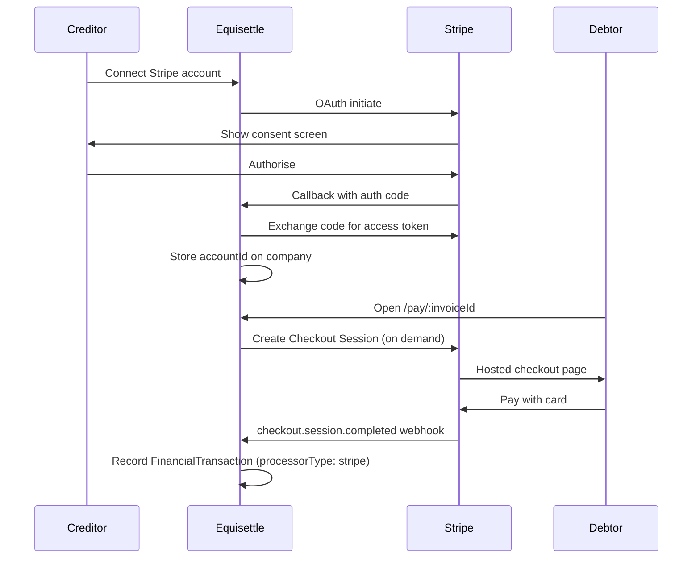

# Stripe Connect Integration

Stripe Connect enables Equisettle creditors (companies) to accept card payments from debtors without needing a GoCardless account. Uses the **destination charges** model — money flows directly to the connected creditor's Stripe account. Equisettle never holds funds, so no e-money licence is required.

## Architecture



### Key design decisions

- **On-demand sessions**: Checkout Sessions are created when the debtor clicks "Pay by Card", not upfront. This avoids the 24-hour expiry problem with pre-created sessions.
- **Destination charges**: `payment_intent_data.transfer_data.destination = company.integrations.stripeConnect.accountId`. Equisettle is the platform; the creditor is the destination.
- **Additive only**: Zero changes to GoCardless. Both providers coexist on the same invoice.

---

## Schema

### Company

```js
integrations: {
  stripeConnect: {
    accountId:   String,  // Stripe connected account ID (acct_xxx)
    accessToken: String,  // OAuth access token
    isActive:    Boolean,
    connectedAt: Date,
  }
}
```

### Invoice

```js
stripe: {
  sessionId:       String,
  paymentIntentId: String,
  paymentStatus:   String,  // pending | completed | failed
  lastUpdated:     Date,
},
paymentLinkProvider: String,  // "stripe" | "yapily" | "gocardless"
```

---

## Routes

| Method | Path | Auth | Description |
|--------|------|------|-------------|
| `GET` | `/api/v1/stripe-connect/initiate/:companyId` | JWT | Redirects to Stripe OAuth |
| `GET` | `/api/v1/stripe-connect/callback` | None | Exchanges code, stores credentials |
| `POST` | `/api/v1/stripe-connect/disconnect/:companyId` | JWT | Revokes and removes integration |
| `POST` | `/api/v1/public/pay/:invoiceId/stripe` | None | Creates Checkout Session on demand |
| `POST` | `/api/v1/webhooks/stripe/connect` | None (raw body) | Handles `checkout.session.completed` |

---

## Key Files

```
src/integration-layer/stripe-connect/
  stripeConnectOAuthController.js   — OAuth initiate, callback, disconnect
  stripeWebhookController.js        — checkout.session.completed handler
  routes.js

src/integration-layer/stripe-connect/utils/
  createStripePaymentLink.js        — Creates Checkout Session, returns URL
```

---

## OAuth Flow

### 1. Initiate

```
GET /api/v1/stripe-connect/initiate/:companyId
```

Validates the company belongs to the authenticated user, then redirects to:

```
https://connect.stripe.com/oauth/authorize?
  response_type=code&
  client_id=STRIPE_CONNECT_CLIENT_ID&
  scope=read_write&
  redirect_uri=STRIPE_CONNECT_REDIRECT_URI&
  state=companyId
```

### 2. Callback

```
GET /api/v1/stripe-connect/callback?code=xxx&state=companyId
```

Token exchange **must use `application/x-www-form-urlencoded`** (not JSON):

```js
await axios.post(
  "https://connect.stripe.com/oauth/token",
  new URLSearchParams({
    grant_type: "authorization_code",
    code,
    client_secret: process.env.STRIPE_PLATFORM_SECRET_KEY,
  })
);
```

Stores `accountId` and `accessToken` on `company.integrations.stripeConnect`.

---

## Webhook

Registered at `POST /api/v1/webhooks/stripe/connect`. Requires raw body for signature verification.

```js
// app.js — raw body middleware (must come before express.json())
app.use("/api/v1/webhooks/stripe/connect", express.raw({ type: "application/json" }), ...);
```

Handles `checkout.session.completed`:
1. Validates signature with `STRIPE_CONNECT_WEBHOOK_SECRET`
2. Looks up invoice by `session.metadata.invoiceId`
3. Calls `webhookTransactionService.handlePaymentSuccess({ processorType: 'stripe', ... })`
4. Updates `invoice.stripe.paymentStatus = 'completed'`

---

## Environment Variables

```bash
STRIPE_PLATFORM_SECRET_KEY=sk_live_...
STRIPE_CONNECT_CLIENT_ID=ca_...
STRIPE_CONNECT_REDIRECT_URI=https://eqs-platform-be.onrender.com/api/v1/stripe-connect/callback
STRIPE_CONNECT_WEBHOOK_SECRET=whsec_...
```

Register the redirect URI in the **Stripe Dashboard → Connect → Settings → Redirect URIs**.

---

## Remittance Table

Stripe payments appear in the remittance table via `FinancialTransaction` records. `remittanceService.js` merges ledger payments alongside legacy `Remittance` model entries:

```js
const ledgerPayments = await FinancialTransaction.find({
  company: companyId,
  type: "payment",
  processorType: "stripe",
});
// mapped to paymentMethod: "credit_card"
```

---

## Troubleshooting

| Issue | Cause | Fix |
|-------|-------|-----|
| 403 on OAuth initiate | `req.user.companyId` mismatch | Check `req.user.companies` array, not `companyId` |
| "No authentication provided" | Token exchange sent JSON body | Use `new URLSearchParams({...})` not `{ ... }` |
| 404 on callback | `STRIPE_CONNECT_REDIRECT_URI` wrong | Must point to BE URL, registered in Stripe Dashboard |
| Webhook not firing | Wrong endpoint registered | Register `POST /api/v1/webhooks/stripe/connect` in Stripe Dashboard under Connect webhooks |
