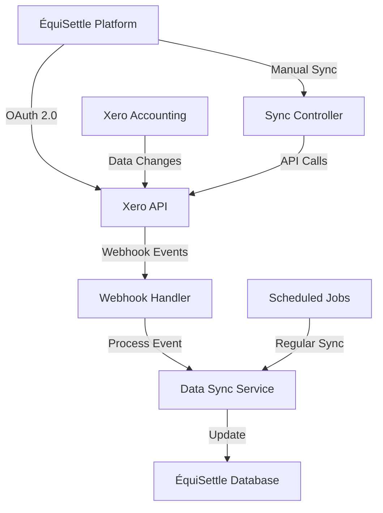
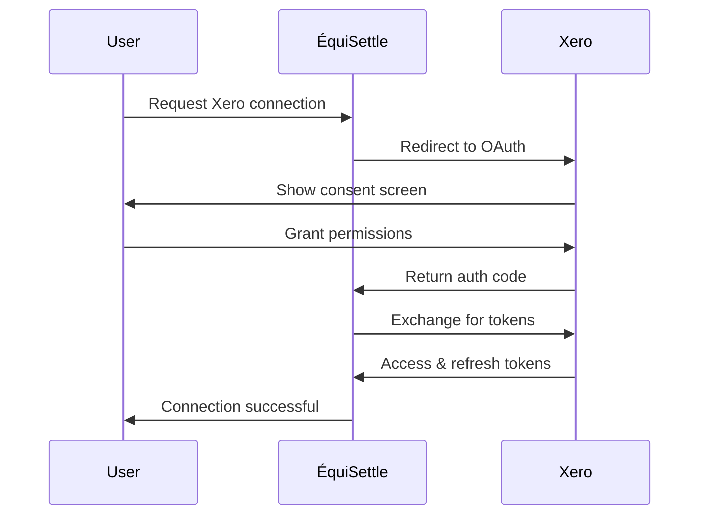

# Xero Integration

The ÉquiSettle Xero integration provides seamless bidirectional synchronization with Xero accounting software, enabling automatic invoice management, customer data sync, and payment tracking.

## DiagramEmbed Component Support

For multi-sheet diagrams, you can specify individual sheets:

```jsx
import DiagramEmbed from '@/components/DiagramEmbed';

// Display specific sheet by name
<DiagramEmbed
  diagramUrl="YOUR_DRAW_IO_URL"
  sheetName="Xero Data Flow"
  title="Xero Integration Architecture"
/>

// Display specific sheet by index (0-based)
<DiagramEmbed
  diagramUrl="YOUR_DRAW_IO_URL"
  sheetIndex={2}
  title="Xero Sync Process"
/>
```

## Overview

Xero is a leading cloud-based accounting software platform used by small to medium businesses worldwide. Our integration enables:

- **Bidirectional Data Sync**: Customer and invoice data flows both ways
- **Real-time Updates**: Webhook-based event processing
- **Payment Tracking**: Automatic payment status updates
- **Automated Debt Creation**: Convert overdue invoices to collection cases

## Features

### Core Capabilities

| Feature | Description | Sync Direction |
|---------|-------------|----------------|
| **Customer Sync** | Contact information, addresses, payment terms | Bidirectional |
| **Invoice Management** | Invoice creation, updates, status tracking | Bidirectional |
| **Payment Tracking** | Payment status, amounts, dates | From Xero |
| **Credit Notes** | Credit note creation and application | Bidirectional |
| **Aged Debtors** | Overdue invoice identification | From Xero |

### Supported Data Types

- **Contacts**: Customers, suppliers, contact persons
- **Invoices**: Sales invoices, purchase bills
- **Payments**: Bank transfers, cash payments, credit card payments
- **Items**: Products and services
- **Accounts**: Chart of accounts, bank accounts
- **Organizations**: Company information and settings

## Architecture

### Integration Flow



### Authentication Flow



## Setup and Configuration

### Prerequisites

1. **Xero Developer Account**: Register at [developer.xero.com](https://developer.xero.com)
2. **OAuth 2.0 App**: Create a new app in Xero Developer Console
3. **Scopes**: Configure required API scopes
4. **Webhook Endpoints**: Set up webhook URLs

### Environment Variables

```bash
# Xero OAuth Configuration
XERO_CLIENT_ID=your_client_id
XERO_CLIENT_SECRET=your_client_secret
XERO_REDIRECT_URI=https://your-domain.com/api/v1/integrations/xero/callback

# Xero API Configuration
XERO_API_BASE_URL=https://api.xero.com
XERO_API_VERSION=2.0
XERO_ENVIRONMENT=production  # or sandbox

# Webhook Configuration
XERO_WEBHOOK_SECRET=your_webhook_signing_key
XERO_WEBHOOK_ENDPOINT=/api/v1/webhooks/xero
```

### Required Scopes

```javascript
const XERO_SCOPES = [
  'accounting.transactions',
  'accounting.contacts',
  'accounting.settings',
  'accounting.attachments'
];
```

## Implementation

### Service Layer

```javascript
// src/integration-layer/xero/services/XeroService.js
class XeroService {
  constructor() {
    this.client = new XeroApi();
    this.tokenManager = new TokenManager();
  }

  async initializeConnection(companyId, authCode) {
    try {
      const tokens = await this.exchangeAuthCode(authCode);
      await this.tokenManager.storeTokens(companyId, 'xero', tokens);

      // Get organization info
      const organizations = await this.getOrganizations(tokens.accessToken);

      return {
        success: true,
        organizationId: organizations[0].organisationID,
        organizationName: organizations[0].name
      };
    } catch (error) {
      throw new XeroIntegrationError('Failed to initialize connection', error);
    }
  }

  async syncCustomers(companyId, options = {}) {
    const token = await this.tokenManager.getValidToken(companyId, 'xero');

    try {
      const contacts = await this.client.contacts.getAll(token, {
        where: 'IsCustomer==true',
        modifiedAfter: options.lastSync
      });

      const syncResults = [];

      for (const contact of contacts) {
        const result = await this.processCustomer(companyId, contact);
        syncResults.push(result);
      }

      return {
        success: true,
        processed: syncResults.length,
        results: syncResults
      };
    } catch (error) {
      throw new XeroSyncError('Customer sync failed', error);
    }
  }

  async syncInvoices(companyId, options = {}) {
    const token = await this.tokenManager.getValidToken(companyId, 'xero');

    try {
      const invoices = await this.client.invoices.getAll(token, {
        where: 'Type=="ACCREC"',
        modifiedAfter: options.lastSync
      });

      const syncResults = [];

      for (const invoice of invoices) {
        const result = await this.processInvoice(companyId, invoice);
        syncResults.push(result);

        // Check if invoice is overdue and needs debt case creation
        if (this.isOverdue(invoice)) {
          await this.createDebtCase(companyId, invoice);
        }
      }

      return {
        success: true,
        processed: syncResults.length,
        results: syncResults
      };
    } catch (error) {
      throw new XeroSyncError('Invoice sync failed', error);
    }
  }

  async createInvoice(companyId, invoiceData) {
    const token = await this.tokenManager.getValidToken(companyId, 'xero');

    const xeroInvoice = this.mapToXeroInvoice(invoiceData);

    try {
      const response = await this.client.invoices.create(token, xeroInvoice);

      // Update local record with Xero ID
      await this.updateLocalInvoice(invoiceData.id, {
        xeroInvoiceId: response.invoiceID,
        xeroInvoiceNumber: response.invoiceNumber,
        lastSyncAt: new Date()
      });

      return response;
    } catch (error) {
      throw new XeroSyncError('Invoice creation failed', error);
    }
  }

  isOverdue(invoice) {
    if (!invoice.dueDate || invoice.status !== 'AUTHORISED') {
      return false;
    }

    const dueDate = new Date(invoice.dueDate);
    const today = new Date();
    const amountDue = invoice.amountDue || 0;

    return today > dueDate && amountDue > 0;
  }
}
```

### Controller Layer

```javascript
// src/integration-layer/xero/controllers/xeroController.js
class XeroController {
  async initiateConnection(req, res) {
    try {
      const { companyId } = req.user;
      const authUrl = await xeroService.getAuthorizationUrl(companyId);

      res.json({
        success: true,
        authUrl,
        message: 'Redirect user to Xero authorization'
      });
    } catch (error) {
      res.status(500).json({
        success: false,
        error: error.message
      });
    }
  }

  async handleCallback(req, res) {
    try {
      const { code, state } = req.query;
      const companyId = await this.validateState(state);

      const result = await xeroService.initializeConnection(companyId, code);

      res.json({
        success: true,
        data: result,
        message: 'Xero integration connected successfully'
      });
    } catch (error) {
      res.status(500).json({
        success: false,
        error: error.message
      });
    }
  }

  async syncData(req, res) {
    try {
      const { companyId } = req.user;
      const { syncType = 'incremental', dataTypes = ['customers', 'invoices'] } = req.body;

      const results = {};

      if (dataTypes.includes('customers')) {
        results.customers = await xeroService.syncCustomers(companyId, {
          lastSync: syncType === 'full' ? null : await this.getLastSync(companyId, 'customers')
        });
      }

      if (dataTypes.includes('invoices')) {
        results.invoices = await xeroService.syncInvoices(companyId, {
          lastSync: syncType === 'full' ? null : await this.getLastSync(companyId, 'invoices')
        });
      }

      res.json({
        success: true,
        data: results,
        message: 'Xero data synchronized successfully'
      });
    } catch (error) {
      res.status(500).json({
        success: false,
        error: error.message
      });
    }
  }

  async getIntegrationStatus(req, res) {
    try {
      const { companyId } = req.user;
      const status = await xeroService.getIntegrationStatus(companyId);

      res.json({
        success: true,
        data: status
      });
    } catch (error) {
      res.status(500).json({
        success: false,
        error: error.message
      });
    }
  }
}
```

### Webhook Handler

```javascript
// src/integration-layer/xero/webhooks/xeroWebhookHandler.js
class XeroWebhookHandler {
  async handleWebhook(req, res) {
    try {
      // Verify webhook signature
      const signature = req.headers['x-xero-signature'];
      if (!this.verifySignature(req.body, signature)) {
        return res.status(401).json({ error: 'Invalid signature' });
      }

      const events = req.body.events || [];

      for (const event of events) {
        await this.processEvent(event);
      }

      res.status(200).json({ status: 'success' });
    } catch (error) {
      console.error('Xero webhook error:', error);
      res.status(500).json({ error: 'Webhook processing failed' });
    }
  }

  async processEvent(event) {
    const { eventCategory, eventType, resourceId, tenantId } = event;

    // Find company by tenant ID
    const companyId = await this.getCompanyByTenantId(tenantId);
    if (!companyId) {
      console.warn(`No company found for Xero tenant: ${tenantId}`);
      return;
    }

    switch (eventCategory) {
      case 'CONTACT':
        await this.handleContactEvent(companyId, eventType, resourceId);
        break;

      case 'INVOICE':
        await this.handleInvoiceEvent(companyId, eventType, resourceId);
        break;

      case 'PAYMENT':
        await this.handlePaymentEvent(companyId, eventType, resourceId);
        break;

      default:
        console.log(`Unhandled Xero event category: ${eventCategory}`);
    }
  }

  async handleInvoiceEvent(companyId, eventType, invoiceId) {
    try {
      const token = await tokenManager.getValidToken(companyId, 'xero');
      const invoice = await xeroApi.invoices.getById(token, invoiceId);

      switch (eventType) {
        case 'CREATE':
        case 'UPDATE':
          await this.syncInvoiceToLocal(companyId, invoice);

          // Check if invoice became overdue
          if (xeroService.isOverdue(invoice)) {
            await xeroService.createDebtCase(companyId, invoice);
          }
          break;

        case 'DELETE':
          await this.handleInvoiceDelete(companyId, invoiceId);
          break;
      }
    } catch (error) {
      console.error(`Failed to handle invoice event ${eventType}:`, error);
    }
  }

  verifySignature(payload, signature) {
    const webhookSecret = process.env.XERO_WEBHOOK_SECRET;
    const hash = crypto
      .createHmac('sha256', webhookSecret)
      .update(JSON.stringify(payload))
      .digest('base64');

    return hash === signature;
  }
}
```

## Data Mapping

### Customer Mapping

```javascript
const customerMapping = {
  // Xero -> ÉquiSettle
  fromXero: (xeroContact) => ({
    externalId: xeroContact.contactID,
    name: xeroContact.name,
    email: xeroContact.emailAddress,
    phone: xeroContact.phones?.find(p => p.phoneType === 'DEFAULT')?.phoneNumber,
    address: {
      street: xeroContact.addresses?.[0]?.addressLine1,
      city: xeroContact.addresses?.[0]?.city,
      state: xeroContact.addresses?.[0]?.region,
      postalCode: xeroContact.addresses?.[0]?.postalCode,
      country: xeroContact.addresses?.[0]?.country
    },
    paymentTerms: xeroContact.paymentTerms?.bills?.day || 30,
    creditLimit: xeroContact.creditLimit,
    accountNumber: xeroContact.accountNumber,
    isActive: !xeroContact.isArchived,
    metadata: {
      xeroContactGroupId: xeroContact.contactGroups?.[0]?.contactGroupID,
      xeroTaxNumber: xeroContact.taxNumber,
      xeroAccountsReceivableTaxType: xeroContact.accountsReceivableTaxType
    }
  }),

  // ÉquiSettle -> Xero
  toXero: (localCustomer) => ({
    contactID: localCustomer.externalId,
    name: localCustomer.name,
    emailAddress: localCustomer.email,
    phones: localCustomer.phone ? [{
      phoneType: 'DEFAULT',
      phoneNumber: localCustomer.phone
    }] : [],
    addresses: localCustomer.address ? [{
      addressType: 'POBOX',
      addressLine1: localCustomer.address.street,
      city: localCustomer.address.city,
      region: localCustomer.address.state,
      postalCode: localCustomer.address.postalCode,
      country: localCustomer.address.country
    }] : [],
    paymentTerms: {
      bills: {
        day: localCustomer.paymentTerms || 30
      }
    },
    creditLimit: localCustomer.creditLimit,
    accountNumber: localCustomer.accountNumber,
    isArchived: !localCustomer.isActive
  })
};
```

### Invoice Mapping

```javascript
const invoiceMapping = {
  fromXero: (xeroInvoice) => ({
    externalId: xeroInvoice.invoiceID,
    invoiceNumber: xeroInvoice.invoiceNumber,
    customerId: xeroInvoice.contact.contactID,
    issueDate: new Date(xeroInvoice.date),
    dueDate: new Date(xeroInvoice.dueDate),
    amount: xeroInvoice.total,
    amountDue: xeroInvoice.amountDue,
    amountPaid: xeroInvoice.amountPaid,
    status: this.mapInvoiceStatus(xeroInvoice.status),
    currency: xeroInvoice.currencyCode,
    lineItems: xeroInvoice.lineItems?.map(item => ({
      description: item.description,
      quantity: item.quantity,
      unitPrice: item.unitAmount,
      amount: item.lineAmount,
      taxAmount: item.taxAmount,
      accountCode: item.accountCode
    })),
    metadata: {
      xeroType: xeroInvoice.type,
      xeroReference: xeroInvoice.reference,
      xeroBrandingThemeID: xeroInvoice.brandingThemeID
    }
  }),

  mapInvoiceStatus: (xeroStatus) => {
    const statusMap = {
      'DRAFT': 'draft',
      'SUBMITTED': 'sent',
      'AUTHORISED': 'sent',
      'PAID': 'paid',
      'VOIDED': 'cancelled'
    };
    return statusMap[xeroStatus] || 'unknown';
  }
};
```

## Scheduled Synchronization

### Sync Jobs

```javascript
// src/integration-layer/xero/jobs/syncJobs.js
class XeroSyncJobs {
  // Full sync - runs weekly
  async fullSync() {
    const companies = await this.getCompaniesWithXeroIntegration();

    for (const company of companies) {
      try {
        await xeroService.syncCustomers(company.id, { syncType: 'full' });
        await xeroService.syncInvoices(company.id, { syncType: 'full' });

        await this.updateLastSync(company.id, 'full');
      } catch (error) {
        console.error(`Full sync failed for company ${company.id}:`, error);
        await this.logSyncError(company.id, 'full', error);
      }
    }
  }

  // Incremental sync - runs every 30 minutes
  async incrementalSync() {
    const companies = await this.getCompaniesWithXeroIntegration();

    for (const company of companies) {
      try {
        const lastSync = await this.getLastSync(company.id, 'incremental');

        await xeroService.syncCustomers(company.id, { lastSync });
        await xeroService.syncInvoices(company.id, { lastSync });

        await this.updateLastSync(company.id, 'incremental');
      } catch (error) {
        console.error(`Incremental sync failed for company ${company.id}:`, error);
        await this.logSyncError(company.id, 'incremental', error);
      }
    }
  }

  // Overdue invoice check - runs daily
  async checkOverdueInvoices() {
    const companies = await this.getCompaniesWithXeroIntegration();

    for (const company of companies) {
      try {
        const overdueInvoices = await this.getOverdueInvoices(company.id);

        for (const invoice of overdueInvoices) {
          await xeroService.createDebtCase(company.id, invoice);
        }
      } catch (error) {
        console.error(`Overdue check failed for company ${company.id}:`, error);
      }
    }
  }
}
```

## Error Handling

### Common Error Scenarios

```javascript
class XeroErrorHandler {
  handleApiError(error) {
    switch (error.status) {
      case 400:
        throw new XeroValidationError('Invalid request data', error.response);

      case 401:
        throw new XeroAuthError('Authentication failed - token may be expired');

      case 403:
        throw new XeroPermissionError('Insufficient permissions for this operation');

      case 429:
        throw new XeroRateLimitError('Rate limit exceeded', error.retryAfter);

      case 500:
        throw new XeroServerError('Xero server error', error.response);

      default:
        throw new XeroIntegrationError('Unknown Xero API error', error);
    }
  }

  async handleRateLimitError(error, operation) {
    const retryAfter = error.retryAfter || 60; // seconds

    console.log(`Rate limited, retrying ${operation} after ${retryAfter} seconds`);

    // Schedule retry
    setTimeout(async () => {
      try {
        await operation();
      } catch (retryError) {
        console.error('Retry failed:', retryError);
      }
    }, retryAfter * 1000);
  }
}
```

## Testing

### Integration Tests

```javascript
// tests/integration/xero.test.js
describe('Xero Integration', () => {
  let xeroService;
  let testCompanyId;

  beforeEach(async () => {
    xeroService = new XeroService();
    testCompanyId = await createTestCompany();
  });

  describe('Authentication', () => {
    test('should generate valid authorization URL', async () => {
      const authUrl = await xeroService.getAuthorizationUrl(testCompanyId);
      expect(authUrl).toContain('https://login.xero.com/identity/connect/authorize');
      expect(authUrl).toContain('response_type=code');
    });

    test('should exchange auth code for tokens', async () => {
      const mockAuthCode = 'test_auth_code';
      const result = await xeroService.initializeConnection(testCompanyId, mockAuthCode);

      expect(result.success).toBe(true);
      expect(result.organizationId).toBeDefined();
    });
  });

  describe('Data Synchronization', () => {
    test('should sync customers from Xero', async () => {
      const result = await xeroService.syncCustomers(testCompanyId);

      expect(result.success).toBe(true);
      expect(result.processed).toBeGreaterThan(0);
    });

    test('should sync invoices and create debt cases for overdue invoices', async () => {
      const result = await xeroService.syncInvoices(testCompanyId);

      expect(result.success).toBe(true);
      expect(result.processed).toBeGreaterThan(0);

      // Check if debt cases were created for overdue invoices
      const debtCases = await getDebtCasesByCompany(testCompanyId);
      expect(debtCases.length).toBeGreaterThan(0);
    });
  });

  describe('Webhook Processing', () => {
    test('should process invoice update webhook', async () => {
      const webhookPayload = {
        events: [{
          eventCategory: 'INVOICE',
          eventType: 'UPDATE',
          resourceId: 'test-invoice-id',
          tenantId: 'test-tenant-id'
        }]
      };

      const result = await xeroWebhookHandler.handleWebhook({
        body: webhookPayload,
        headers: { 'x-xero-signature': 'valid-signature' }
      });

      expect(result.status).toBe(200);
    });
  });
});
```

## Best Practices

### Performance Optimization

1. **Batch Processing**: Process multiple records in batches
2. **Incremental Sync**: Only sync changed data since last update
3. **Caching**: Cache frequently accessed data like contacts
4. **Async Processing**: Use background jobs for large sync operations

### Data Consistency

1. **Transaction Management**: Use database transactions for multi-table updates
2. **Conflict Resolution**: Handle data conflicts with timestamp-based resolution
3. **Validation**: Validate data before syncing to prevent errors
4. **Audit Trail**: Log all sync operations for troubleshooting

### Security Considerations

1. **Token Security**: Encrypt stored tokens and rotate regularly
2. **Webhook Verification**: Always verify webhook signatures
3. **Rate Limiting**: Respect Xero's API rate limits
4. **Error Logging**: Log errors without exposing sensitive data

## Troubleshooting

### Common Issues

| Issue | Cause | Solution |
|-------|-------|----------|
| Token Expired | Refresh token expired | Re-authenticate with Xero |
| Rate Limited | Too many API calls | Implement exponential backoff |
| Sync Failures | Network or API issues | Retry with error handling |
| Data Conflicts | Simultaneous updates | Use conflict resolution logic |

### Debugging

```javascript
// Enable debug logging
process.env.DEBUG = 'xero:*';

// Test API connectivity
curl -X GET "https://api.xero.com/api.xro/2.0/Organisation" \
  -H "Authorization: Bearer $ACCESS_TOKEN"

// Check webhook endpoint
curl -X POST "https://your-domain.com/api/v1/webhooks/xero" \
  -H "Content-Type: application/json" \
  -d '{"test": true}'
```

## Support

For Xero integration issues:

1. **Xero Developer Documentation**: [developer.xero.com](https://developer.xero.com)
2. **API Reference**: [developer.xero.com/documentation/api/api-overview](https://developer.xero.com/documentation/api/api-overview)
3. **Support Forum**: [community.xero.com](https://community.xero.com)
4. **ÉquiSettle Support**: [support@equisettle.com](mailto:support@equisettle.com)

The Xero integration provides a robust foundation for automated accounting synchronization and debt collection management within the ÉquiSettle platform.