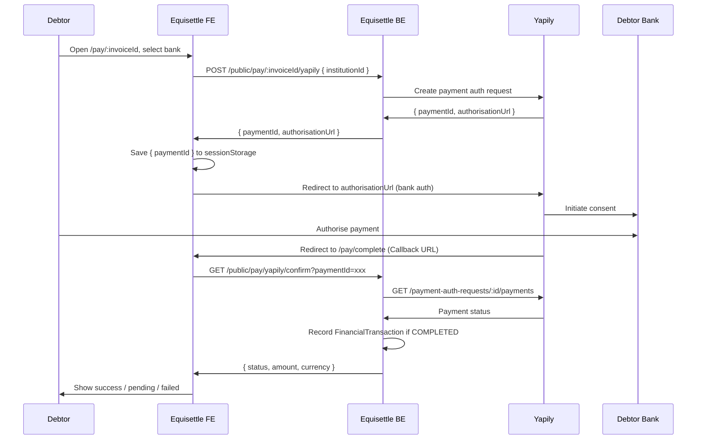

# Yapily Open Banking Integration

Yapily is a Payment Initiation Service Provider (PISP). It enables debtors to pay invoices via Open Banking bank transfer directly — no account, no mandate, no card needed. Equisettle holds **one** Yapily application (env vars). No per-company OAuth. The payee bank details (sort code + account number) are specified per payment request so money flows directly to the creditor.

## Architecture



### Key design decisions

- **No webhooks (private beta)**: Yapily webhooks require an application. Instead, we use a **callback URL** pattern: `sessionStorage` holds `paymentId` before redirect; `/pay/complete` confirms status on return.
- **Idempotent confirmation**: `FinancialTransaction.processorReference` has a unique constraint — re-calling confirm for the same `paymentId` is safe.
- **No redirectUrl in payload (sandbox)**: Yapily sandbox mock banks only accept `https://staging-auth.yapily.com/` as the bank redirect. Passing a custom `redirectUrl` in the payment auth request causes `redirect_uri_not_registered`. Omit it; use the Yapily Console "Callback URL" instead.

---

## Prerequisites

Yapily is available for an invoice when `company.bankDetails.sortCode` and `company.bankDetails.accountNumber` are both set. Without these the company cannot be a Yapily payee.

### Schema additions

```js
// Company
bankDetails: {
  sortCode:      String,
  accountNumber: String,
  accountName:   String,
}

// Invoice
yapily: {
  paymentId:       String,
  authorisationUrl: String,
  paymentStatus:   String,  // pending | completed | failed
  lastUpdated:     Date,
}
```

---

## Routes

All public routes — no JWT required.

| Method | Path | Description |
|--------|------|-------------|
| `GET` | `/api/v1/public/pay/:invoiceId/yapily/institutions` | UK PIS-capable bank list for picker |
| `POST` | `/api/v1/public/pay/:invoiceId/yapily` | Create payment auth request |
| `GET` | `/api/v1/public/pay/yapily/confirm?paymentId=xxx` | Confirm payment on return from bank |

:::caution Route order
`GET /yapily/confirm` **must be registered before** `GET /:invoiceId` in `publicPaymentRoutes.js` to prevent `"confirm"` being matched as an invoice ID.
:::

---

## Key Files

```
src/integration-layer/yapily/utils/
  createYapilyPaymentLink.js          — POSTs to Yapily, returns { paymentId, authorisationUrl }

src/core-features/invoices/controllers/
  publicPaymentController.js          — getYapilyInstitutions, createYapilyPayment, confirmYapilyPayment

src/routes/
  publicPaymentRoutes.js              — route registration

src/pages/ (FE)
  PaymentPage.jsx                     — bank picker, saves paymentId to sessionStorage
  PaymentComplete.jsx                 — reads sessionStorage, calls confirm endpoint
```

---

## Institutions Endpoint

```
GET /api/v1/public/pay/:invoiceId/yapily/institutions
```

Returns UK institutions with at least one PIS feature (`INITIATE_DOMESTIC_PAYMENTS`, etc.). Falls back to all UK institutions if the feature filter returns nothing (common in sandbox).

Response shape:
```json
[
  { "id": "monzo", "name": "Monzo", "logo": "https://..." },
  ...
]
```

---

## Payment Creation

```
POST /api/v1/public/pay/:invoiceId/yapily
Body: { "institutionId": "monzo" }
```

Calls `createYapilyPaymentLink(invoice, institutionId)`:

```js
const payload = {
  applicationUserId: company._id.toString(),
  institutionId,
  // redirectUrl omitted — use Yapily Console "Callback URL" instead
  paymentRequest: {
    type: "DOMESTIC_PAYMENT",
    reference: invoice.invoiceNumber,
    amount: { amount: invoice.amount, currency: invoice.currency || "GBP" },
    payee: {
      name: bankDetails.accountName || company.name,
      accountIdentifications: [
        { type: "SORT_CODE", identification: bankDetails.sortCode },
        { type: "ACCOUNT_NUMBER", identification: bankDetails.accountNumber },
      ],
    },
  },
};
```

Response: `{ paymentId, authorisationUrl }`

---

## Callback Confirm Flow

When the debtor returns from bank auth, the browser lands on `/pay/complete`.

**Frontend** (`PaymentComplete.jsx`):
1. Reads `sessionStorage.getItem('yapily_pending')` → `{ paymentId }`
2. Calls `GET /api/v1/public/pay/yapily/confirm?paymentId=xxx`
3. Shows loading → completed / pending / failed / error state
4. Clears `sessionStorage` after confirm

**Backend** (`confirmYapilyPayment`):
1. Looks up invoice by `yapily.paymentId`
2. Calls Yapily `GET /payment-auth-requests/:paymentId/payments`
3. If status `COMPLETED`: checks for existing `FinancialTransaction` (idempotency), then calls `webhookTransactionService.handlePaymentSuccess({ processorType: 'yapily', ... })`
4. Returns `{ status, amount, currency, invoiceNumber, companyName }`

---

## Yapily Console Setup

| Setting | Value |
|---------|-------|
| **Open Banking redirect URL** (sandbox) | `https://staging-auth.yapily.com/` |
| **Open Banking redirect URL** (production) | Register your custom URL |
| **Callback URL** | `https://eqs-platform-fe.onrender.com/pay/complete` |

---

## Environment Variables

```bash
YAPILY_APPLICATION_ID=...
YAPILY_APPLICATION_SECRET=...
YAPILY_BASE_URL=https://api.yapily.com   # Do NOT use api.yapi.ly (typo that caused 500s)
YAPILY_WEBHOOK_SECRET=...                 # For when webhook access is granted
```

---

## CORS

Public pay routes accept requests from **any origin** (debtors arrive via email links from any browser):

```js
// app.js — applied before authLessRoute mounting
app.use("/api/v1/public/pay", cors({ origin: "*", credentials: false }));
```

---

## Remittance Table

Yapily payments appear in the remittance table via `FinancialTransaction` records. `remittanceService.js` merges them:

```js
const ledgerPayments = await FinancialTransaction.find({
  processorType: "yapily",
});
// mapped to paymentMethod: "bank_transfer"
```

---

## Troubleshooting

| Issue | Cause | Fix |
|-------|-------|-----|
| `getaddrinfo ENOTFOUND api.yapi.ly` | `YAPILY_BASE_URL` typo | Set to `https://api.yapily.com` |
| `redirect_uri_not_registered` | `redirectUrl` passed in payload | Remove `redirectUrl` from payload entirely |
| 500 on institutions | Env vars not set | Check `YAPILY_APPLICATION_ID` and `YAPILY_APPLICATION_SECRET` on Render |
| 403 OPTIONS preflight | CORS origin blocked | Ensure `app.use("/api/v1/public/pay", cors({ origin: "*" }))` is in `app.js` |
| Blank `/pay/complete` | `sessionStorage` empty | Debtor navigated directly — show "no payment session" error |
| Confirm returns no payment | Bank hasn't processed yet | Return `status: pending` — this is normal for slower banks |

---

## Payment Plans

Yapily PIS is **one-time only**. It is not suitable for payment plans. Payment plans requiring recurring collections should remain on GoCardless.
