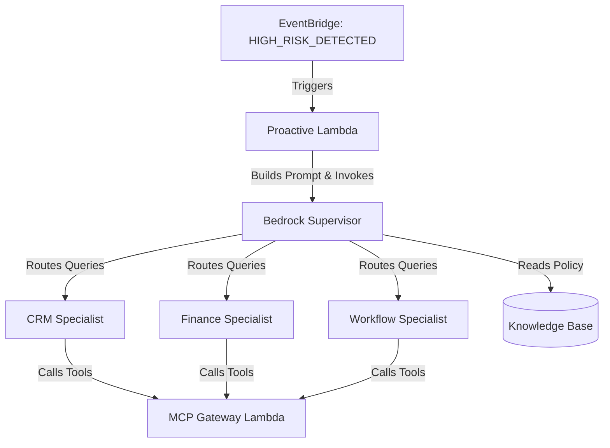

# AWS Bedrock Multi-Agent Architecture for EquiSettle

EquiSettle utilizes a multi-agent architectural model built on **AWS Bedrock**. The system relies on a central "Supervisor" agent that coordinates multiple specialized sub-agents and retrieves data dynamically via the MCP Gateway. 

The primary use case is providing highly contextual insights and automated workflows—such as advanced financial risk predictions—before standard aging buckets even begin.

## Architecture Overview

You can view the visual representation of this architecture in the `bedrock-architecture.drawio` file located in this directory.



### 1. The Supervisor (Lead Advisor)
The **Bedrock Supervisor** (`eqs-financial-advisor`) acts as the orchestrator. Its primary function is to interpret the user or system prompt and delegate the workload to the most relevant highly-specialized agent. 

**Alias**: `main`
**Collaboration Mode**: `SUPERVISOR_ROUTER`

### 2. Specialized Sub-Agents
The system operates with three specialized sub-agents:
*   **CRM Specialist (`eqs-crm-specialist`)**: Specialist in customer relationships, profiles, and case management. Searches for customers and pulls case details.
*   **Finance Specialist (`eqs-finance-specialist`)**: Specialist in invoices, payments, and financial risk. Responsible for pulling invoice balances, detecting overdue trends, and running risk models.
*   **Workflow Specialist (`eqs-workflow-specialist`)**: Specialist in process automation, document tracking, and disputes. Used for executing workflow status changes or generating documents.

### 3. The Knowledge Base
The **Amazon Bedrock Knowledge Base** utilizes Pinecone and S3 to store all agent instructions and strict company policies. The prime examples are the `advanced-risk-policy.md` and `ar-collections-policy.md`.
*   Whenever the agent generates a payment term or recommendation, it checks against the strict rules in the Knowledge Base (e.g., ensuring UK Government Late Payment Laws are enforced).

### 4. MCP Gateway Lambda
The agents have tools attached to them to execute arbitrary operations via the **MCP Gateway Lambda** (`eqs-mcp-gateway`). When an agent decides it needs to retrieve invoice data, it determines the tool (e.g. `get_customer_invoices`), formats the arguments, and dispatches the execution to the Lambda, subsequently ingesting the JSON response back into its context.

---

## Proactive Trigger Flow

The Bedrock architecture is not just reactive (answering user chats). It's also fully proactive.

1.  A backend process or integration (like Creditsafe/HMRC checks) detects risk and fires a `HIGH_RISK_DETECTED` event to **Amazon EventBridge**.
2.  EventBridge triggers the **Proactive Lambda** (`eqs-proactive-trigger-staging`).
3.  The Proactive Lambda builds an agentic prompt (e.g. "Assess this case and suggest actions based on high volatility") and invokes the **Bedrock Supervisor**.
4.  The Supervisor queries the sub-agents and the Knowledge Base to formulate a recommendation.
5.  The final result is pushed via WebSocket into the EquiSettle frontend, where it's parsed and displayed as actionable UI insights (e.g. the AI Recommendation Banner).

---

## How to Test the Bedrock Setup

You can actively test the multi-agent orchestration locally or in staging:

### Method 1: Testing via Localhost WebSocket
1. Boot up the backend `npm start` and frontend `npm start`.
2. Navigate to a Customer **Debt Details** page.
3. Open the **EQUI AI Chat** widget on the page.
4. Issue a direct command, e.g. *"Analyze this case and recommend payment terms based on recent risk."*
5. The local backend will forward the WebSocket payload to the AWS Bedrock environment, waiting for the supervisor to complete workflow and dispatch response.
6. Observe the UI automatically parse the result into the "AI Suggests" inline banner.

### Method 2: Testing Proactive Lambdas via AWS CLI
You can simulate an EventBridge trigger without waiting for an automated external credit trigger:
```bash
aws lambda invoke \
  --function-name eqs-proactive-trigger-staging \
  --payload '{"detail":{"caseId":"test_case","triggerReason":"HIGH_RISK_DETECTED"}}' \
  response.json \
  --cli-binary-format raw-in-base64-out \
  --region eu-west-2
```
Once invoked, head over to the frontend Debt Details page for the corresponding "test_case", and you will see the AI Recommendation Banner appear as if it recognized a new threat automatically!
