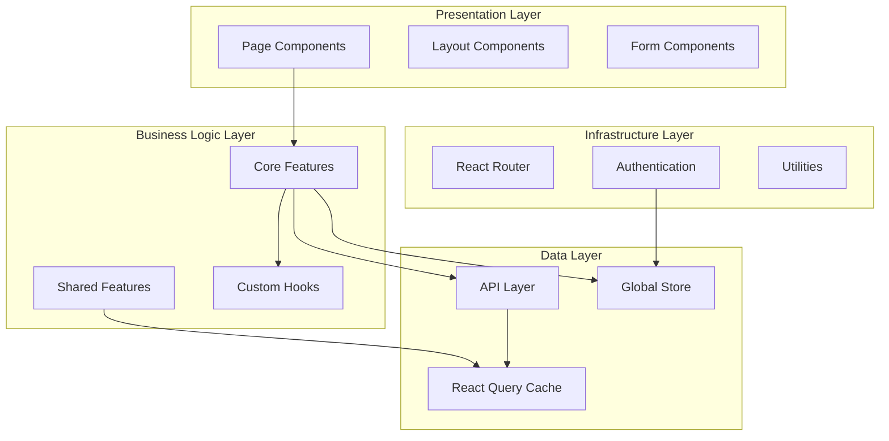

# ÉquiSettle Frontend Platform Overview

## Platform Purpose

The ÉquiSettle frontend is a comprehensive React-based web application that provides an intuitive, feature-rich interface for debt collection and accounts receivable management. Built with modern web technologies, it offers real-time data visualization, complex workflow management, and seamless integration with multiple business systems.

## Technology Stack

### Core Technologies
- **Framework**: React 18.2.0 with modern hooks and concurrent features
- **Build Tool**: Vite 6.0.0 for fast development and optimized builds
- **Language**: JavaScript (ES2022) with modern syntax
- **Styling**: TailwindCSS 3.4.1 with custom components
- **State Management**: Zustand 4.4.7 for global state and React Query for server state

### UI Framework & Components
- **Component Library**: Custom components with Radix UI primitives
- **Icons**: Heroicons, React Icons, and Lucide React
- **Animations**: Framer Motion 11.5.4 for smooth interactions
- **Charts**: Recharts 2.15.0 for data visualization
- **Forms**: React Hook Form 7.61.0 with Yup/Zod validation

### Data Management
- **Server State**: TanStack React Query 5.90.2 with DevTools
- **HTTP Client**: Axios 1.8.3 with interceptors and error handling
- **Caching**: React Query caching with custom strategies
- **Real-time**: WebSocket integration for live updates

### Development Tools
- **Type Safety**: PropTypes for runtime type checking
- **Testing**: Testing Library with Jest and Cypress for E2E
- **Code Quality**: ESLint, Prettier, and custom linting rules
- **Performance**: React DevTools and LogRocket integration

## Application Architecture

### High-Level Architecture



### Project Structure

```
src/
├── components/              # Reusable UI components
│   ├── ui/                 # Base UI components
│   ├── forms/              # Form-specific components
│   ├── charts/             # Data visualization components
│   ├── modals/             # Modal components
│   └── tables/             # Table components
├── core-features/          # Business feature modules
│   ├── admin/              # Admin management
│   ├── collections/        # Debt collection workflows
│   ├── companyonlydashboard/  # Company dashboard
│   ├── integrations/       # Third-party integrations
│   ├── logging/            # Authentication & logging
│   ├── store/              # Global state management
│   └── supply-chain/       # Inventory management
├── shared-features/        # Cross-cutting features
│   ├── layouts/            # Page layouts
│   ├── navigation/         # Navigation components
│   ├── notifications/      # Notification system
│   └── utilities/          # Shared utilities
├── hooks/                  # Custom React hooks
├── context/                # React context providers
├── api/                    # API layer and services
├── utils/                  # Utility functions
├── assets/                 # Static assets
└── lib/                    # Third-party library configurations
```

## Core Features Overview

### 🏢 Company Management Dashboard
- **Multi-tenant Architecture**: Complete company isolation and management
- **Company Settings**: Comprehensive configuration and preferences
- **User Management**: Role-based access control and team management
- **Integration Management**: Third-party service connections and status

### 📊 Case Management System
- **Case Creation**: Multiple case types (individual, company) with detailed forms
- **Workflow Management**: Visual workflow builder and automated progression
- **Follow-up System**: Comprehensive follow-up scheduling and tracking
- **Status Tracking**: Real-time case status updates and history

### 💰 Invoice Management
- **Invoice Creation**: Template-based invoice generation
- **Payment Tracking**: Real-time payment status and reconciliation
- **Integration Sync**: Seamless sync with accounting systems
- **Bulk Operations**: Mass invoice processing and updates

### 📈 Analytics & Reporting
- **Interactive Dashboards**: Real-time data visualization
- **Custom Reports**: Configurable reporting with export capabilities
- **Performance Metrics**: KPI tracking and trend analysis
- **Predictive Analytics**: AI-powered insights and forecasting

### 🔄 Workflow Engine
- **Visual Workflow Builder**: Drag-and-drop workflow creation
- **Automated Actions**: Email, SMS, and system actions
- **Conditional Logic**: Complex business rule implementation
- **Progress Tracking**: Real-time workflow execution monitoring

### 🔗 Integration Management
- **OAuth Flows**: Secure third-party authentication
- **Real-time Sync**: Live data synchronization status
- **Error Handling**: Comprehensive integration error management
- **Health Monitoring**: Integration status and performance tracking

## Key Features and Capabilities

### Modern React Patterns

#### Hooks-Based Architecture
```javascript
// Custom hooks for business logic
const useCaseManagement = () => {
  const [cases, setCases] = useState([]);
  const { user } = useAuthStore();

  const { data, isLoading, error } = useQuery({
    queryKey: ['cases', user.companyId],
    queryFn: () => fetchCases(user.companyId),
    enabled: !!user.companyId
  });

  return {
    cases: data || [],
    isLoading,
    error,
    refetch: () => queryClient.invalidateQueries(['cases'])
  };
};
```

#### Component Composition
```javascript
// Flexible component composition
const CaseDetailsPage = () => {
  return (
    <PageLayout>
      <PageHeader title="Case Details" />
      <CaseInformation />
      <CaseActions />
      <CaseHistory />
      <CaseComments />
    </PageLayout>
  );
};
```

### State Management Strategy

#### Global State with Zustand
```javascript
// Authentication store
export const useAuthStore = create((set, get) => ({
  user: null,
  isAuthenticated: false,
  permissions: [],

  login: async (credentials) => {
    const response = await authAPI.login(credentials);
    set({
      user: response.user,
      isAuthenticated: true,
      permissions: response.permissions
    });
  },

  logout: () => {
    set({
      user: null,
      isAuthenticated: false,
      permissions: []
    });
  }
}));
```

#### Server State with React Query
```javascript
// API queries and mutations
export const useCases = (companyId, filters) => {
  return useQuery({
    queryKey: ['cases', companyId, filters],
    queryFn: () => casesAPI.getCases(companyId, filters),
    staleTime: 5 * 60 * 1000, // 5 minutes
    cacheTime: 10 * 60 * 1000, // 10 minutes
  });
};

export const useCreateCase = () => {
  const queryClient = useQueryClient();

  return useMutation({
    mutationFn: casesAPI.createCase,
    onSuccess: () => {
      queryClient.invalidateQueries(['cases']);
      toast.success('Case created successfully');
    },
    onError: (error) => {
      toast.error(error.message);
    }
  });
};
```

### Form Management

#### React Hook Form Integration
```javascript
const CaseForm = ({ initialData, onSubmit }) => {
  const {
    register,
    handleSubmit,
    formState: { errors, isSubmitting },
    watch,
    setValue
  } = useForm({
    defaultValues: initialData,
    resolver: yupResolver(caseSchema)
  });

  const caseType = watch('caseType');

  return (
    <form onSubmit={handleSubmit(onSubmit)}>
      <FormField>
        <Label>Case Type</Label>
        <Select {...register('caseType')}>
          <option value="individual">Individual</option>
          <option value="company">Company</option>
        </Select>
        {errors.caseType && <ErrorMessage>{errors.caseType.message}</ErrorMessage>}
      </FormField>

      {caseType === 'company' && <CompanyFields register={register} errors={errors} />}

      <Button type="submit" disabled={isSubmitting}>
        {isSubmitting ? 'Creating...' : 'Create Case'}
      </Button>
    </form>
  );
};
```

### Real-time Features

#### WebSocket Integration
```javascript
const useWebSocket = (url, options = {}) => {
  const [socket, setSocket] = useState(null);
  const [isConnected, setIsConnected] = useState(false);

  useEffect(() => {
    const ws = new WebSocket(url);

    ws.onopen = () => {
      setIsConnected(true);
      options.onConnect?.();
    };

    ws.onmessage = (event) => {
      const data = JSON.parse(event.data);
      options.onMessage?.(data);
    };

    ws.onclose = () => {
      setIsConnected(false);
      options.onDisconnect?.();
    };

    setSocket(ws);

    return () => ws.close();
  }, [url]);

  return { socket, isConnected };
};
```

#### Live Data Updates
```javascript
const CasesList = () => {
  const { user } = useAuthStore();
  const queryClient = useQueryClient();

  // WebSocket for real-time updates
  useWebSocket(`ws://localhost:8000/cases/${user.companyId}`, {
    onMessage: (data) => {
      switch (data.type) {
        case 'CASE_UPDATED':
          queryClient.setQueryData(['cases'], (oldData) =>
            oldData.map(case =>
              case.id === data.caseId
                ? { ...case, ...data.updates }
                : case
            )
          );
          break;
        case 'CASE_CREATED':
          queryClient.invalidateQueries(['cases']);
          break;
      }
    }
  });

  // ... rest of component
};
```

## Performance Optimization

### Code Splitting and Lazy Loading

```javascript
// Route-based code splitting
const CompanyDashboard = lazy(() => import('core-features/companyonlydashboard/CompanyOnlyDashboard'));
const CaseManagement = lazy(() => import('core-features/collections/CaseManagement'));

// Component-based lazy loading
const HeavyChart = lazy(() => import('components/charts/HeavyChart'));

const Dashboard = () => {
  return (
    <Suspense fallback={<LoadingSpinner />}>
      <Routes>
        <Route path="/dashboard" element={<CompanyDashboard />} />
        <Route path="/cases" element={<CaseManagement />} />
      </Routes>
    </Suspense>
  );
};
```

### Memoization and Optimization

```javascript
// Component memoization
const CaseCard = memo(({ case, onUpdate }) => {
  const handleUpdate = useCallback((updates) => {
    onUpdate(case.id, updates);
  }, [case.id, onUpdate]);

  return (
    <Card>
      <CardHeader>{case.name}</CardHeader>
      <CardContent>
        {/* Case details */}
      </CardContent>
    </Card>
  );
});

// Expensive computation memoization
const CaseAnalytics = ({ cases }) => {
  const analytics = useMemo(() => {
    return calculateAnalytics(cases);
  }, [cases]);

  return <AnalyticsChart data={analytics} />;
};
```

### Virtual Scrolling for Large Lists

```javascript
import { FixedSizeList as List } from 'react-window';

const CasesList = ({ cases }) => {
  const Row = ({ index, style }) => (
    <div style={style}>
      <CaseCard case={cases[index]} />
    </div>
  );

  return (
    <List
      height={600}
      itemCount={cases.length}
      itemSize={120}
      width="100%"
    >
      {Row}
    </List>
  );
};
```

## Development Workflow

### Component Development

#### Component Structure
```javascript
// Standard component structure
const ComponentName = ({
  prop1,
  prop2,
  onAction,
  className,
  ...rest
}) => {
  // Hooks
  const [state, setState] = useState();
  const { data, isLoading } = useQuery();

  // Event handlers
  const handleClick = useCallback(() => {
    onAction?.(data);
  }, [data, onAction]);

  // Effects
  useEffect(() => {
    // Side effects
  }, [dependencies]);

  // Render
  return (
    <div className={cn('default-classes', className)} {...rest}>
      {/* Component content */}
    </div>
  );
};

// PropTypes for type safety
ComponentName.propTypes = {
  prop1: PropTypes.string.isRequired,
  prop2: PropTypes.number,
  onAction: PropTypes.func,
  className: PropTypes.string
};

export default ComponentName;
```

### Custom Hooks Pattern

```javascript
// Business logic hooks
export const useCaseOperations = (caseId) => {
  const queryClient = useQueryClient();

  const updateCase = useMutation({
    mutationFn: (updates) => casesAPI.updateCase(caseId, updates),
    onSuccess: () => {
      queryClient.invalidateQueries(['case', caseId]);
      toast.success('Case updated successfully');
    }
  });

  const deleteCase = useMutation({
    mutationFn: () => casesAPI.deleteCase(caseId),
    onSuccess: () => {
      queryClient.invalidateQueries(['cases']);
      navigate('/cases');
    }
  });

  return {
    updateCase: updateCase.mutate,
    deleteCase: deleteCase.mutate,
    isUpdating: updateCase.isLoading,
    isDeleting: deleteCase.isLoading
  };
};
```

## Styling and Design System

### TailwindCSS Configuration

```javascript
// tailwind.config.js
module.exports = {
  content: ['./src/**/*.{js,jsx,ts,tsx}'],
  theme: {
    extend: {
      colors: {
        primary: {
          50: '#eff6ff',
          500: '#3b82f6',
          900: '#1e3a8a',
        },
        secondary: {
          50: '#f8fafc',
          500: '#64748b',
          900: '#0f172a',
        }
      },
      fontFamily: {
        sans: ['Inter', 'system-ui', 'sans-serif'],
      },
      animation: {
        'fade-in': 'fadeIn 0.3s ease-in-out',
        'slide-up': 'slideUp 0.3s ease-out',
      }
    },
  },
  plugins: [
    require('@tailwindcss/forms'),
    require('@tailwindcss/typography'),
    require('tailwindcss-animate'),
  ],
};
```

### Component Library

```javascript
// Button component with variants
const Button = ({ variant = 'primary', size = 'md', children, ...props }) => {
  const baseClasses = 'inline-flex items-center justify-center rounded-md font-medium transition-colors';

  const variants = {
    primary: 'bg-primary-500 text-white hover:bg-primary-600',
    secondary: 'bg-gray-200 text-gray-900 hover:bg-gray-300',
    outline: 'border border-gray-300 bg-white text-gray-700 hover:bg-gray-50'
  };

  const sizes = {
    sm: 'px-3 py-1.5 text-sm',
    md: 'px-4 py-2 text-sm',
    lg: 'px-6 py-3 text-base'
  };

  const className = cn(
    baseClasses,
    variants[variant],
    sizes[size],
    props.className
  );

  return <button className={className} {...props}>{children}</button>;
};
```

## Testing Strategy

### Component Testing
```javascript
import { render, screen, fireEvent } from '@testing-library/react';
import { QueryClient, QueryClientProvider } from '@tanstack/react-query';
import CaseForm from './CaseForm';

const renderWithProviders = (component) => {
  const queryClient = new QueryClient({
    defaultOptions: { queries: { retry: false } }
  });

  return render(
    <QueryClientProvider client={queryClient}>
      {component}
    </QueryClientProvider>
  );
};

describe('CaseForm', () => {
  it('should submit form with valid data', async () => {
    const onSubmit = jest.fn();

    renderWithProviders(<CaseForm onSubmit={onSubmit} />);

    fireEvent.change(screen.getByLabelText('Case Name'), {
      target: { value: 'Test Case' }
    });

    fireEvent.click(screen.getByRole('button', { name: 'Create Case' }));

    await waitFor(() => {
      expect(onSubmit).toHaveBeenCalledWith({
        name: 'Test Case',
        // ... other form data
      });
    });
  });
});
```

### E2E Testing with Cypress
```javascript
describe('Case Management', () => {
  beforeEach(() => {
    cy.login();
    cy.visit('/cases');
  });

  it('should create new case', () => {
    cy.get('[data-cy=create-case-button]').click();
    cy.get('[data-cy=case-name-input]').type('Test Case');
    cy.get('[data-cy=case-type-select]').select('company');
    cy.get('[data-cy=submit-button]').click();

    cy.contains('Case created successfully');
    cy.url().should('include', '/cases');
  });
});
```

## Security Considerations

### Authentication & Authorization
- **JWT Token Management**: Secure token storage and automatic refresh
- **Route Protection**: Role-based route access control
- **API Security**: Request signing and CSRF protection
- **XSS Prevention**: Input sanitization and content security policy

### Data Protection
- **Sensitive Data Handling**: Secure form data transmission
- **Client-side Validation**: Input validation and sanitization
- **Error Handling**: Secure error messages without sensitive data exposure
- **Audit Logging**: User action tracking and compliance

## Next Steps

To get started with the ÉquiSettle frontend:

1. **[Development Setup](./getting-started/setup)** - Set up your development environment
2. **[Architecture Deep Dive](./architecture/overview)** - Understanding the system design
3. **[Component Library](./components/overview)** - Using and building components
4. **[State Management](./architecture/state-management)** - Managing application state
5. **[Feature Development](./features/dashboard)** - Building new features

The ÉquiSettle frontend platform provides a modern, scalable foundation for building sophisticated debt collection and business management interfaces with excellent user experience and developer productivity.