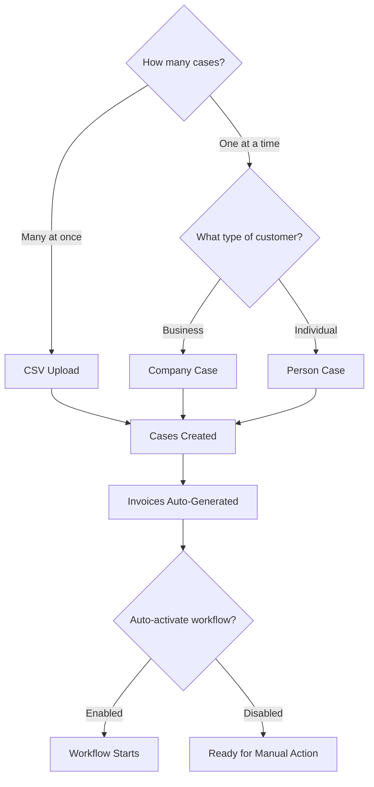
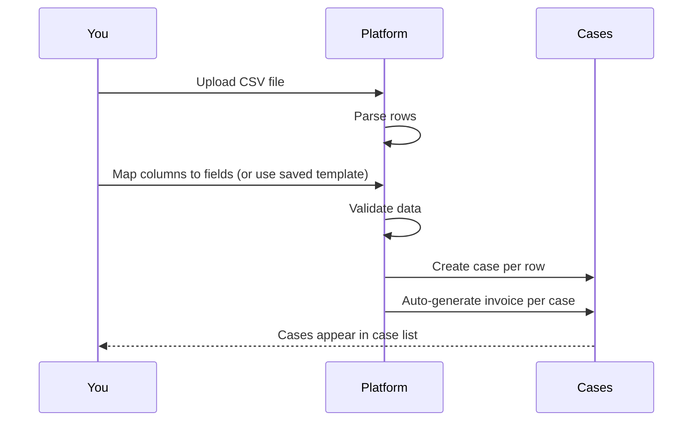
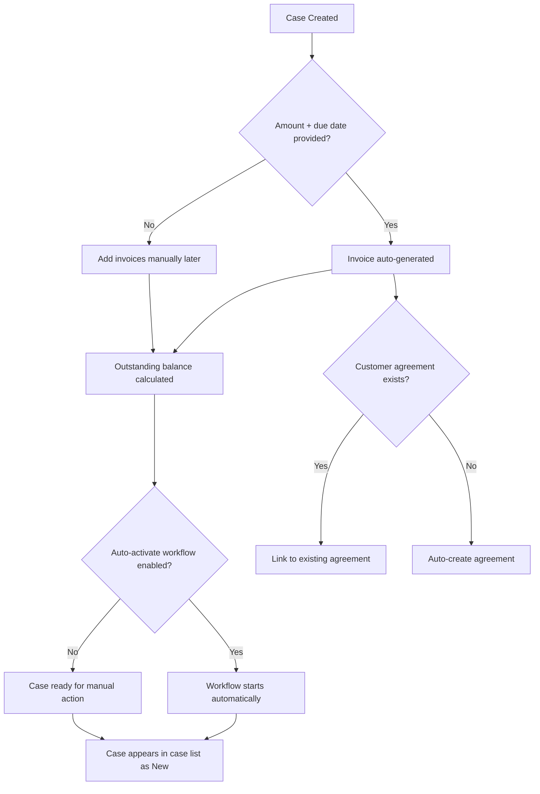

# Creating Cases

There are three ways to get cases into ÉquiSettle. Choose the method that fits your situation.

## Method 1: CSV Upload (bulk)

Best for importing many cases at once — whether you're migrating from spreadsheets, onboarding a batch of debts, or loading data from another system.

### How it works

1. **Prepare your CSV file** with columns for debtor details:
   - Debtor name (company or person)
   - Amount owed
   - Due date
   - Email address
   - Phone number
   - Any other relevant fields (address, reference number, etc.)

2. **Map your columns** — the platform needs to know which CSV column matches which field. You can:
   - Map columns manually during upload
   - Use a saved template if you've done this before

3. **Upload the file** — the platform processes each row and creates a case for each entry

4. **Invoices are auto-created** — each case gets an invoice with the amount and due date from your CSV

### CSV Templates

If you upload CSVs regularly with the same column layout, save your column mappings as a **template**:

- Create a template once with your column-to-field mappings
- Reuse it for future uploads — no remapping needed
- Edit or delete templates at any time
- Multiple templates supported (e.g., one per data source)

## Method 2: Manual — Company Case

Best for creating a single case for a business customer.

### Required information

- **Company name**
- **Link to customer agreement** (or create one during case setup)

### Optional information you can add

| Category | Fields |
|----------|--------|
| **Company details** | Registration number, VAT/Tax ID, industry, company size, year established, credit rating |
| **Addresses** | Physical, billing, shipping, registered, and mailing addresses |
| **Primary contact** | Name, email, phone number |
| **Role-based contacts** | Separate contacts for billing, legal, technical, operations, sales, and admin |
| **Invoice details** | Amount and due date (if provided, an invoice is automatically created and linked) |

### What happens after creation

- If you provided an amount and due date, an invoice is generated automatically
- The case outstanding balance is calculated from the linked invoice
- If your company has auto-activate workflow enabled, the assigned workflow starts immediately
- The case appears in your case list with status "New"

## Method 3: Manual — Person Case

Best for creating a case for an individual (not a business).

### How it differs from a company case

- Personal contact details instead of company registration
- No company-specific fields (industry, company size, etc.)
- Same invoice auto-creation if you provide amount and due date
- Same workflow auto-activation behaviour

## What happens after any case is created

Regardless of which method you use:

1. **Invoice generation** — for single-invoice cases with an amount and due date, an invoice is created and linked automatically
2. **Outstanding balance** — calculated from the new invoice's amount
3. **Workflow activation** — if your company settings have auto-activate enabled, the configured workflow begins
4. **Case appears in your list** — with status "New", ready for you to work on
5. **Customer agreement** — if one doesn't exist for this customer, it can be created during case setup or auto-generated later (e.g., when converting a standalone invoice)
