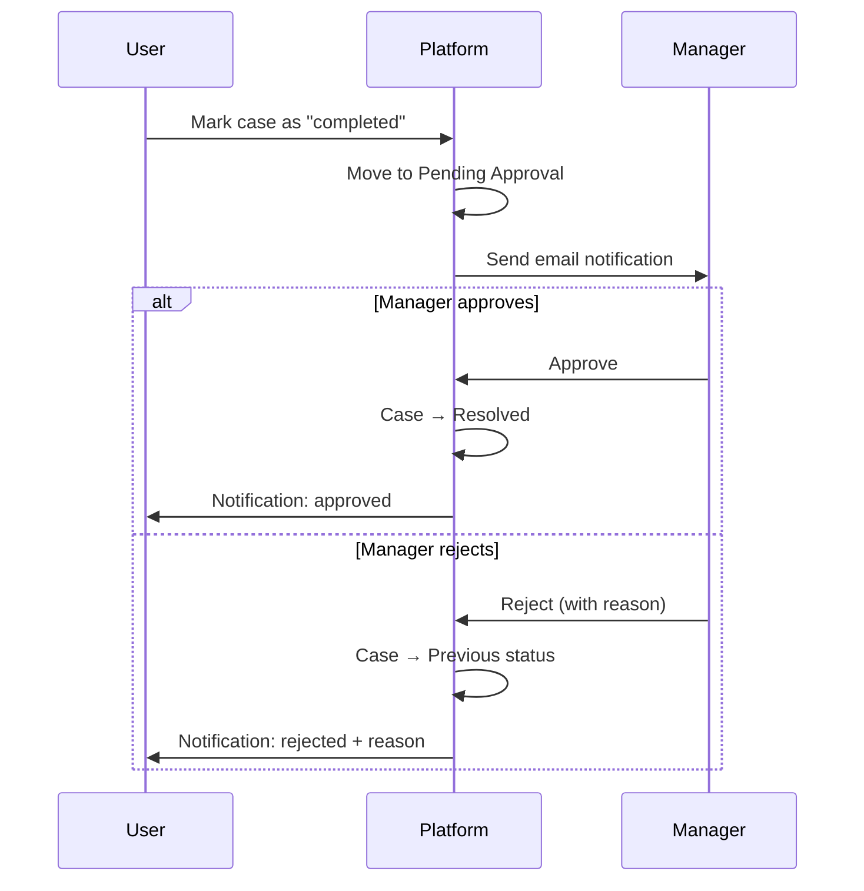
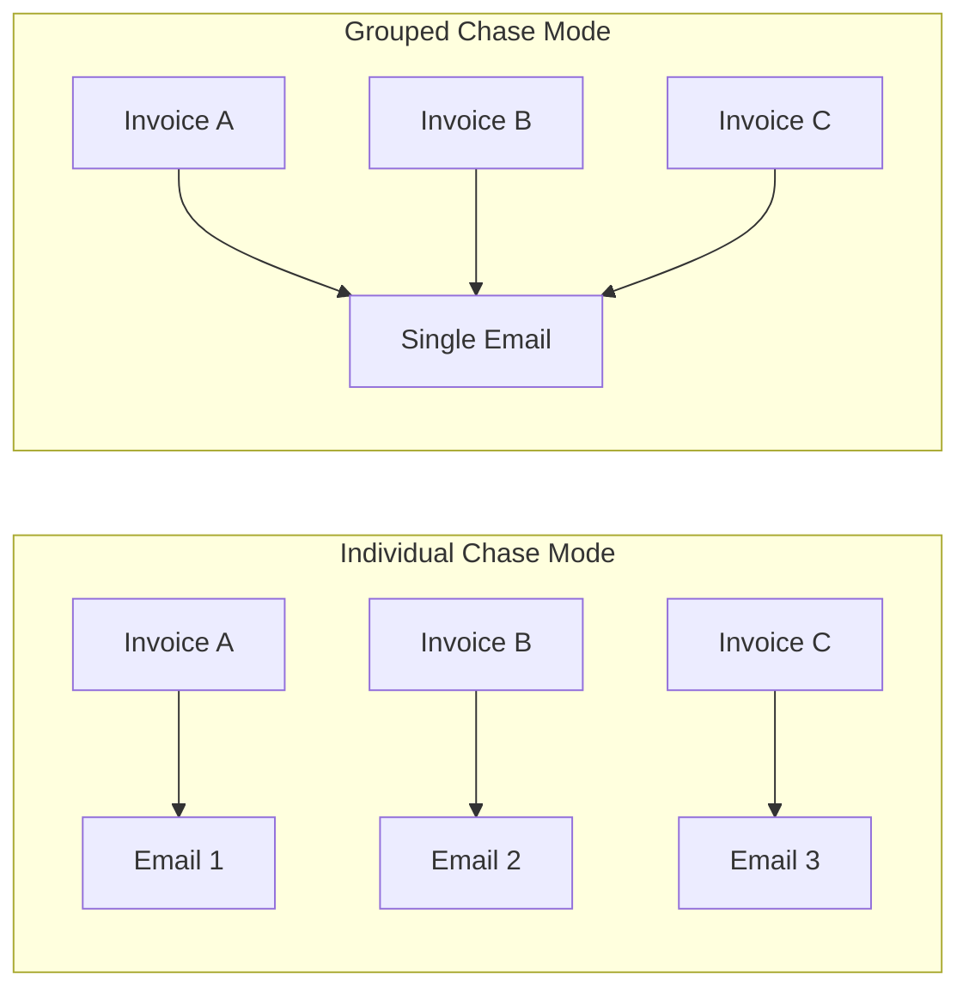
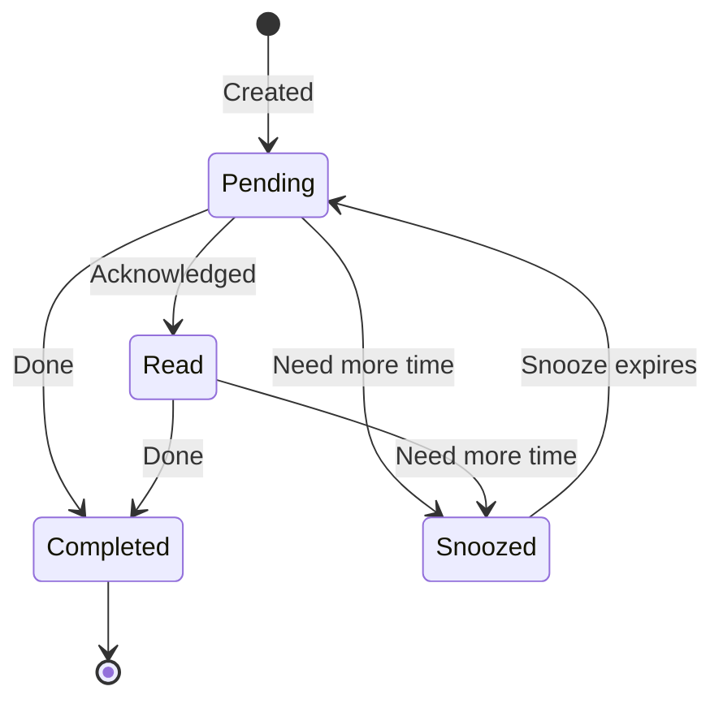
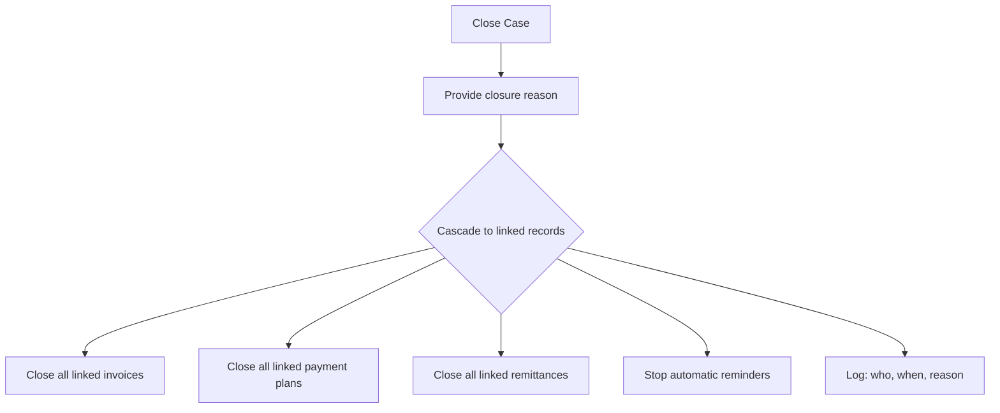

# Managing Cases

Once a case is created, here's everything you can do with it.

## Changing case status

Move cases through statuses as your collection work progresses. Select the case and update its status to reflect the current situation.

**Available statuses**: New, Active, Pending, In Review, At Risk, On Hold, Blocked, Resolved, Closed.

### Completion and approval

When you mark a case as "completed":

1. The case moves to **Pending Approval** (not directly to Resolved)
2. An email notification is sent to the assigned manager
3. The manager reviews and either:
   - **Approves** — the case proceeds to Resolved
   - **Rejects** — the case returns to its previous status with a reason

This approval step ensures proper oversight before cases are closed out.

## Chase mode

Chase mode controls how reminder emails are sent for a case with multiple invoices.

| Mode | How it works | Best for |
|------|-------------|----------|
| **Individual** | Each invoice gets its own separate reminder email | Single-invoice cases, or when each invoice needs individual attention |
| **Grouped** | One email is sent listing all invoices together | Multi-invoice cases, or customers with several outstanding invoices |

- Multi-invoice cases are automatically set to "grouped"
- You can switch between modes at any time on single-invoice cases

## Comments

Add notes to a case that are visible to your entire team.

- Write text comments to record updates, decisions, or important information
- **@mention** team members to send them a notification
- Attach files — documents, screenshots, evidence, correspondence
- All comments are timestamped with the author's name

Comments are useful for keeping a running record of what's happened on a case, so anyone on your team can pick it up and understand the history.

## Follow-ups

Create reminders and tasks linked to a case.

- **Set a date and time** for when the follow-up should be actioned
- **Priority**: Low, Medium, or High
- **@mention** team members to assign or notify them
- Add quick notes, contact information, or the best time to reach the customer

### Follow-up lifecycle

| Status | What it means |
|--------|--------------|
| **Pending** | Not yet actioned — waiting for the scheduled date |
| **Completed** | Done — the follow-up has been handled |
| **Snoozed** | Postponed — you'll come back to it later (requires a reason) |
| **Read** | Acknowledged but not yet completed |

Snoozing is useful when you've attempted contact but need to try again later. The platform records why you snoozed and when.

## Watchers

Add team members as watchers on a case so they stay informed without being directly assigned.

### What watchers receive notifications for
- Follow-ups added to the case
- Comments posted on the case
- Status changes
- Payments received

### Managing watchers
- Add or remove watchers at any time
- Each watcher can configure their notification preferences (how often and through which channel they want to be notified)

## Assigning cases

Assign a case to a specific team member or manager:

- The assignee becomes the primary person responsible for the case
- Assignment date is tracked
- Useful for distributing workload across your team

## Closing a case

When a case is fully resolved and no further action is needed:

1. Select the case and choose to close it
2. Provide a reason for closure
3. The platform automatically:
   - Closes all linked invoices
   - Closes all linked payment plans
   - Finalises all linked remittances
   - Stops automatic reminders
   - Records who closed it and when

You can also **close multiple cases in bulk** — select several cases and close them all at once.

## Reopening a case

If circumstances change and you need to revisit a closed case:

1. Select the closed case and choose to reopen it
2. Provide a reason for reopening
3. The platform automatically:
   - Reopens all linked invoices
   - Reopens all linked payment plans
   - Reopens all linked remittances
   - Resumes automatic reminders for eligible invoices
   - Records who reopened it and when

The full case history is preserved — nothing is deleted or lost when closing and reopening.
