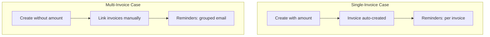
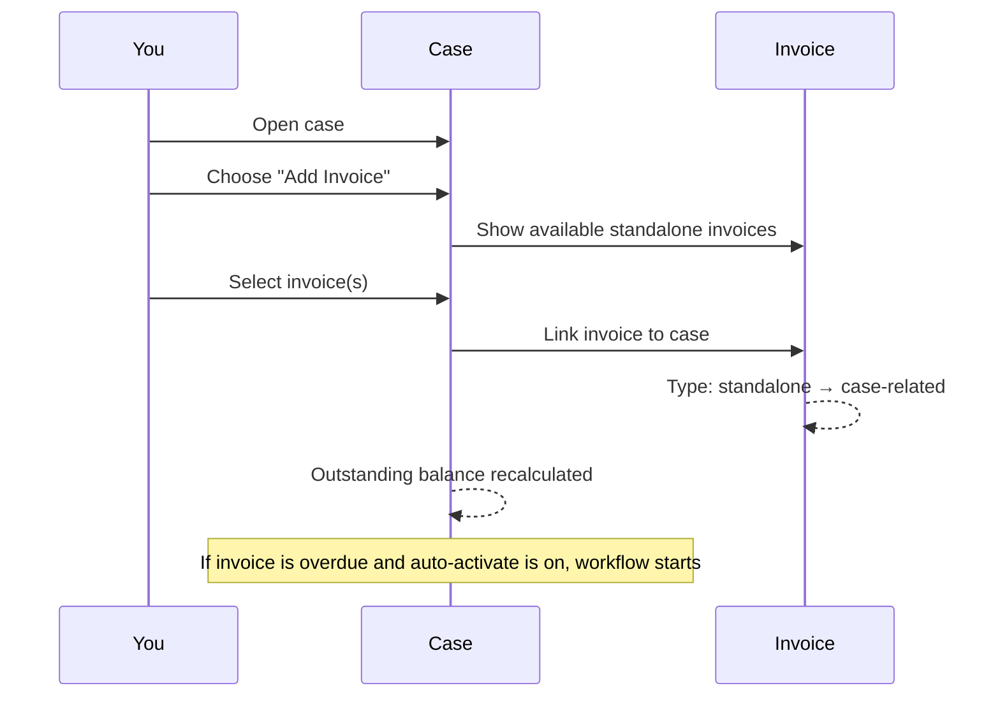
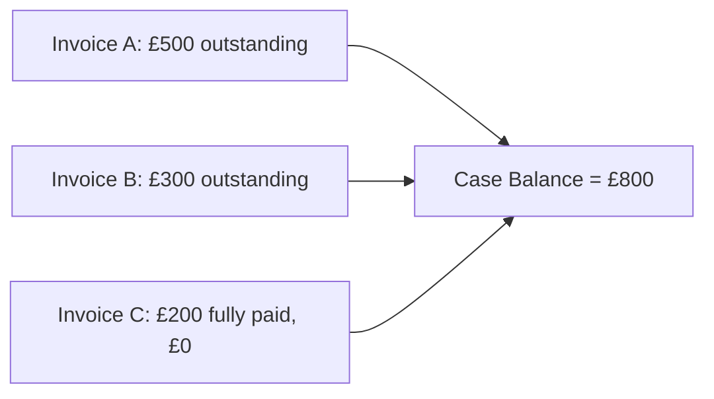

# Multi-Invoice Cases

When a customer has several outstanding invoices, a multi-invoice case lets you group them together and manage the collection as one effort.

## When to use multi-invoice cases

- A customer has multiple unpaid invoices from different periods
- You want to send one combined reminder covering all outstanding amounts
- You need to track total outstanding across multiple invoices in one place

## How multi-invoice cases differ from single-invoice cases

| Feature | Single-invoice case | Multi-invoice case |
|---------|-------------------|-------------------|
| Amount required at creation | Yes (auto-creates invoice) | No (invoices added later) |
| Chase mode | Individual or Grouped (your choice) | Forced to Grouped |
| Workflow auto-activation | On creation (if enabled) | Only when an overdue invoice is added |
| Invoice creation | Automatic at case creation | Manual — you link existing invoices |

## Adding invoices to a multi-invoice case

1. Open the case
2. Choose to add an invoice
3. The platform shows you **available invoices** — these are standalone invoices not already linked to another case
4. Select the invoice(s) to add

When you add an invoice:
- The invoice type changes from "standalone" to "case-related"
- The case's outstanding balance increases by the invoice's outstanding amount
- If the invoice is overdue and your company has auto-activate workflow enabled, the workflow starts

:::info
Only standalone invoices can be added to a case. If an invoice is already linked to another case, you'll need to remove it from that case first.
:::

## Removing invoices from a case

If an invoice no longer belongs on a case:

1. Open the case
2. Find the invoice and choose to remove it
3. The invoice is unlinked and returns to "standalone" status
4. The case's outstanding balance decreases by the invoice's outstanding amount

The invoice isn't deleted — it still exists as a standalone invoice and can be added to a different case if needed.

## Outstanding balance calculation

The outstanding balance on a multi-invoice case is the **sum of all linked invoices' outstanding balances**.

For example, if a case has three linked invoices:
- Invoice A: £500 outstanding
- Invoice B: £300 outstanding
- Invoice C: £200 (fully paid, £0 outstanding)

The case outstanding balance is **£800** (£500 + £300 + £0).

This updates automatically whenever:
- A payment is received on any linked invoice
- An invoice is added or removed
- An invoice is voided or superseded

## Grouped chase mode

Multi-invoice cases always use **grouped** chase mode. This means:

- When a reminder is sent, the customer receives **one email** listing all outstanding invoices
- This is better for the customer experience — instead of getting 5 separate emails, they get one clear summary
- The email includes the total outstanding amount across all invoices
- Each invoice's amount and due date is listed individually

You cannot switch a multi-invoice case to individual chase mode.
