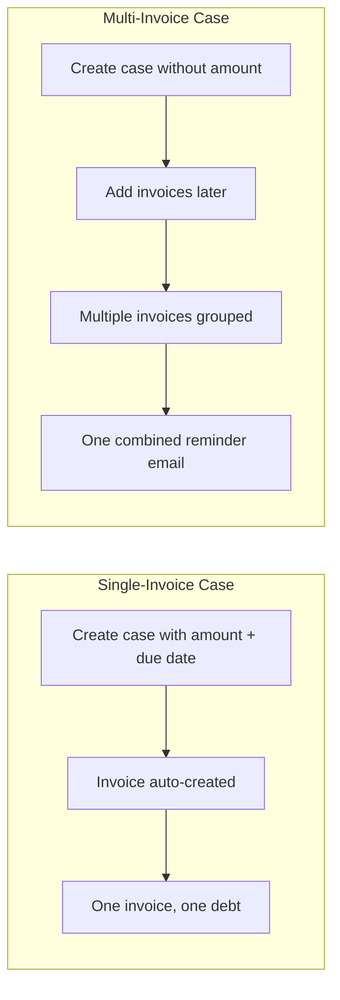
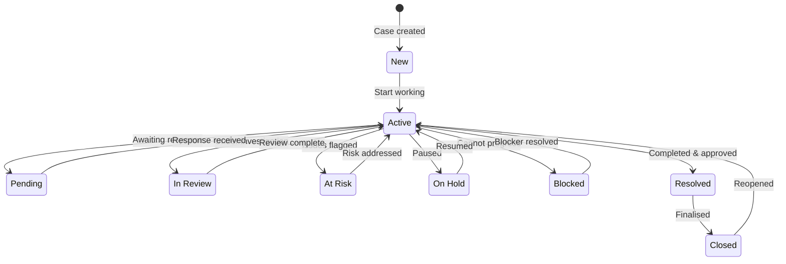
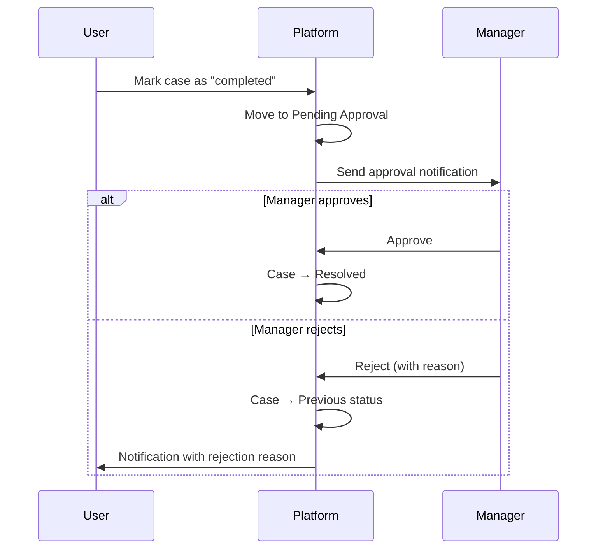
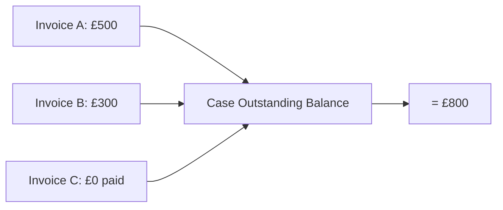
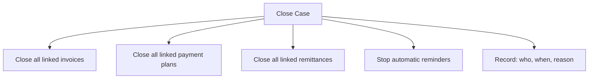

# Understanding Cases

A **case** represents a debt or receivable you're collecting. Every piece of collection work on ÉquiSettle starts with a case. Whether someone owes you for an unpaid invoice, a missed payment, or an outstanding account — you create a case to track and manage it.

## Single-invoice vs multi-invoice cases

### Single-invoice case
- One customer, one debt, one invoice
- When you create the case with an amount and due date, an invoice is **automatically generated** and linked
- This is the most common type — ideal for straightforward debts
- Chase mode can be individual or grouped (your choice)

### Multi-invoice case
- One customer, multiple outstanding invoices grouped together
- You create the case first, then add invoices to it later
- Useful when a customer has several unpaid invoices and you want to manage them as one collection effort
- Chase mode is automatically set to "grouped" (one email covering all invoices)
- Workflow only auto-activates when an overdue invoice is added (not at case creation)

## Case lifecycle

Every case has a status that shows where it is in the collection process:

| Status | What it means | When to use |
|--------|--------------|-------------|
| **New** | Just created. No action has been taken yet. | Fresh cases from CSV upload or manual creation. |
| **Active** | Being actively worked on by your team. | Default working state — the case is being managed. |
| **Pending** | Waiting for the customer to respond or for external action. | You've sent a reminder and are waiting for a reply or payment. |
| **In Review** | Under investigation or review by your team. | Something needs checking — disputed amount, incorrect details. |
| **At Risk** | Flagged for potential issues — missed deadlines, non-responsive customer. | Customer hasn't engaged after multiple reminders. |
| **On Hold** | Temporarily paused. | Customer has requested a delay, or you're waiting for internal approval. |
| **Blocked** | Cannot progress until something is resolved. | Missing information, unresolved dispute, or dependency on another process. |
| **Resolved** | Successfully concluded — paid or arrangement reached. | Customer has paid in full, or a payment plan/settlement is in place. |
| **Closed** | Fully finished. No more actions. | Everything is done — the case is archived. |

### Approval flow

When you mark a case as "completed", it doesn't go straight to resolved. Instead:

This ensures oversight on case closures — managers review before any case is marked as resolved.

## Payment status

Each case also has a payment status that reflects the financial state:

| Payment status | What it means |
|----------------|--------------|
| **Has debt** | There's still money owed — the outstanding balance is greater than zero |
| **Paid** | All invoices have been paid in full — outstanding balance is zero |
| **Has credit** | Overpayment has resulted in a credit balance — the customer is owed money back |

## Outstanding balance

The outstanding balance on a case is the **sum of all linked invoices' outstanding balances**. It updates automatically when:

- A payment is received against an invoice
- An invoice is added to or removed from the case
- An invoice is voided or superseded
- A payment plan replaces existing invoices

This means you always see the real-time amount still owed without manual calculation.

## Closing a case

When you close a case, it triggers a cascade of actions:

- All linked invoices are also closed
- All linked payment plans are closed
- All linked remittances are finalised
- The closure is recorded with: who closed it, when, and why
- Automatic reminders stop for all linked invoices
- You can close cases individually or in bulk

## Reopening a case

If you need to reopen a closed case:

- Provide a reason for reopening
- All linked invoices, payment plans, and remittances are also reopened
- The case returns to its previous active status
- Full history is maintained — nothing is lost
- Automatic reminders resume for eligible invoices

The close/reopen cycle is fully reversible. Every action is logged for audit purposes.
