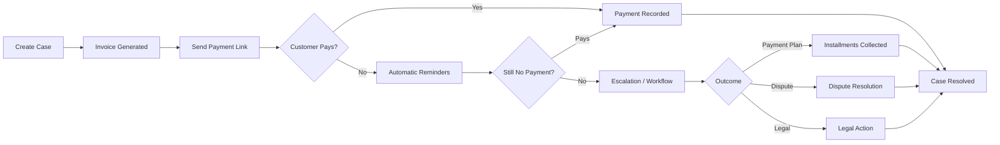
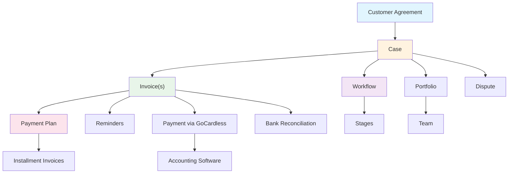

# Welcome to ÉquiSettle

ÉquiSettle is an accounts receivable management and collections platform. It helps you track outstanding invoices, manage debt cases, automate payment reminders, set up payment plans, and monitor your collections performance — all in one place.

## Who is this for?

This knowledge base is for everyone on your team who uses ÉquiSettle:

- **Admins** — full access to all features, settings, and user management
- **Managers** — oversee cases, approve workflows, and monitor team performance
- **Users** — day-to-day case management, sending reminders, and tracking payments

## The platform at a glance

This diagram shows the core flow — from creating a case through to resolution. Most cases follow the left side (customer pays after a reminder), but the platform handles every scenario, including payment plans, disputes, and legal escalation.

## What you'll find here

| Section | What it covers |
|---------|---------------|
| [Platform Overview](./platform-overview) | How the platform works, key terminology, and user roles |
| [Cases](./cases/understanding-cases) | Creating and managing debt cases — the core of your collections work |
| [Invoices](./invoices/understanding-invoices) | Invoice types, statuses, payments, and accounting integrations |
| [Payment Plans](./payment-plans/setting-up-payment-plans) | Setting up installment plans for customers who can't pay in full |
| [Reminders & Communications](./reminders/how-reminders-work) | Automatic payment reminders via email, SMS, and WhatsApp |
| [Workflows](./workflows/understanding-workflows) | Automating your collection process with staged workflows |
| [Analytics & Reporting](./analytics/dashboard-overview) | Understanding your dashboard metrics and performance data |
| [Customers & Disputes](./customers/customer-agreements) | Managing customer relationships and handling disputes |
| [Teams & Portfolios](./teams/teams-and-portfolios) | Organising your team and grouping cases |
| [Bank Reconciliation](./reconciliation/bank-reconciliation) | Matching bank transactions to invoices |

## How everything connects

The **Customer Agreement** is at the top — it represents your relationship with a customer. Under it sit **Cases**, each with **Invoices**. From there, the platform branches into payment collection, reminders, workflows, analytics, and more. Everything is connected and automatically kept in sync.

## The basics in 30 seconds

1. **Create a case** — import via CSV or create manually for a customer who owes money
2. **An invoice is generated** — linked to the case with the amount and due date
3. **Send a payment link** — customer receives an email with a secure link to pay online via GoCardless
4. **Reminders go out automatically** — if the customer doesn't pay, the platform sends escalating reminders on a milestone schedule (day 0, 1, 7, 14, then weekly)
5. **Track everything** — your dashboard shows what's been paid, what's overdue, and where to focus
6. **Escalate when needed** — workflows automate the progression from gentle reminders through to legal action

If a customer can't pay in full, you can set up a **payment plan** to collect in installments (the original invoice is superseded and replaced by installment invoices). If there's a disagreement, you can raise a **dispute** that follows a formal resolution process. And **workflows** let you automate the entire process from first contact to resolution.
