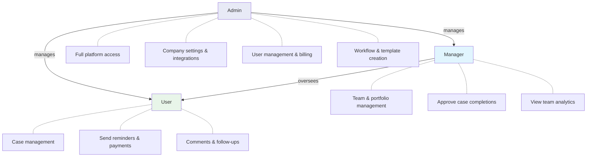
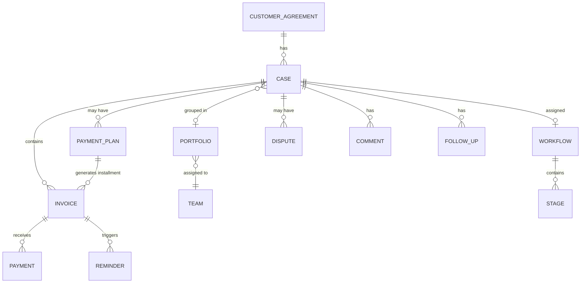

# Platform Overview

This page explains how the platform is structured, the roles available to your team, and the key terms you'll see throughout.

## User roles

ÉquiSettle has three user roles, each with different levels of access:

### Admin
- Full access to all features and settings
- Can create and manage users (admins, managers, team members)
- Can configure company settings, integrations, and workflows
- Can approve or reject case completions, workflow transitions, and stage skips
- Can manage billing and subscriptions
- Can create and manage email templates, document templates, and workflow definitions
- Can delete company data

### Manager
- Can view and manage all cases assigned to their team
- Can approve or reject case completions and workflow actions
- Receives notifications when cases need approval
- Can manage team members and portfolios
- Cannot change company-wide settings or integrations

### User
- Can create and manage cases assigned to them
- Can send payment links and reminders
- Can add comments, follow-ups, and notes to cases
- Can view analytics for their own work
- Cannot approve workflow transitions or case completions

## Key terminology

| Term | What it means |
|------|--------------|
| **Case** | A record representing a debt you're collecting. Every piece of collection work starts with a case. |
| **Invoice** | A document representing money owed. Cases have one or more invoices linked to them. |
| **Outstanding balance** | The total amount still owed — calculated from all linked invoices that haven't been fully paid. |
| **Customer agreement** | Your relationship with a customer — stores their details, preferences, and links all their cases together. |
| **Payment plan** | An arrangement that splits a debt into smaller installments collected over time. |
| **Workflow** | An automated series of stages that a case progresses through (e.g., send email, request documents, legal serving). |
| **Stage** | A single step within a workflow — each has an action type and can auto-progress after a time period. |
| **Chase mode** | How reminders are sent for a case: **Individual** (one email per invoice) or **Grouped** (one email listing all invoices). |
| **Superseded** | An invoice that's been replaced — for example, when a payment plan replaces the original invoice. The old invoice is closed with zero balance. |
| **Remittance** | A record of a payment received against an invoice or case. |
| **Portfolio** | A grouping of cases — used to organise work by client, region, risk level, or any other criteria. |
| **PTP (Promise-to-Pay)** | A recorded commitment from a customer to pay by a specific date. Tracked for follow-through. |
| **DSO (Days Sales Outstanding)** | The average number of days it takes to collect payment. Lower is better. |
| **Credit note** | A financial adjustment issued when a dispute is upheld or an overpayment needs to be corrected. |

## How the data model connects

This diagram shows how the major entities in ÉquiSettle relate to each other. A **Customer Agreement** can have many **Cases**. Each **Case** has **Invoices**, and can optionally have a **Workflow**, **Payment Plan**, or **Dispute** attached.

## Sandbox vs Production

Your company can operate in two modes:

- **Production** — real data, real emails, real payments. This is your live environment.
- **Sandbox** — test environment for trying things out. Emails and payments are simulated. Use this to learn the platform or test new workflows before going live.

You can switch between modes in your company settings (Admin only).

:::warning
Be careful when switching modes. Actions taken in Production are real — emails are sent, payments are processed, and records are permanent.
:::

## Navigating the dashboard

When you log in, you'll see your main dashboard with:

- **Stat cards** at the top — key metrics like total outstanding, amount recovered, collection rate, DSO
- **Status distribution** — visual breakdown of your invoices by status (paid, unpaid, partially paid)
- **Aging buckets** — how long your overdue invoices have been outstanding (current, 1-30 days, 31-60 days, 61-90 days, 90+)
- **Recent activity** — latest actions across your cases

You can customise your dashboard by:
- Reordering stat cards to put your most important metrics first
- Reordering sections
- Setting a default time period filter (all time, this year, last 6 months, etc.)

Use the navigation bar at the top to access Cases, Invoices, Payment Plans, Analytics, and other features.
